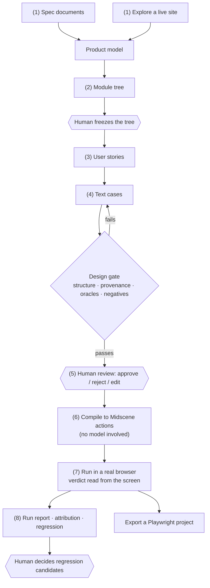
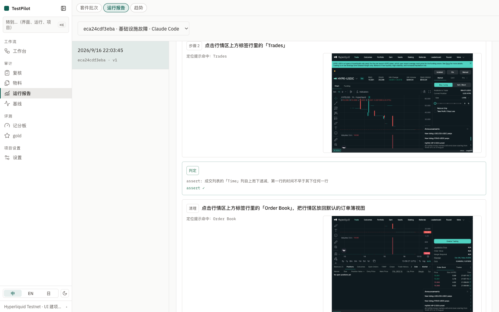
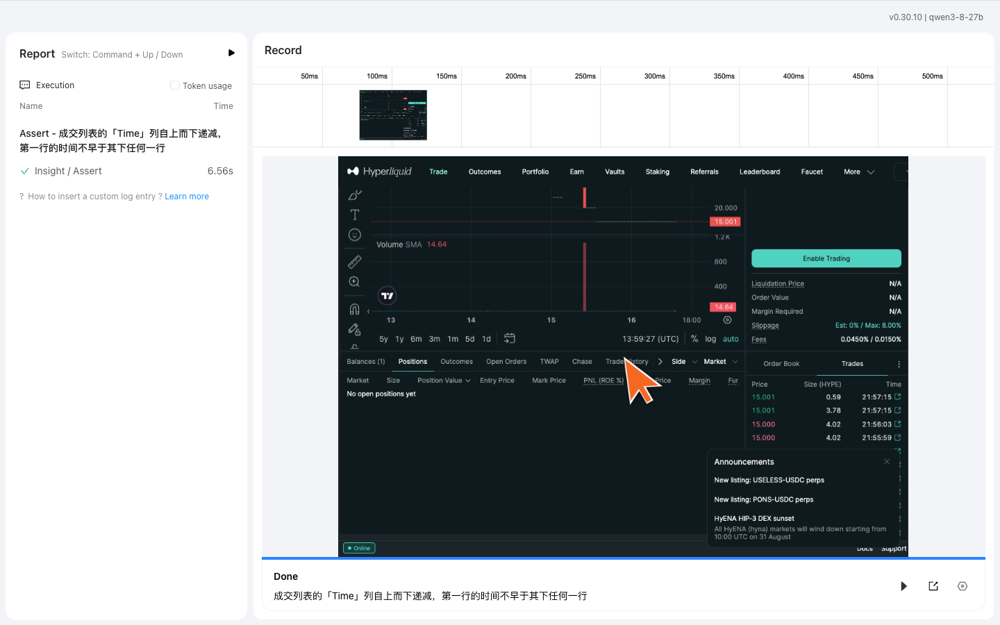
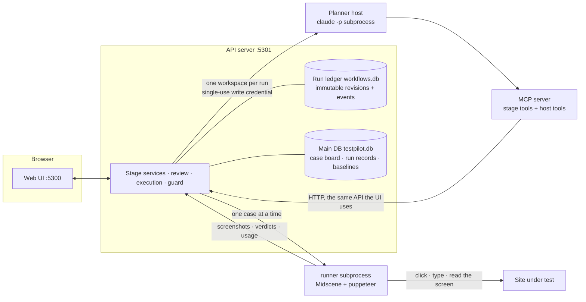

<h1 align="center">TestPilot</h1>

<p align="center">
  <b>Turn requirement documents, or an exploration of a live site, into human-reviewed end-to-end UI tests whose verdicts are read from the screen.</b>
</p>

<p align="center">
  <a href="LICENSE"></a>
  = 22" src="https://img.shields.io/badge/node-%3E%3D22-339933.svg">
  
  
</p>

<p align="center">
  <a href="README.md">简体中文</a> · English
</p>

---

> **Status**: early release (0.1). The full pipeline has been run end to end against two systems under test: a self-hosted [Vikunja](https://vikunja.io/) and the Hyperliquid testnet. Data formats and APIs may still change; check the recent changes in the [handoff guide](docs/v3/09-执行目标与接手指南.md) (Chinese) before upgrading.

## What it is

TestPilot takes one of two inputs: a requirement document (spec), or an exploration of a running site (explore). It builds a product model and a module tree, then writes user stories and text test cases, compiles them into [Midscene](https://midscenejs.com/) actions, runs them in a real browser, and can export a Playwright project.

How it differs from "let an AI write test scripts":

- **Humans hold two gates.** A person freezes the module tree the model proposes, and approves each text case. Only approved cases are compiled and run.
- **Verdicts come from the screen.** Cases drive the product's UI and judge what the UI shows. They never call the product's own API for a verdict, so "the API said OK but the row never appeared" cannot pass.
- **Deterministic gates.** Stories, cases and generated code are checked by tools (structure, provenance, oracles, coverage). Scores are computed, not self-reported by the model.
- **Domain knowledge is project data.** Rule packs, domain references and environment profiles live in the project. You can draft them in a chat drawer or write them yourself. No domain content is hard-coded.
- **Failures must be explainable.** Every run has an attribution report that assigns problems, by fixed rules, to one of six layers: model, context, tool, workflow, test case, or product. Cases that fail an assertion become regression candidates, and a human decides whether to keep them.

## Capabilities

| Capability | What it does |
|---|---|
| Product model & module tree | Features and rules from the material or exploration; the model proposes modules, a human freezes them |
| Stories & text cases | Generated per module; each case carries its risk, covered acceptance criteria, test data, design evidence (equivalence, boundary, decision table…) and oracles |
| Oracle tiers | Tier 1 text / count / URL checked by a program; tier 2 a relation between two readings; tier 3 judged by a model looking at the screen. Generated content (images, summaries, captions) uses a `judge` oracle: yes/no criteria, sampled several times, decided statistically |
| Design gate | Structure, provenance, vague or volatile oracles, negative-case ratio, acceptance coverage |
| Compile & execute | Approved cases become Midscene actions, run in a browser with a screenshot per step; each case gets visual and performance baselines, and its Midscene report is kept |
| Run report | Per case: overview, step timeline, checks, visual baseline, performance, raw data, plus a link to the Midscene report |
| Attribution & regression | See "Failures must be explainable" above |
| Export | A standalone Playwright + Midscene project that uses the same oracle implementation as the platform |
| Host entry | Through an MCP server and plugins, Claude Code (and the experimental Codex and Penguin) can perform what the UI can, except 3 UI-only features (chat drawer, event stream…), enforced by `pnpm check:host-parity` |

## What a run looks like

Follow this line once and you have seen all of TestPilot. The screenshots come from a real run against the [Hyperliquid testnet](https://app.hyperliquid-testnet.xyz/trade): planned by the locally signed-in Claude Code, started from an exploration, producing 34 user stories and 115 text cases, 9 of which were executed. The UI is shown in Chinese; English and Japanese are available from the language switch.



The pipeline stops for a human in exactly three places: **freezing the module tree, reviewing cases, and deciding regression candidates.** Everything else is driven stage by stage by the server, and every stage's output is recorded in the run ledger as an immutable revision.

The workbench is that line: eight stages with their state and artifacts — green is done, red is failed or waiting.


### 1. Start a run: give it documents, or let it look for itself

Choose spec or explore, set the target URL, domain knowledge, rule pack and output language, and pick who plans (the local Claude Code by default). Once the run is registered, the materials, rule pack, domain reference and planner runtime are frozen to it.


### 2. Module tree: the model proposes, a human freezes

The model cuts a tree at least two levels deep from the materials or the exploration, and the server machine-checks it (structure, references, cycles). **Freezing is a human decision**: until the tree is frozen, no work unit can be claimed for stories. After freezing, press "continue" and the planner picks up where it left off.


### 3. User stories: one work unit per module

Each story carries Given/When/Then acceptance criteria, the features and rules it refers to, and its provenance (which passage of which material). Every module shows its story count, highlighted when it is zero — so a module nobody covered is visible at a glance.


### 4. Text cases and the design gate

Cases hang off acceptance criteria and carry the risk they address, test data, the design technique behind them (equivalence classes, boundaries, decision tables…) and their oracles. The gate checks structure, provenance, whether an oracle is vague or reads a volatile value, the share of negative cases, and whether every criterion is covered. When it fails, the affected work units are reopened for another pass. The score is computed by tooling, never by the model itself.

### 5. Review: approve or reject, one case at a time

The list on the left filters, searches and handles cases in bulk; the panel on the right shows everything behind a case: why it is worth testing, which criterion it covers, preconditions, test data, steps and checks. You can edit a case, which invalidates its approval and sends it back to review. **Only approved cases go any further**, and a rejection with a reason becomes a counter-example candidate.


### 6. Compile: no model involved

Approved steps become Midscene actions (`aiAction` / `aiWaitFor` / `aiAssert`) one by one, then pass a code gate. This step is deterministic: the same set of approvals must compile to the same artifact, and execution recompiles and compares before it starts — a mismatch is refused.


### 7. Execution: real clicks in a real browser, verdicts read from the screen

Every case gets a fresh browser session. Each step keeps a screenshot of the page under test, whether the locator hint matched, and whatever is checked after that step. Below is the passing case `C-MKT-BOOK-05` ("the trades list is newest first", 35.1s):



Midscene's own report replays the run frame by frame, including where each click landed:



Those screenshots also become the visual baseline compared step by step on the next run; performance gets a baseline the same way.

### 8. Reports: a failure has to say whose fault it is

In the run report every case opens into overview, steps, checks, visual baseline, performance and raw data, with links straight to the Midscene report or back to review.


The attribution report assigns each problem to one of six layers — model, context, tooling and environment, workflow, case, product — by fixed rules, each with the rule that fired and the evidence behind it. In the run above, 5 of 9 cases failed and the report is explicit: one never ran because of the environment (not a verdict), one had a step that never landed on the UI (locating or decomposition failed), and one was failed by a programmatic oracle with no baseline to separate "just broke" from "always been broken".


Failed verdicts and rejections with a reason become regression candidates, and **approving or dismissing them is a human decision**: an approved defect joins the regression suite and runs from then on, an approved counter-example becomes an evaluation item for the generator.


## How it fits together



Two model roles, neither standing in for the other:

| Role | Provided by | Does |
|---|---|---|
| Planner | The host's own model (by default the locally signed-in Claude Code) | Product model, module tree, stories, cases |
| Executor | Midscene, using the vision model configured in `server/.env` | Locating elements, acting, reading the screen, judging tier 3 oracles |

What every stage reads and writes, which error codes reject it, the run state machine and sequence diagrams for six key operations are in [Workflows](docs/v3/02-工作流-横向与纵向.md) (Chinese).

## Quick start

### Prerequisites

- Node.js 22 or newer (install and run with the same major version)
- pnpm 9 or 10
- The [Claude Code](https://docs.anthropic.com/en/docs/claude-code) CLI, signed in (`claude` on PATH, or set `TP_CLAUDE_BIN`)
- An OpenAI-compatible endpoint serving a vision model with visual grounding, for Midscene (see [Midscene's model setup](https://midscenejs.com/model-common-config))

### 1. Install

```bash
git clone https://github.com/zyonlab/TestPilot.git testpilot && cd testpilot
pnpm install --frozen-lockfile
```

This is a pnpm workspace; `server/`, `packages/*` and `apps/*` are installed together.

### 2. Configure the executor model

```bash
cp server/.env.example server/.env
```

Edit `server/.env` and set at least:

```bash
MIDSCENE_MODEL_BASE_URL=http://127.0.0.1:8000/v1   # legacy OPENAI_BASE_URL also works
MIDSCENE_MODEL_API_KEY=...                         # legacy OPENAI_API_KEY also works
MIDSCENE_MODEL_NAME=your-vl-model
```

Check the environment:

```bash
node scripts/testpilot-setup.mjs doctor      # lists what is missing; --help shows every command
```

> Use `node scripts/testpilot-setup.mjs …`, not `pnpm setup` / `pnpm doctor`: pnpm has built-in commands with those names that run first, and `pnpm setup` edits your shell configuration.

### 3. Start

```bash
node scripts/testpilot-setup.mjs start       # API server (:5301) and Web UI (:5300) together
# or in two terminals: pnpm server:dev and pnpm dev
```

Open http://localhost:5300 .

### 4. Install the Claude Code plugin

The plugin provides the MCP stage tools, ten skills and the gate hooks. It is generated from the source of truth in `plugins/testpilot/` and refers to the MCP server and hook scripts in this repository, so **install it from your local checkout**, not straight from the GitHub URL.

Generate the plugin directory first (and again after every pull):

```bash
pnpm build:claude-plugin          # writes plugins/testpilot-claude/
```

That is all you need for runs started from the Web UI: the server launches `claude` with `--plugin-dir` pointing at it. To use TestPilot in your own Claude Code sessions, pick one of:

**Option A: install as a plugin (recommended, available in every session)**

`.claude-plugin/marketplace.json` at the repository root declares this checkout as a local plugin marketplace:

```bash
claude plugin marketplace add /path/to/testpilot     # absolute path of this checkout
claude plugin install testpilot@testpilot
claude plugin list                                   # should show testpilot@testpilot  ✔ enabled
```

Or, inside Claude Code: `/plugin marketplace add /path/to/testpilot`, then `/plugin install testpilot@testpilot`. Restart the session; `/mcp` should list `plugin:testpilot:testpilot` as connected.

- Update: after pulling, rerun `pnpm build:claude-plugin`, then `claude plugin marketplace update testpilot` and `claude plugin update testpilot@testpilot`.
- Uninstall: `claude plugin uninstall testpilot@testpilot`, then `claude plugin marketplace remove testpilot`.
- Moving or deleting the checkout breaks the plugin; install it again.

**Option B: load it for one session (development)**

```bash
claude --plugin-dir plugins/testpilot-claude
```

**Option C: install into a workspace (no hooks)**

```bash
node scripts/testpilot-setup.mjs install --entry claude-code --workspace <your-workspace>
node scripts/testpilot-setup.mjs uninstall --workspace <your-workspace>   # removes only files you have not modified
```

This writes the MCP server into `.mcp.json`, the skills into `.claude/skills/`, plus a `.testpilot/` directory. It installs no hooks; only the server-side gates apply.

All three use the same API server (`http://127.0.0.1:5301` by default, override with `TP_SERVER_URL`), which must be running. See [Claude Code and Codex integration](docs/v3/14-Claude-Code与Codex接入实操.md) (Chinese) for details.

## Usage

### From the Web UI

The flow, and what each step looks like, is [walked through above](#what-a-run-looks-like). Two things come first:

1. Create a project, set the target URL and configure the environment profile (login flow, viewport, wallet injection…).
2. Add domain knowledge where you need it, in "rule packs" and "domain references", or by talking it out in the chat drawer.

Then start a run from the workbench. Local review needs no sign-in; the origin and version of every action are recorded.

### From Claude Code

Keep the API server (:5301) running and install the plugin as [described above](#4-install-the-claude-code-plugin).

Describe your goal in the session, for example "use TestPilot to generate tests for this project". The host goes through modules → stories → cases → gate and hands off to human review; the artifacts are the same ones you see in the Web UI. See [Claude Code and Codex integration](docs/v3/14-Claude-Code与Codex接入实操.md) (Chinese) for details.

### Experimental runtimes

- **Codex**: `pnpm build:codex-plugin` generates `plugins/testpilot-codex/`, or install per project with `install --entry codex`.
- **Penguin**: needs Node 24 and a running Penguin service; install with `install --entry penguin --agent-id <id>`, and set `TP_AGENT_RUNTIME=penguin` to have it plan Web-started runs.

Neither is covered by this release's acceptance.

## Configuration

| Variable | Purpose | Default |
|---|---|---|
| `MIDSCENE_MODEL_BASE_URL` / `MIDSCENE_MODEL_API_KEY` / `MIDSCENE_MODEL_NAME` | Executor model | required |
| `TP_AGENT_RUNTIME` | Who plans Web-started runs: `claude-code` or `penguin` | `claude-code` |
| `TP_CLAUDE_BIN` | Path to the `claude` executable | `claude` on PATH |
| `TP_PLANNER_*` | Planner model; only for Penguin or the internal pipeline mode | — |
| `TP_EXECUTOR_MAX_CALLS` / `TP_RUN_MAX_MS` | Per-run model-call and wall-time budget | see `.env.example` |
| `DENY_HOSTS` | Extra hosts to block | — |
| `GUARD_STRICT=1` | Block irreversible steps machine-wide | off |
| `TP_DATA_DIR` | Data directory (to isolate instances) | `server/.data` |

Model settings saved in a project take precedence over environment variables. See [installation and diagnostics](docs/v3/10-安装与诊断.md) (Chinese) and `server/.env.example`.

## Safety

- Only run against systems you are allowed to test, ideally a test environment. Exploration and execution really click, submit and delete.
- There is one global deny list: `guard.denyHosts` in `server/harness.config.ts` (`DENY_HOSTS` can only add to it). Listed hosts are never allowed, in any environment.
- Irreversible steps such as delete, complete or clean up are **allowed by default**, because they are the features under test. To block them machine-wide, set `GUARD_STRICT=1`; the rule pack's `sideEffectLabels` then take effect.
- Local review has no authentication and is meant for a single machine. Do not expose the server to the internet.

To report a vulnerability, see [SECURITY.md](SECURITY.md).

## Repository layout

```
src/                      Web UI (React + Rsbuild, :5300)
server/                   API server (Express + SQLite, :5301), runtime adapters, export
  harness.config.ts       concurrency, budgets, guard
packages/
  harness-core/           model calls, config, run contracts, observability
  harness-testing/        domain modelling, case generation and gates, oracles, codegen, executor
  testpilot-mcp/          stdio MCP server that host agents use to call TestPilot
apps/
  agent/  runner/         run orchestration and browser execution processes
plugins/
  testpilot/              source of truth for skills and hooks
  testpilot-claude/       generated Claude Code plugin
  testpilot-codex/        generated Codex plugin (experimental)
fixtures/                 local systems under test and data for tests and evals
extensions/               Penguin evaluation extension (experimental)
scripts/                  setup, diagnostics, plugin builds, checks
docs/                     documentation (start at docs/README.md)
```

## Development

```bash
pnpm typecheck && pnpm test     # tsc and vitest for every package
pnpm test:hooks                 # hook subprocess tests
pnpm check:drift                # prompts and skills match rule by rule; plugin copies match the source
pnpm check:host-parity          # every new UI route is classified; host coverage may not drop
pnpm check:domain-neutral       # no hard-coded domain content in product code or skills
pnpm check:i18n                 # every UI string exists in Chinese, English and Japanese
```

After changing `plugins/testpilot/skills/**` or `packages/harness-testing/src/casegen/prompts.ts`, bump the matching `skillVersions` entry in `plugins/testpilot/plugin.json`, regenerate the plugins (`pnpm build:claude-plugin`, `pnpm build:codex-plugin`) and make sure `pnpm check:drift` passes.

CI is currently switched off by hand (the reason is written in `.github/workflows/ci.yml`); please run the checks above locally before sending a PR.

## Documentation

The documentation is mostly in Chinese. Start at [docs/README.md](docs/README.md):

- [Architecture](docs/v3/00-架构.md): processes, packages, pipeline stages, ledger and guard, with code locations
- [Data contracts](docs/v3/01-数据契约.md): the schema source of truth for every artifact
- [Workflows](docs/v3/02-工作流-横向与纵向.md): the end-to-end flow, the run state machine and sequence diagrams for the key operations (Chinese)
- [Goals and handoff guide](docs/v3/09-执行目标与接手指南.md): goals, scope, status, next steps, recent changes
- [Installation and diagnostics](docs/v3/10-安装与诊断.md)
- [Claude Code and Codex integration](docs/v3/14-Claude-Code与Codex接入实操.md)

## Contributing

Issues and pull requests are welcome. Please read [CONTRIBUTING.md](CONTRIBUTING.md) first, and follow the [Code of Conduct](CODE_OF_CONDUCT.md).

## Roadmap and known limitations

- This release covers the Web UI and Claude Code; Codex and Penguin are experimental.
- Self-improvement, an experience / counter-example library, parallel sub-agents, gold sets and scoreboards, and the research track are frozen and not part of this release.
- The regression suite is a list for now; executions do not pick it up automatically, and new cases are not yet generated from failures or rejection reasons.
- Whether repeated `judge` sampling exposes unstable verdicts still needs ambiguous samples to verify.
- The full list is in [the handoff guide §4](docs/v3/09-执行目标与接手指南.md).

## Acknowledgements

- [Midscene.js](https://midscenejs.com/): vision-driven browser actions and assertions
- [React Flow (@xyflow/react)](https://reactflow.dev/): workbench and module graphs
- [Playwright](https://playwright.dev/): runtime of the exported projects
- [Model Context Protocol](https://modelcontextprotocol.io/): host agent integration

## License

[MIT](LICENSE)
