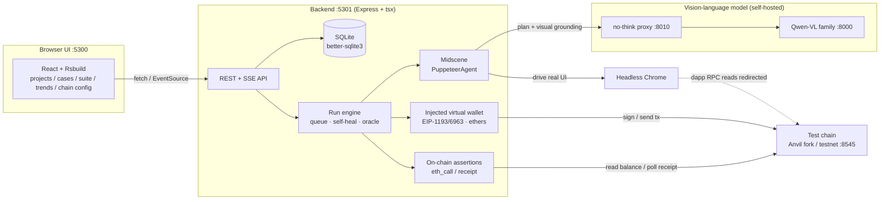
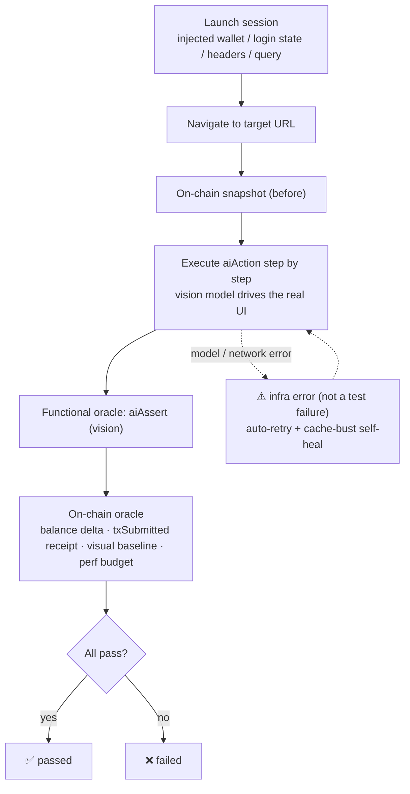
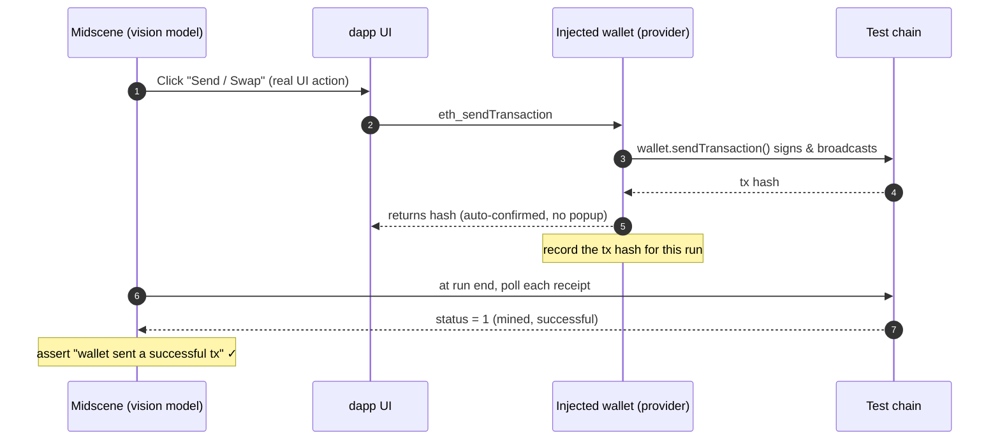

<p align="center">
  
</p>

<h1 align="center">TestPilot</h1>

<p align="center">
  <b>AI-driven end-to-end testing for web apps and Web3 dapps.</b><br>
  Point it at a URL — the AI explores the flows, drives the real UI, and returns reviewable results with explicit oracle evidence.
</p>

<p align="center">
  <a href="README.md"></a>
  <a href="README.en.md"></a>
  <a href="README.ja.md"></a>
</p>

<p align="center">
  
  
  
  
</p>

---

## Current delivery · 2026-09-09

TestPilot turns domain rules, test design, deterministic oracles and human review into a reusable testing capability for Web users and host agents. The Web UI owns projects, workflows, models, materials and reviews. Claude Code, Codex and PenguinHarness inherit their host planner; Midscene uses a separate low-cost execution role. The initial Web planner uses the same provider/model as execution and can later change through `TP_PLANNER_*`.

Start with the [current HTML report](docs/reports/testpilot-delivery-2026-09-09.html), [installation guide](docs/v3/10-安装与诊断.md) or [handoff](docs/v3/09-执行目标与接手指南.md). Domain assets are version `2026-09-09.3`. Real integrations cover all three hosts, Web-to-Codex application repair, role-separated usage, cache/export parity and a rejected candidate in the Penguin evaluation companion.

Human gold review, formal domain evaluation, actual promotion, four further stability nights and remote release remain pending. The experiments do not establish a reliable benefit from domain references or memory. The report distinguishes real runs, synthetic gate checks and unresolved evidence.

## v3 · Tier 4 (numbers from 2026-09-07, not an architecture diagram)

> This is a historical 2026-09-07 snapshot; current product responsibilities are described above. Its core assets include: skills (generator prompts), hooks (gates), MCP tools (scoring / execution / retrieval) and benchmarks (gold). Every number below has a source; the roadmap with per-task acceptance is [`docs/v3/07`](docs/v3/07-第四档路线-任务与进度.md), four build logs are in [`docs/build-log/`](docs/build-log/) (zh + en).

**Cost of execution** (`app.hyperliquid-testnet.xyz`, 7 P0 cases, all API oracles, `Qwen3.8-27B-FP8`@inferx, Midscene 0.30.10; source `docs/v3/06 §6`):

| | cold first pass | second pass (cache replay) | third pass |
|---|---|---|---|
| wall clock, 7 cases | 583s | 591s | **310s (53% of first)** |
| model calls / tokens | 50 / 177k | 22 / 77k | **5 / 15k** |
| cache hit / miss / stale | 0 / 64 / 0 | 39 / 26 / 1 | **56 / 4 / 0 (93%)** |
| verdicts decided by machine oracle | 100% | 100% | 100% |

On the first pass the machine oracle caught a real failure: "market buy 0.001" filled 0.17365 BTC, invisible on screen, obvious to `szi eq 0.001`. The target "second pass ≤ 1/3 of first" was not reached (53%): the remaining floor is Midscene taking a screenshot and DOM snapshot per replayed action, not the model.

**Three runtimes, one set of assets** (source `docs/v3/07` T-05…T-09, `docs/build-log/03`):

| runtime | hooks execute | one g1 run | status |
|---|---|---|---|
| PenguinHarness 0.2.9 | no (`pre_tool_use` / `stop` absent from the published package) | 2 stories / 12 cases, 0 hook events in trace | gates reduced to a sentence in SKILL.md |
| Claude Code | yes (PreToolUse blocked a provenance-less Write, recorded in `holds.jsonl`) | 2 stories / 16 cases in 1:48 | usable |

On 2026-09-08, same skill + gold (casegen, 16 items) + MCP + materials + model (`qwen3.8-flash`), n=3 per runtime (`evals/runtime-compare.json`):

| runtime | gate (3 runs) | coverage (3 runs) | tokens (inside MCP) | wall clock | paired vs the other arm |
|---|---|---|---|---|---|
| PenguinHarness 0.2.9 | 1.00 / 0.94 / 0.86 | 0 / 0.17 / 0 | 44–48k | 161s / 456s / **927s** | three McNemar pairs, p = 1.0 |
| Claude Code | 1.00 / 1.00 / 0.94 | 0.08 / 0.17 / 0 | 39–53k | 162s / 207s / 207s | 1 / 5 / 1 flips, i.e. noise |
| Codex | — | — | — | — | not run |

Switching runtimes produces no measurable difference. The "no hooks" gap on the Penguin arm never gets a chance to show: g1 writes its files in one `run_pipeline` call, and no hook fires on that path. The slow part is Penguin's own agent turns, not the model.
| Codex | no hooks; gate moved into the `write_stories` / `write_cases` tools | not run | this machine's account has no usable model |

**In the development loop**: `fixtures/tier4-demo/` is an order panel edited by a coding agent; a Stop hook runs P0 whenever the agent tries to end its turn. A real session on 2026-09-08 (`docs/v3/evidence/t15-stop-hook-session.jsonl`): the agent changed only a placeholder, Stop was blocked (`position.szi = 0.002, expected 0.001`), the agent read `holds.jsonl`, fixed `normalizeSize`, and the four P0 cases replayed with zero model calls before the turn was released.

**Not done yet** (kept on the first screen so it is not only the good numbers): the paired eval with / without the domain REFERENCE has not run (it needs a human-reviewed, frozen gold); the runtime table lacks the Codex column; n=3 per arm is only enough to say "no measurable difference".

---

## Table of contents

- [What is TestPilot](#what-is-testpilot)
- [Core capabilities](#core-capabilities)
- [Feature tour (with screenshots)](#feature-tour-with-screenshots)
- [Architecture](#architecture)
- [Run pipeline](#run-pipeline)
- [Dapp / Web3 testing](#dapp--web3-testing)
- [AI model dependency](#ai-model-dependency)
- [Local development](#local-development)
- [Tech stack](#tech-stack)
- [Project layout](#project-layout)
- [Roadmap](#roadmap)

---

## What is TestPilot

TestPilot hands "a whole QA department's automation work" to an AI:

1. **Explore** — give it a URL; a vision-language model reads the page and proposes test cases with **P0/P1/P2 priority** and a business rationale.
2. **Execute** — [Midscene](https://midscenejs.com/) drives a **real browser** with natural-language steps against the real UI (no selectors).
3. **Judge** — every run uses a **dual oracle**: a functional assertion (vision) plus deterministic checks (on-chain / performance / visual baseline).
4. **Govern** — suite runs, CI gates, self-healing retries, flakiness stats, a trends dashboard, and runnable-code export.

Unlike record-and-replay or hand-written selectors, cases are expressed in natural language, so a small UI change doesn't break them en masse; verdicts lean on deterministic signals (tx receipts, pixel baselines, performance budgets), decoupling the flaky visual judgement from the reliable result judgement.

> **Web3 dapp E2E is a first-class focus.** The user interacts with the dapp's UI; the ground truth of that interaction is "the wallet gained a confirmed transaction." TestPilot auto-approves the wallet popup with an injected virtual wallet and turns that tx receipt into a first-class assertion — never bypassing the UI.

---

## Core capabilities

| Capability | What it does |
|---|---|
| 🧭 **AI explore** | Vision model reads the site → generates prioritized cases with rationale; supports deep crawl and "Dapp mode" |
| ⌨️ **Natural-language cases** | Steps are plain English ("Click Send 0.01 ETH"), no CSS selectors |
| ✅ **Dual oracle** | Functional assertion (`aiAssert`) + on-chain assertions / visual-baseline diff / performance budget |
| ⛓ **Dapp / on-chain assertions** | Injected wallet auto-confirms popups; assert balance deltas and **"wallet sent a successful tx" (receipt status=1)** |
| 🔁 **Suite · gate · self-heal** | Concurrency queue, retry on failure, cache-bust self-heal, CI gate, flakiness stats & quarantine |
| 🖼 **Visual / perf baselines** | Per-step pixel diff (triptych + approve-as-baseline); TTFB/FCP/DCL/Load budget with regression flags |
| 🐞 **Live case debugging** | Step-by-step SSE replay + intent-first AI fix (edit steps/assertion, preview the diff before saving) |
| 📊 **Trends dashboard** | Pass rate, flake rate, mean-time-to-repair, coverage, heal rate |
| 🔐 **Environments & secrets** | Per-project env vars, encrypted secrets, login state (API login / cookie / storageState) |
| 🧬 **Data-driven** | Bind a dataset, run once per row (`${row}` / `${row.col}`) |
| 📤 **Code export** | One-click export to a runnable Playwright project (env / secrets / login state / CI) |
| 🌐 **Trilingual + dark** | zh / en / ja; the active language is sent to the model to constrain its output language |

---

## Feature tour (with screenshots)

### Project portfolio
Point TestPilot at multiple sites, each with its own E2E suite. The sidebar holds 11 entries in four groups (Work / Orchestrate / Quality / Config); the active project sits at its foot.


### AI explore
Enter a URL → the model reads live screenshots of the page → produces "discovered flows" with priority and business rationale. Deep crawl and Dapp mode supported.


### Test-case board
A P0/P1/P2 board. Each case carries natural-language steps, an expected assertion, data-driven binding, a Web3 run mode, on-chain assertions, generated code, a quarantine toggle, and the last run result inline.


### 🐞 Live case debugging
Select a case and hit "Debug" to open live debug: each step is replayed over SSE with a live screenshot of the page on the right (dapp cases auto-inject the wallet — `provider:present`). You see exactly which step fails, and can apply an **intent-first** "Fix with AI" — first declare whether you're changing the *steps* or the *assertion*, preview the diff, then save and re-run.


### ⛓ Dapp / on-chain assertions (the headline)
A case can run with an **injected virtual wallet** and carry **on-chain assertions**. Below: one real UI click on "Send 0.01 ETH" → assert "wallet sent a successful tx ≥ 1" → poll the receipt to confirm it mined → pass. That is the closest thing to the user's truth, and it doesn't depend on the model reading the dapp's success UI.


### Suite & CI gate
Run by priority in bulk; each suite yields pass/fail, a gate result (can block CI), and retry/heal records.


### Run report
A project-level run ledger: total runs, pass rate, P0 pass rate, average duration, and per-run oracle details.


### ⏱ Performance baseline
Every run captures TTFB / FCP / DCL / Load, compares each metric to the baseline and computes Δ%; over-budget metrics are flagged red as a "regression", and the first run establishes the baseline.


### 🖼 Visual baseline
Per-step screenshots are pixel-diffed (pixelmatch) against the baseline, giving a "baseline │ current │ diff" triptych and a mismatch %. If the change is intended, "Approve as baseline" updates it in one click.


### Trends dashboard
Pass rate over time (green = gate passed, red = gate failed), flake rate, mean-time-to-repair, coverage, heal rate, and per-suite result distribution.


### Chain / Dapp config
Test chain, RPC, and wallet in their own panel: presets for a local Anvil fork / Tenderly Virtual TestNet / public testnet, a controlled test wallet, one-click real verification of the injected wallet, plus a "how to test a dapp" guide and a Uniswap example.


### Model config
Connect a self-hosted, OpenAI-compatible vision-language endpoint: base URL, API key, model name, model family, with an endpoint preview and copyable environment variables.


---

## Architecture

TestPilot = frontend (Rsbuild/React) + backend (Express/SQLite) + run engine (Midscene drives the browser + injected wallet + on-chain assertions) + a self-hosted vision-language model + a test chain.



**Key point:** Midscene does **UI automation only** (not extended, not modified); TestPilot wraps an "injected wallet + on-chain assertion" layer around it. In injected mode we **are** the wallet — we record the tx hash at the source it's sent, with no chain polling or wallet listening.

---

## Run pipeline

How a run flows, and how failures are classified/healed:



The functional assertion (vision model) is the flaky part; the on-chain / pixel / performance checks are deterministic ground truth. Both gate the verdict, decoupling "UI-driving reliability" from "result judgement."

---

## Dapp / Web3 testing

**Principle: never bypass the UI.** The user interacts with the dapp's interface; that action ultimately shows up as one more transaction in their wallet. TestPilot follows the modern mainstream approach (Synpress-mock / Dappwright) — inject an EIP-1193/6963 provider that auto-confirms the connect / sign / transaction popups, while the dapp's own UI is genuinely clicked throughout.



**On-chain assertion types:** `balance increased / decreased / changed`, `balance ≥ / ≤ / = threshold` (ERC-20 or native), `wallet sent ≥N successful txs (txSubmitted)`. These are **deterministic RPC calls — no LLM involved** — hence the most reliable verdict; the vision assertion only backstops the UI layer.

**Testing your own dapp:** TestPilot does not deploy dapps. You provide a dapp URL + one chain RPC (local fork / Tenderly / testnet); the platform injects a controlled wallet that connects to it. The repo ships `/testdapp` (connect / sign / send tx / WETH wrap) for out-of-the-box verification, and the chain-config page includes a Uniswap example and guidance.

> ⚠️ **About production Uniswap:** its frontend reads balances from its own backend gateway (invisible to a fork) and its UI is very dense — hard to drive reliably with a **self-hosted 35B model**. This is a **model-capability axis** issue, not a platform-design one: point `MIDSCENE_MODEL_*` at a stronger vision model and it works; the on-chain assertion layer is model-independent. The built-in `/testdapp` cases (connect / sign / send tx + on-chain assertions) run green reliably even on the local model.

---

## AI model dependency

TestPilot relies on an **OpenAI-compatible vision-language (VL) endpoint** for page planning and visual grounding. The default, verified setup:

| Item | Value |
|---|---|
| Model | **Qwen3.6-35B-A3B-4bit** (Qwen3-VL family, self-hosted, e.g. MLX / vLLM) |
| Endpoint | `http://127.0.0.1:8010/v1` (no-think proxy; the raw model is on `:8000`) |
| Model-family flag | `MIDSCENE_USE_QWEN3_VL=1` (use `MIDSCENE_USE_QWEN_VL=1` for Qwen2.5-VL) |
| Cache | `MIDSCENE_CACHE=1` (cache planning per case so regression re-runs replay without the model) |

Configure it visually on the "Model config" page, or via environment variables (`server/.env`):

```bash
MIDSCENE_MODEL_BASE_URL=http://127.0.0.1:8010/v1
MIDSCENE_MODEL_API_KEY=your-key
MIDSCENE_MODEL_NAME=Qwen3.6-35B-A3B-4bit
MIDSCENE_USE_QWEN3_VL=1
```

**Swap in any VL model:** as long as the endpoint is OpenAI-compatible and the model supports visual grounding (Qwen-VL, or a stronger frontier model), point the three values above at it. The stronger the model, the better it drives dense UIs like Uniswap.

> 🧠 **Memory note:** running a large VL model on a VRAM/RAM-constrained machine, a bigger page DOM means a bigger prompt, which is more likely to trip the memory guard. TestPilot already downsamples the screenshot viewport (`MIDSCENE_SHOT_WIDTH/HEIGHT`, default 1024×720) to keep the prompt small; if that's still not enough, use a machine with more VRAM or a smaller model.

---

## Local development

### Prerequisites

- **Node.js ≥ 20** (verified on 22) and **pnpm**
- An **OpenAI-compatible vision-language endpoint** (see above)
- (optional, for dapp testing) **Foundry / anvil** to run a local chain or fork

### 1) Install

```bash
# Frontend (repo root)
pnpm install

# Backend
cd server && pnpm install && cd ..
```

### 2) Configure the model (backend)

```bash
# Edit server/.env with your MIDSCENE_MODEL_* endpoint (see "AI model dependency")
```

### 3) Start the services

```bash
# Terminal A — backend API (:5301)
cd server && pnpm dev

# Terminal B — frontend (:5300)
pnpm dev
```

Open **http://localhost:5300** .

### 4) (Optional) Dapp testing: start a test chain

```bash
cd server
pnpm gen:wallet          # generate a controlled test wallet (.wallets/seed.txt)
pnpm chain               # local Anvil (chainId 31337)
# or fork mainnet:
pnpm fork                # anvil --fork-url ... (chainId 1)
```

On the "Chain / Dapp config" page, point the RPC at `http://127.0.0.1:8545` and run dapp cases with the injected wallet.

### Ports

| Port | Service |
|---|---|
| `5300` | Frontend (Rsbuild dev) |
| `5301` | Backend API + built-in `/testdapp` |
| `8010` | Model no-think proxy |
| `8000` | Raw VL model |
| `8545` | Test chain (Anvil / fork) |

### Common scripts

```bash
pnpm typecheck                 # frontend type-check
cd server && pnpm typecheck    # backend type-check
pnpm build                     # frontend production build → dist/
```

---

## Tech stack

| Layer | Choice |
|---|---|
| Build / bundling | **Rsbuild** (Rspack, Rust core) + **SWC** transpile |
| Frontend | React 18 · TypeScript · react-router v6 (hash router) · Zustand · Tailwind v3 · lucide-react |
| Backend | Express · tsx · **better-sqlite3** (embedded SQLite) · cors · dotenv |
| Automation engine | **@midscene/web** (PuppeteerAgent) · Puppeteer (headless Chrome) |
| Web3 | **ethers v6** (injected wallet signing/sending) · EIP-1193 / EIP-6963 provider |
| Visual diff / perf | pixelmatch · pngjs · Puppeteer performance metrics |
| Model | Self-hosted Qwen-VL (OpenAI-compatible) · no-think proxy |
| i18n | zh / en / ja dictionaries + language constraint sent to the model |

---

## Project layout

```
testpilot/
├── src/                    # Frontend (React + Rsbuild)
│   ├── pages/              # Projects / Explore / CasesBoard / Suite / Trends / RunReport / ModelConfig / ChainConfig
│   ├── components/         # Layout / Sidebar / primitives
│   └── lib/                # store (zustand) · api · types · i18n · prefs
├── server/                 # Backend (Express + tsx)
│   └── src/
│       ├── index.ts        # API + run engine (executeRun / suite / explore SSE)
│       ├── agent.ts        # launchSession: Midscene + injected wallet + login state/headers/query
│       ├── injectedWallet.ts  # EIP-1193/6963 injected virtual wallet
│       ├── chain.ts        # on-chain assertions (balance / txSubmitted receipt)
│       ├── db.ts           # SQLite schema & migrations
│       ├── config.ts       # model / chain / viewport resolution
│       └── settings.ts     # exploration-methodology prompt / language constraint
├── docs/screenshots/       # screenshots used by this README (zh / en / ja)
└── README.md               # Chinese (default) · README.en.md · README.ja.md
```

---

## Roadmap

- **P1** — real MetaMask popup mode wired into the run pipeline (for teams that must test the real popup UX)
- **P2** — more on-chain assertions: nonce/txCount, event logs, ERC-20 allowance, ERC-721 owner
- Stronger vision-model integration and Midscene plan caching to drive complex, production-grade dapp UIs

---

<p align="center">
  <sub>Powered by Midscene · built to hand a department's automation testing to an AI.</sub>
</p>
