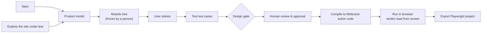

<h1 align="center">TestPilot</h1>

<p align="center">
  <b>Turn specs, or an exploration of a live site, into human-reviewed end-to-end UI tests that reach their verdicts from the screen.</b>
</p>

<p align="center">
  <a href="README.md">简体中文</a> · English
</p>

---

## What it is

TestPilot takes one of two inputs: a specification document (spec), or an exploration of a running site under test (explore). From that input it builds a product model and a module tree. It then writes user stories and text test cases, compiles them into [Midscene](https://midscenejs.com/) action code, and runs them in a real browser. The result can also be exported as a Playwright project.

How this differs from having an AI write test scripts directly:

- **A person freezes the module tree.** The model proposes the module breakdown. Stories and cases are generated only after a person confirms and freezes it, so the scope cannot drift midway.
- **A person approves the cases.** Text cases are approved in Review. Only approved cases are compiled and executed.
- **Verdicts come from the screen.** The output is end-to-end UI tests. Each case drives the product's UI and judges what appears on screen. It never calls the site's API. If the API reports success but the row never appears on screen, the test does not pass.
- **Machine-checked gates.** Stories, cases and generated code each pass deterministic gates for structure, provenance, oracles and coverage. The tools compute every score. The model never scores its own work.
- **Domain knowledge is project data.** Rule packs, domain references and environment profiles live in the project. You can work them out through the chat drawer in the UI or write them yourself. The repository ships no domain presets.

## Pipeline



The pipeline uses two model roles:

| Role | Provided by | Does |
|---|---|---|
| Planning | The host's own model (by default, your locally signed-in Claude Code) | Product model, module tree, stories, cases |
| Execution | Midscene, using the vision model configured in `server/.env` | Locating elements, acting and reading the screen in the browser |

## Quick start

### Prerequisites

- Node.js 22 or newer (install dependencies and start the server with the same major version)
- pnpm (the lockfile is v9; use pnpm 9 or 10)
- A signed-in [Claude Code](https://docs.anthropic.com/en/docs/claude-code) CLI (`claude` on PATH, or point `TP_CLAUDE_BIN` at it)
- An OpenAI-compatible model endpoint with visual grounding, for Midscene

### 1. Install

```bash
git clone <this-repo> testpilot && cd testpilot
pnpm install --frozen-lockfile
```

The repository is a pnpm workspace, so this one command installs `server/`, `packages/*` and `apps/*` together.

### 2. Configure the execution model

```bash
cp server/.env.example server/.env
```

Edit `server/.env` and fill in at least the execution model:

```bash
MIDSCENE_MODEL_BASE_URL=http://127.0.0.1:8000/v1   # legacy OPENAI_BASE_URL also works
MIDSCENE_MODEL_API_KEY=...                         # legacy OPENAI_API_KEY also works
MIDSCENE_MODEL_NAME=your-vl-model
TP_AGENT_RUNTIME=claude-code                       # claude-code is the default when unset
```

You only need `TP_PLANNER_*` for the Penguin runtime or the internal pipeline mode. Claude Code uses the host's own model. Model settings saved in a project's settings override environment variables.

To check that everything is in place:

```bash
node scripts/testpilot-setup.mjs doctor --entry claude-code
```

### 3. Start

```bash
pnpm server:dev   # API server, :5301
pnpm dev          # Web UI, :5300
```

Or start both with `node scripts/testpilot-setup.mjs start`. Then open http://localhost:5300.

### 4. Build the Claude Code plugin

```bash
pnpm build:claude-plugin    # same as node scripts/build-claude-plugin.mjs
```

This command builds `plugins/testpilot-claude/` from the source of truth in `plugins/testpilot/`. The output contains the skills, the hooks (gates) and the testpilot MCP server. Generation runs started from the Web UI load this directory automatically.

## Usage

### From the Web UI

1. Create a project under Projects. Enter the target URL and set up the environment profile (login precondition, viewport and so on).
2. Add spec material to the project, or choose to explore the site under test. Add domain knowledge in Product rule packs and Domain reference as needed, or work it out in the chat drawer.
3. Start a generation run from the Workbench. Claude Code on your machine plans by default, and the new-run form lets you pick a different runtime. Once a run is registered, resuming it uses the same runtime.
4. The run pauses at the module tree until you confirm and freeze it. It then generates stories and cases, which go through the design gate.
5. Approve or send back each case in Review. Approved cases are compiled into Midscene action code and run in the browser. You can view the results in the execution report or export them as a Playwright project.

Local review needs no login. The source and version of every action are still recorded.

### From Claude Code

Keep the API server (:5301) running, then use one of these two options:

```bash
# Use inside this checkout, with the gate hooks
claude --plugin-dir plugins/testpilot-claude

# Or install into your own workspace (writes .mcp.json, .claude/skills/, .testpilot/)
node scripts/testpilot-setup.mjs install --entry claude-code --workspace <your-workspace>
node scripts/testpilot-setup.mjs uninstall --workspace <your-workspace>   # removes only files that are unchanged since install
```

In the session, describe your goal in plain language, for example "run a TestPilot generation for this project". The `testpilot-run-c` skill drives the host model through modules → stories → cases → gate → handoff for human review. The Web UI shows the same artifacts.

### Experimental runtimes

- **Codex**: run `pnpm build:codex-plugin` to generate `plugins/testpilot-codex/`, or use `install --entry codex` for a project-level install.
- **Penguin**: requires Node 24 and a running Penguin service. Install with `install --entry penguin --agent-id <id>`.

Neither runtime is covered by the acceptance testing for this initial release.

## Safety

- There is exactly one global deny list: `guard.denyHosts` in `server/harness.config.ts`. The `DENY_HOSTS` environment variable can only add hosts to it. A listed host is never allowed, whatever the environment.
- Irreversible steps such as delete, complete and cleanup are **allowed by default**, because they are the features under test. Operators who want to block them machine-wide can set `GUARD_STRICT=1` (or set `guard.blockIrreversible` to `true`). Only then do the rule pack's `sideEffectLabels` take effect.
- Keep targets in test environments. The accepted targets are a self-hosted local Vikunja and the Hyperliquid testnet (`https://app.hyperliquid-testnet.xyz/trade`).

## Repository layout

```
src/                      Web UI (React + Rsbuild, :5300)
server/                   API server (Express + SQLite, :5301), runtime adapters, export
  harness.config.ts       concurrency, budget, guard settings
packages/
  harness-core/           graph execution, model calls, config resolution, observability
  harness-testing/        domain modelling, case generation and gates, codegen, executor
  testpilot-mcp/          stdio MCP server that host agents use to call TestPilot
apps/
  agent/  runner/         run orchestration and executor processes
plugins/
  testpilot/              source of truth for skills and hooks
  testpilot-claude/       generated Claude Code plugin
  testpilot-codex/        generated Codex plugin (experimental)
extensions/               Penguin evaluation extension (experimental, not in this release)
scripts/                  setup/doctor, plugin builds, checks
docs/v3/                  current documentation
```

## Development and checks

```bash
pnpm typecheck && pnpm test     # tsc and vitest across packages
pnpm test:hooks                 # hook subprocess tests
pnpm check:drift                # prompts and skills match clause by clause; plugin copies match the source
pnpm check:host-parity          # new UI routes must be classified; host coverage must not drop
pnpm check:domain-neutral       # no hard-coded domain content in product code or skills
```

After you change `plugins/testpilot/skills/**` or `packages/harness-testing/src/casegen/prompts.ts`, take three steps. Bump `skillVersions` in `plugins/testpilot/plugin.json`. Regenerate the plugins with `pnpm build:claude-plugin` and `pnpm build:codex-plugin`. Then make sure `pnpm check:drift` passes.

## Documentation (Chinese)

- [Architecture](docs/v3/00-架构.md)
- [Data contracts](docs/v3/01-数据契约.md)
- [Goals and maintainer handbook](docs/v3/09-执行目标与接手指南.md)
- [Installation and diagnostics](docs/v3/10-安装与诊断.md)
- [Claude Code and Codex integration](docs/v3/14-Claude-Code与Codex接入实操.md)

## Roadmap and non-goals

This initial release includes two entry points, Web and Claude Code, and the pipeline described above. The following are frozen and not part of this release: self-evolution, the experience and counterexample library, parallel sub-agents, Gold and scoreboards, and the research track.

## License

[MIT](LICENSE)
