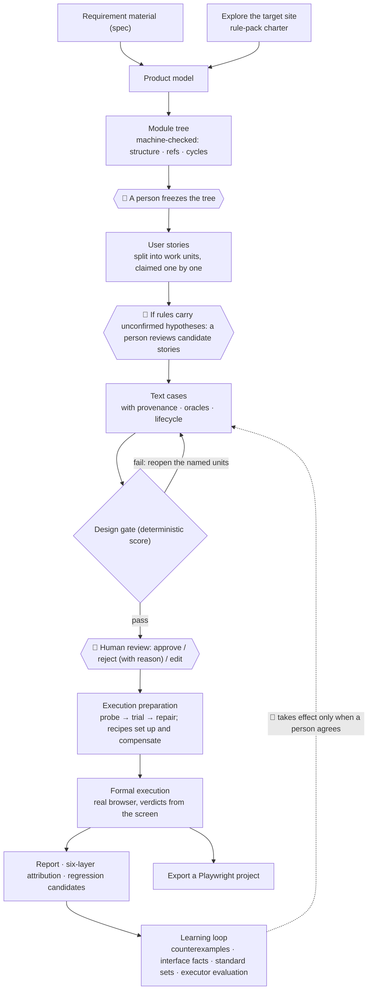
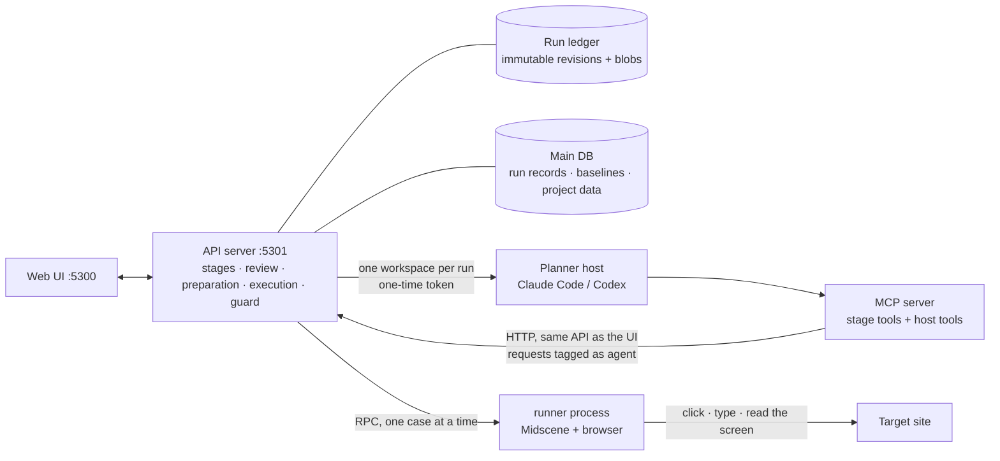
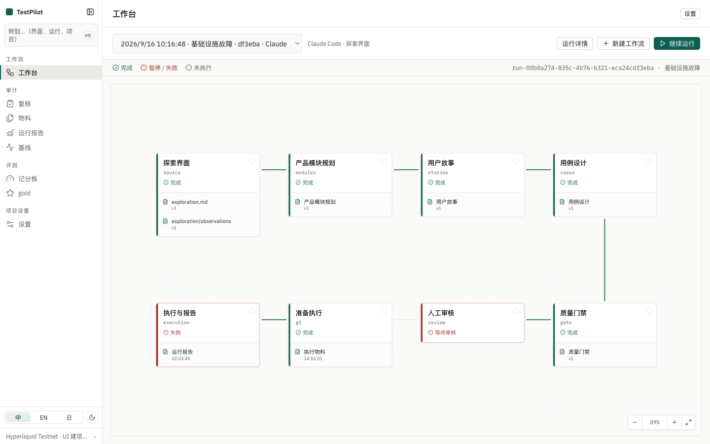
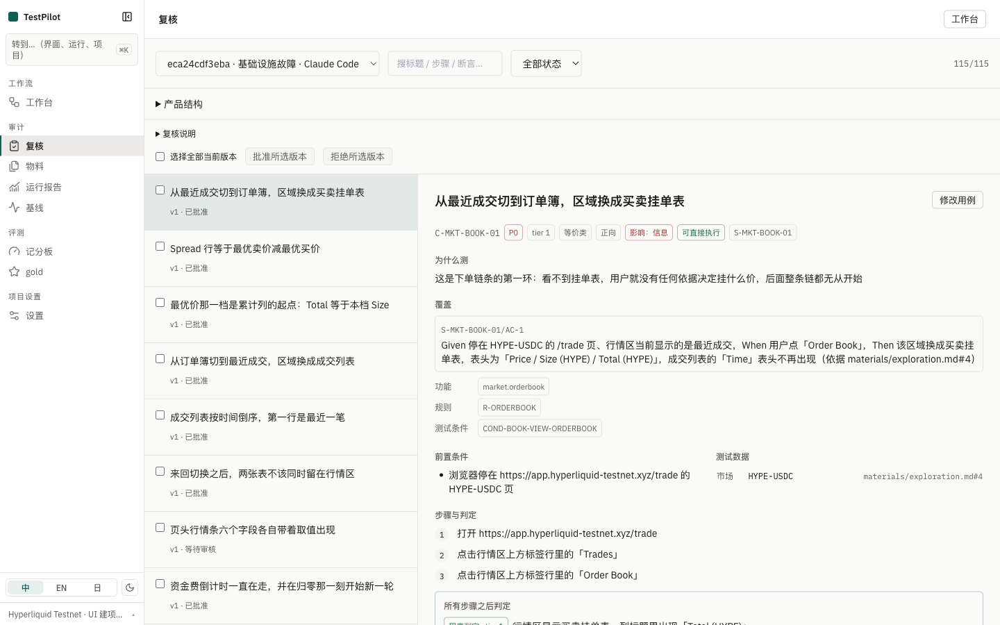
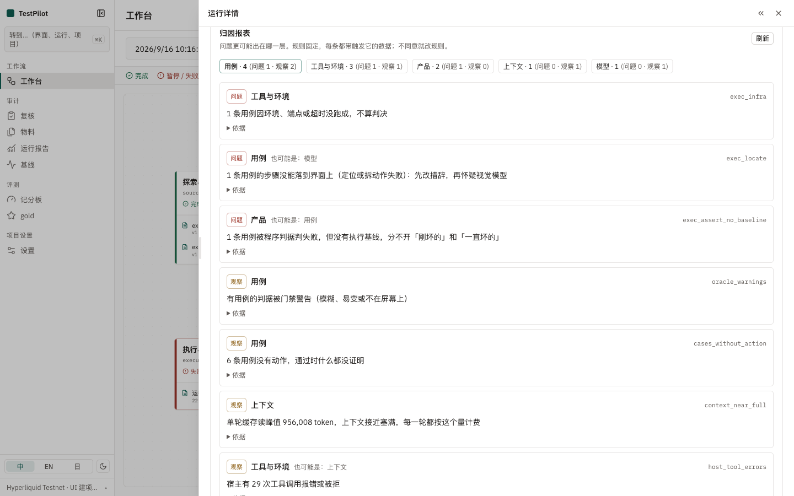

<h1 align="center">TestPilot</h1>

<p align="center">
  <b>A vertical harness agent for end-to-end UI testing: the model proposes; programs, the screen and people decide.</b>
</p>

<p align="center">
  <a href="LICENSE"></a>
  = 22" src="https://img.shields.io/badge/node-%3E%3D22-339933.svg">
  
  
</p>

<p align="center">
  <a href="README.md">简体中文</a> · English
</p>

---

**The 30-second version**

- **It has run against a real system; it is not a demo.** On the Hyperliquid testnet (a perpetual-futures exchange with real matching), one run produced 89 human-reviewed test cases. Execution preparation took three days and 13 batches, going from 25 to **70/89 cases verified**. The test account was checked at the end: no positions, no open orders, account value 984.02 → 979.90 (fees and slippage), nothing left behind.
- **Scores are computed by tools, never written by the model.** Gates, oracles, scoring and execution verdicts are deterministic code. The model may propose; it may not grade itself. When an agent once submitted forged run metadata (`provider` where `baseUrl` belongs, and a thinking flag reported the wrong way), provenance checking rejected it on the spot (it is now the adversarial fixture `fixtures/eval-cases/meta-forgery.json`).
- **Verdicts are read from the screen.** Cases drive the real UI and judge what the UI shows; asking the product's own API for a verdict is not allowed. "The API said OK but the row never appeared" cannot pass.
- **Every failure leaves evidence and feeds the next round.** Failures are attributed by fixed rules to one of six layers (model, context, tool, workflow, test case, product). Approved rejection reasons and newly seen interface facts flow back into the next generation automatically, but only take effect after a person agrees.

> I have built this alone since July 2026: 353 commits, about 118k lines of TypeScript including tests, 1,878 automated tests passing.
> Every number below names its source (run id, report, commit) so you can check it; what failed or is not done yet is written down in [the honest part](#the-honest-part-what-failed-and-what-is-not-done).

---

## Contents

1. [The problem](#the-problem)
2. [How I understand harness agents, and how that shows up here](#how-i-understand-harness-agents-and-how-that-shows-up-here)
3. [Architecture](#architecture)
4. [Module design](#module-design)
5. [Results and evidence](#results-and-evidence)
6. [Datasets and process data usable for training](#datasets-and-process-data-usable-for-training)
7. [What comes next](#what-comes-next)
8. [Quick start](#quick-start)
9. [Documentation](#documentation)

---

## The problem

Letting an LLM write E2E tests usually ends in "all green, nothing proven". Before building this I measured three kinds of problem:

| Problem | What it looks like | What this project does about it |
|---|---|---|
| **Fake green** | Self-healing retries until it passes; a judge model glances at a screenshot and says "fine". The same four cases, run three times, passed a different one each time (recorded in the design notes of `exec/oracle.ts`) | Tiered oracles: whatever a program can decide, a program decides; a model's verdict needs several samples and a statistical rule; "unobservable" is kept apart from pass and fail |
| **Broken provenance** | 66 cases quoted 12 pieces of UI text; only 4 could be found in the requirement material ([measurement](docs/archive/spec/01-设计依据与实测数据.md)) | Every case carries `sourceRefs` pointing at source chunks the server actually delivered; UI text the materials never mention gets flagged by the gate |
| **The model grades itself** | Eval scores written into a file by the agent, never recomputed | Scoring, gates and verdicts are deterministic code; the run's models, skill version and materials hash are frozen in the ledger, and a run missing any of them is not scored |

---

## How I understand harness agents, and how that shows up here

My definition of a harness: **everything outside the model that decides whether the agent can be trusted.** I split it into six runtime responsibilities (after the survey [arXiv 2606.20683](https://arxiv.org/pdf/2606.20683)), plus the two cells a vertical domain adds and that are hardest: **grounding** and **artifact reuse**. General agent frameworks give you the skeleton of the first six; the last two you have to build.

| Responsibility | Question | How TestPilot does it | Code |
|---|---|---|---|
| **Observation** | How is the system under test perceived | Two inputs: requirement material (spec), or exploration in a real browser driven by a rule-pack charter (explore), recording controls, state transitions and page text screen by screen | `harness-testing/src/exec/interactive.ts`, `domain/charter.ts` |
| **Context** | What reaches the model, when, how much | Materials frozen at run start; retrieval delivered within a budget and **every delivery audited** (replacing blind token trimming); run-wide material sent once; execution semantics always on, guides read on demand, one level deep | `server/src/retrievalAudit.ts`, `runStages.ts::loadRunInstructions`, `preparationGuidance.ts` |
| **Control** | Who decides the next step | A server-side stage machine; **the server splits work units, the planner may only claim them**; budgets, pause, resume, cancel; freezing the module tree and reviewing cases are human-only gates | `workUnits.ts`, `workflowControls.ts`, `moduleStage.ts` |
| **Action** | How tools are called and outputs produced | The planner writes artifacts through MCP tools, every write schema-checked; the runner performs one UI action per step; a deny-list guard covers every request, redirect and new window | `packages/testpilot-mcp`, `exec/run.ts`, `guard.ts` |
| **State** | How long-horizon information survives | **The run ledger**: every artifact is an immutable, content-addressed revision with provenance references and an author (human / agent / system); the run's model, skill and material bindings are frozen at registration | `server/src/runLedger.ts` |
| **Verification** | On what grounds is it done, and right | Design gate, code gate, tiered oracles (text / count / decimal equation / cross-step readings / sampled judge), lifecycle cleanup checks, human review | `casegen/gate.ts`, `exec/oracle.ts`, `exec/decimalEquation.ts`, `exec/lifecycle.ts` |
| **Grounding** *(vertical)* | Can every output point back to a source | A case's `sourceRefs` must be chunks retrieved in this run; the `literal-unsourced` gate rule checks UI text against the domain reference and materials | `workUnits.ts`, `gate.ts` |
| **Reuse** *(vertical)* | Can outputs be kept, reused, parameterised | Preparation recipes become reusable only after two independent cases verify them; export to a standalone Playwright project; standard sets; counterexamples and interface facts flow back | `preparationExperience.ts`, `export.ts`, `standardSets.ts` |

Five principles run through all of it:

1. **The loop lives in the host; the scale lives in the tools.** Planning loops run in a mature host agent (Claude Code / Codex); scoring, gates and verdicts stay in deterministic code the host cannot touch.
2. **Verdicts come from the screen.** This is E2E testing, not API testing; the constrained-decoding oracle enum has no "ask the API" option at all.
3. **People sign the decisions that matter.** Freezing the module tree, approving or rejecting cases (rejection needs a reason), deciding regression candidates, accepting interface facts, freezing standard sets, switching the executor model — the server requires `human`, and host tools cannot even register these actions.
4. **Domain knowledge is data, not code.** Exchange rules and interface facts live in the project's rule pack and domain reference; `check:domain-neutral` keeps every domain word out of product code.
5. **Three honest outcomes.** Pass, fail and unobservable are recorded separately; infrastructure failures are not product failures; leftover resources stop the batch rather than pretend the account is clean.

---

## Architecture

### The pipeline of one run


```mermaid
flowchart TD
  S["Requirement material (spec)"] --> PM["Product model"]
  E["Explore the target site<br/>rule-pack charter"] --> PM
  PM --> MT["Module tree<br/>machine-checked: structure · refs · cycles"]
  MT --> FZ{{"👤 A person freezes the tree"}}
  FZ --> ST["User stories<br/>split into work units, claimed one by one"]
  ST --> SR{{"👤 If rules carry unconfirmed hypotheses: a person reviews candidate stories"}}
  SR --> TC["Text cases<br/>with provenance · oracles · lifecycle"]
  TC --> G1{"Design gate (deterministic score)"}
  G1 -- "fail: reopen the named units" --> TC
  G1 -- pass --> RV{{"👤 Human review: approve / reject (with reason) / edit"}}
  RV --> PR["Execution preparation<br/>probe → trial → repair; recipes set up and compensate"]
  PR --> EX["Formal execution<br/>real browser, verdicts from the screen"]
  EX --> RP["Report · six-layer attribution · regression candidates"]
  EX --> PW["Export a Playwright project"]
  RP --> LR["Learning loop<br/>counterexamples · interface facts · standard sets · executor evaluation"]
  LR -.->|"👤 takes effect only when a person agrees"| TC
```

### Processes and data


```mermaid
flowchart LR
  W["Web UI :5300"] <--> API["API server :5301<br/>stages · review · preparation · execution · guard"]
  API --- LG[("Run ledger<br/>immutable revisions + blobs")]
  API --- DB[("Main DB<br/>run records · baselines · project data")]
  API -->|"one workspace per run<br/>one-time token"| H["Planner host<br/>Claude Code / Codex"]
  H --> M["MCP server<br/>stage tools + host tools"]
  M -->|"HTTP, same API as the UI<br/>requests tagged as agent"| API
  API -->|"RPC, one case at a time"| R["runner process<br/>Midscene + browser"]
  R -->|"click · type · read the screen"| T["Target site"]
```

Two models, each with its own job: **planning** uses the host's own model (a signed-in local Claude Code / Codex); **execution** uses a vision model driven by Midscene (configured per project, swappable, evaluable). Once a run is registered, both are frozen together with its materials, rule pack and domain reference.

### Seven layers

| Layer | Directory | Responsibility |
|---|---|---|
| Web UI | `src/` | Renders runs, revisions, reviews and executions from the ledger; hosts the human decisions |
| API server | `server/src/` | Stage machine, ledger, work units, gates, review, preparation, execution scheduling, learning loop |
| Processes | `apps/agent`, `apps/runner` | Supervised child processes: planning orchestration, browser execution |
| Domain package | `packages/harness-testing` | Case schema and gate, oracles, runner, exploration, codegen, retrieval |
| Core | `packages/harness-core` | Model profiles and clients, process supervision and RPC, observability, eval statistics, run contracts |
| Host integration | `packages/testpilot-mcp`, `plugins/testpilot` | stdio MCP, skills and hooks; plugin copies are generated |
| Data | `server/.data/` | Main DB, run ledger and blobs, events, screenshots and reports |

Which file and function implements each feature, and how one run crosses the seven layers: [layered implementation](docs/v3/04-分层功能实现.md) (Chinese).

---

## Module design

| Module | Responsibility | Key design |
|---|---|---|
| **Run ledger** `runLedger.ts` | Single source of truth for all artifacts | Immutable content-addressed revisions; provenance refs must point at existing revisions; authors are human / agent / system; a finalized run is never re-judged by today's rules |
| **Work-unit loop** `workUnits.ts` | Hands big jobs to the planner in pieces | The server splits units from the frozen module tree; the planner can only claim; a failed gate reopens exactly the named units, and the rejection says what to change |
| **Design gate** `casegen/gate.ts` | Deterministic scoring of case quality | A dozen-plus rules: vague or volatile oracles, several actions in one step, provenance, negative-case ratio, UI-text provenance, cross-step reading order… the score is a product of two ratios, so it collapses when either half does |
| **Tiered oracles** `exec/oracle.ts` · `decimalEquation.ts` · `judge.ts` | Verdicts | Text / count / URL (tier 1); before/after relations, `reading` values carried across steps, table cells read by row (tier 2); a sampled judge with a statistical rule (tier 3). Interval arithmetic: what display precision cannot separate is "unobservable", never a pass |
| **Runner** `exec/run.ts` | Runs one case in a browser | One action per step; step-bound assertions checked on the spot; re-read when the UI lags; persistent overlays dismissed and retried; screenshot and page text for every step |
| **Lifecycle** `exec/lifecycle.ts` | What a case creates must be removed | Read-only vs controlled; resource identity, sessions, persisted settings (original → restore → on-screen check); unverified cleanup records a leftover and stops the batch, optionally re-checked by an environment read-only command |
| **Execution preparation** `preparation.ts` | Makes approved cases actually runnable | Admission verdict (impossible prerequisites stopped up front); probe → trial → repair; recipes set up prerequisites and compensate in reverse; only a runner receipt can mark a case verified |
| **Planner hosts** `claudecode.ts` · `plannerHost.ts` | Starts Claude Code / Codex as the planner | One workspace and one-time token per run; plugin with hooks; requests from the host process are tagged as agent and cannot reach human gates |
| **Learning loop** `regressionCandidates.ts` · `factCandidates.ts` · `standardSets.ts` · `standardEvaluation.ts` | Lets data feed back automatically | Rejection reasons become counterexamples frozen into the next run; new UI text becomes evidence-backed fact candidates; cases that passed real execution are frozen into standard sets; executor models are compared on a frozen set. **Collection is automatic; taking effect is human** |
| **Consistency checks** `scripts/check-*` | Rules that don't rely on discipline | Two prompt sources claimed rule by rule (drift), host coverage can only go up (host-parity), no domain words in code (domain-neutral), three-language UI copy (i18n), frozen runs re-scored bit for bit (replay) |

---

## Results and evidence

### Results on a real system

Target: **Hyperliquid testnet** (`app.hyperliquid-testnet.xyz`, real matching engine; mainnet is on the deny list — the same wallet holds real money there, so it is never allowed).

| Result | Numbers | Source |
|---|---|---|
| Reviewed cases from one run | 89 (P0 trading main line 38 / P1 margin and leverage 24 / P2 history and account 27) | run `run-03387545`; [final report](docs/reports/testnet-preparation-final-2026-09-27.md) |
| Cases verified by execution preparation, 13 batches over three days | 25 → 33 → 41 → 51 → 54 → 58 → 62 → **70 / 89** | [preparation baseline](docs/reports/prep-baseline-2026-09-28.md); commit `b6d0836` |
| Why the other 19 did not pass | 11 need preconditions the testnet cannot give (partial fills, fault injection, a second account) — **blocking them is correct**; the rest are oracle wording, product decisions waiting for a person, and design conflicts | same report §2 |
| Account after real trading | no positions, no open orders; 984.02 → 979.90 (fees and slippage) | same report, top |
| Lifecycle contract v2 | same stories, gate score **0 → 0.857** | [handoff guide §7 · 2026-09-24](docs/v3/09-执行目标与接手指南.md) |
| Module-planning contract completed | planner reading product source 15 → **0** times, turns 48 → 37, self-reported cost $6.39 → $3.29 (confounded: the baseline included exploration) | [handoff log 2026-09-16](docs/v3/history/09-交接日志-至2026-09-16.md) |
| Preparation node's always-on prompt | 9,011 → **3,325** characters (the rest moved to six on-demand guides; every rejection carries a fix) | [implementation doc §8](docs/v3/15-节点提示词与领域知识重构实施.md) |
| Cross-step reading oracle | validated on **201 real position-table screenshots** from the ledger: isolated "liq. price < entry price" held 52/52; found that the PNL and Mark columns are not priced at the same instant (9/201 disagree), hence a sign-only comparison | commit `67f18ec` |
| UI-text provenance gate | replayed offline on the 89 cases: 21 flagged against the materials of the time, 5 after adding measured interface facts | commit `1a9cea3` |
| Judge oracle | golden set 9 × 2 passes, 18/18 correct, zero disagreement across 54 samples | handoff guide §7; `fixtures/judge-golden/` |

### What you can check yourself

```bash
pnpm install --frozen-lockfile
pnpm typecheck && pnpm test      # 1,878 tests: harness-core 228 · harness-testing 834 · mcp 112 · agent 1 · runner 4 · server 699
pnpm test:hooks                  # 26 hook subprocess tests
node scripts/replay.mjs          # deterministic re-scoring of a frozen run, bit for bit
pnpm check:drift && pnpm check:domain-neutral && pnpm check:host-parity && pnpm check:i18n
```

- The full commit history is public (353 commits since 2026-07-04); recent commit messages state what failed first, then what changed, with sourced numbers.
- `fixtures/eval-cases/` holds **adversarial fixtures** — an honest run, forged metadata, poisoned material — to confirm the gates reject what they should and pass what they should.
- Screenshots are from the 2026-09-16 testnet run (34 stories, 115 cases):

| Workbench | Review | Attribution |
|---|---|---|
|  |  |  |

### The honest part: what failed and what is not done

- **Formal execution did not finish.** Of the 70 prepared cases, 24 have passed formal execution so far; the rest are stuck on executor-model free quota — three free tiers hit 402/429 one after another, and quotas reset weekly. That is infrastructure, not the cases or the product. Probing the executor's quota before a run starts was added because of this.
- **The first-trial pass rate was only 50.7%.** The largest failure class (18/51) was "a prerequisite needs a resource and the case does not say where it comes from". Execution semantics are now always on in the case node; the replay comparison after that change has not been run, so there is no number yet for how much it helped.
- **Early paired evaluations were not significant.** A discrimination experiment gave p = 0.375 (stage acceptance table at commit `f40b5ca`); judge-vs-human agreement was only κ = 0.235, with the judge systematically stricter (post-mortem in `harness-core/src/eval/semantic.ts`). That is where the "let a program decide whatever it can" principle comes from.
- **Only one target product so far.** Domain neutrality is enforced by a check script, but has not been proven on a second product.

---

## Datasets and process data usable for training

### Datasets

| Dataset | Size | Purpose | Who may change it |
|---|---|---|---|
| `benchmark/casegen/` | frozen gold 16 items (4 held out) + replay fixture | deterministic scoring and replay of case generation | gold, held-out and rubric are human-only and never enter a prompt |
| Standard sets (project data) | 24 cases can be drafted from `run-03387545` | compare executor models and other candidates on the same really-passed cases | drafted automatically, **frozen only by a person**, hashed and immutable once frozen |
| `fixtures/judge-golden/` | 9 items | calibrating the judge oracle | human |
| `fixtures/eval-cases/` | honest / forged / poisoned | adversarial evaluation of agent runs | human |
| `examples/hyperliquid-testnet/` | domain reference + rule pack (measured interface facts with evidence) | starting domain knowledge for a new project | human (takes effect once saved into a project) |

### Process data: every step is kept, already in a trainable shape

The run ledger stores every step of the pipeline as immutable revisions — **inputs, actions, observations, verdicts and human feedback** — linked to each other by provenance references:

| Data | Contents | Where | Possible use |
|---|---|---|---|
| Planning trajectories | per work unit: the frozen context (materials, retrieval deliveries, execution semantics, counterexamples) → model output → schema and gate verdicts → revisions after reopening | `context/*`, `units/*`, `validated/*`, `retrieval/*` revisions | supervised fine-tuning of the planner; gate verdicts as process rewards |
| Human preferences | approve / reject / edit events per case, every rejection with a reason; story review, regression and fact decisions | `case_approval_events`, `review/case/*`, `regression_suite`, `fact_candidates` | preference pairs (approved vs rejected + reason) |
| Execution trajectories | every preparation probe and trial: plan, step actions, **page text for every step**, screenshots, oracle results, lifecycle receipts | `preparation/<batch>/<case>/{probe-N,round-N}/{plan,result}`, `artifacts/` | training UI grounding and action models; oracle results as verifiable outcome rewards |
| Model calls | role, model, usage, latency and status of every call | `modelRequests` in results, run records | cost and stability analysis; model comparison |
| Failures and attribution | six-layer attribution signals, failure classes, reasons for "unobservable" | report revisions, execution results | failure classifiers; hard-example mining |
| Host sessions | the planner host's (Claude Code) full conversation and tool calls | local Claude Code session directory | tool-use trajectories; server rejections and how they were fixed |

For `run-03387545` alone: 13 preparation batches, 292 probes and 185 trials, each with step-by-step page text and verdicts.

**Boundaries**: gold, held-out data and rubrics never go into training or prompts. Secrets and wallet addresses of the target must be redacted; all data comes from the testnet. The script that exports this as training JSONL is not written yet — see the next section.

---

## What comes next

In priority order:

1. **Finish formal execution and the controlled comparisons.** Run the remaining 46 cases of `run-03387545` on an executor with quota; replay the stage-0 baseline before and after "execution semantics always on" and "preparation prompt slimming", compare first-trial pass rates and rejection counts, and roll back what did not help.
2. **Export the process data.** Write `export-trajectories`: ledger → JSONL as input → action → observation → verdict → human feedback, with redaction, held-out exclusion and a data card.
3. **Extend the learning loop to the planner side.** Today only the executor model evolves; next, prompt and preparation-guide candidates compete on the frozen standard set, with a person still deciding what ships.
4. **A second target product**, to show "domain knowledge is data" holds without code changes.
5. **Visible execution progress.** Per-case results are written only when a batch ends, so a batch cut off by quota shows only failed batches in the UI.
6. **Run the defect regression suite automatically**, and generate new cases from failure reasons (rejection reasons already reach generation as counterexamples).
7. **Authentication for local review.** A raw HTTP request with the agent header deliberately stripped can still impersonate the local operator.
8. **Readiness checks that look at the project's chosen planner host.** Today they can be all green while creating a run still fails.
9. **Ambiguous judge samples.** All 9 golden items are clear-cut, so "sampling exposes instability" has not been tested on data.
10. **Turn CI on.** All acceptance runs locally today.

The fuller list is in [handoff guide §4](docs/v3/09-执行目标与接手指南.md) and the [known gaps](docs/v3/02-工作流-横向与纵向.md) (§10), both in Chinese.

---

## Quick start

Prerequisites: Node.js 22+, pnpm 9/10, a signed-in [Claude Code](https://docs.anthropic.com/en/docs/claude-code) CLI (or Codex), and an OpenAI-compatible endpoint for a vision model that can locate elements, for Midscene.

```bash
git clone https://github.com/zyonlab/TestPilot.git testpilot && cd testpilot
pnpm install --frozen-lockfile
cp server/.env.example server/.env        # at least MIDSCENE_MODEL_BASE_URL / _API_KEY / _NAME
node scripts/testpilot-setup.mjs doctor   # lists what is missing
pnpm build:claude-plugin                  # builds the Claude Code plugin (Web-started runs load it automatically)
node scripts/testpilot-setup.mjs start    # API :5301 + Web :5300
```

Open http://localhost:5300: create a project, set the target URL and environment profile, choose the planner host, then start a run from the workbench.
You can also drive the whole flow from your own Claude Code session through the plugin. Installation, plugins, configuration and troubleshooting: [install and diagnostics](docs/v3/10-安装与诊断.md) and [Claude Code and Codex integration](docs/v3/14-Claude-Code与Codex接入实操.md) (Chinese).

> Only run it against environments you are allowed to test. Exploration and execution really click, submit and delete. The global deny list is `guard.denyHosts` in `server/harness.config.ts`; local review has no authentication, so do not expose the service to the internet.

---

## Documentation

Start at [docs/README.md](docs/README.md); the current docs are mostly in Chinese:

| To learn | Read |
|---|---|
| What the product does for whom (43 user stories, each with its code location) | [03 · user stories](docs/v3/03-用户故事.md) |
| Which layer and function each feature lives in | [04 · layered implementation](docs/v3/04-分层功能实现.md) |
| Processes, packages, pipeline, ledger, guard | [00 · architecture](docs/v3/00-架构.md) |
| Schema source of truth for every artifact | [01 · data contracts](docs/v3/01-数据契约.md) |
| How a run flows, where it waits for people, known gaps | [02 · workflows](docs/v3/02-工作流-横向与纵向.md) |
| Execution semantics, preparation guides, cross-step oracles, the learning loop — implementation and acceptance | [15 · implementation](docs/v3/15-节点提示词与领域知识重构实施.md) |
| Goals, status, next steps, and a handoff record for every change | [09 · handoff guide](docs/v3/09-执行目标与接手指南.md) |

`docs/v3/history/` holds early experiment reports, ledgers and design proposals, kept only for provenance; code comments that cite `docs/v3/history/NN §x` point there.

## Acknowledgements

[Midscene.js](https://midscenejs.com/) (vision-driven browser actions and assertions) · [Model Context Protocol](https://modelcontextprotocol.io/) (host integration) · [Playwright](https://playwright.dev/) (exported projects) · [React Flow](https://reactflow.dev/) (workbench)

## License

[MIT](LICENSE)
