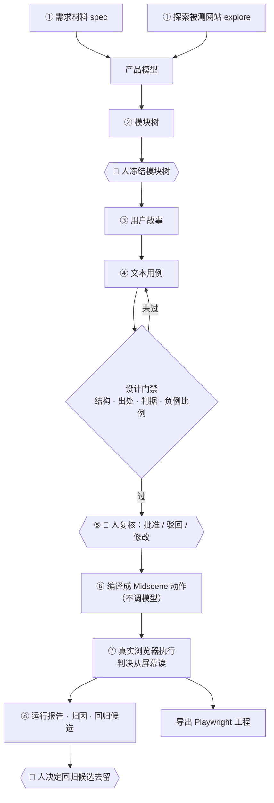
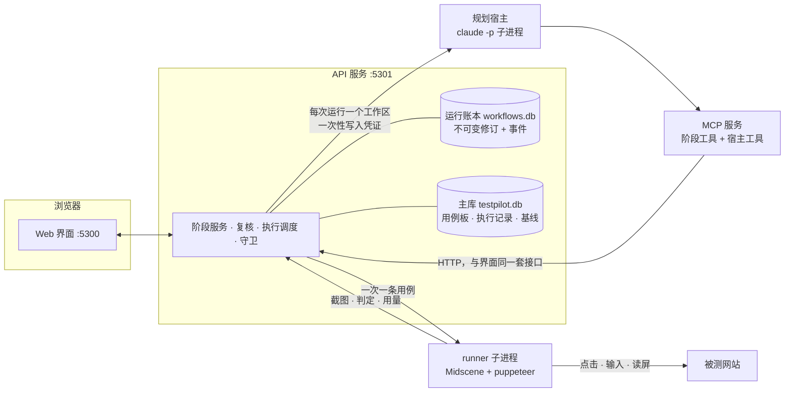

<h1 align="center">TestPilot</h1>

<p align="center">
  <b>把需求材料或对网站的探索，变成经人复核、判决落在屏幕上的端到端 UI 测试。</b>
</p>

<p align="center">
  <a href="LICENSE"></a>
  = 22" src="https://img.shields.io/badge/node-%3E%3D22-339933.svg">
  
  
</p>

<p align="center">
  简体中文 · <a href="README.en.md">English</a>
</p>

---

> **项目状态**：早期版本（0.1）。完整流程已在两个被测对象上跑通：本地自建的 [Vikunja](https://vikunja.io/) 和 Hyperliquid 测试网。数据格式和接口仍可能变化，升级前请看 [接手指南](docs/v3/09-执行目标与接手指南.md) 里的最近变更。

## 这是什么

TestPilot 读两种输入：一份需求材料（spec），或者对一个正在运行的被测网站的探索（explore）。它先整理出产品模型和模块树，再依次写出用户故事和文本用例，编译成 [Midscene](https://midscenejs.com/) 动作代码，在真实浏览器里执行，最后可以导出成 Playwright 工程。

它和「让 AI 直接写测试脚本」的区别：

- **人把关两处**：模型提出的模块树要人冻结，文本用例要人批准。只有批准过的用例才会编译和执行。
- **判决落在屏幕上**：用例驱动产品界面，再根据界面上看到的内容下判断，不调用被测站的接口。接口说成功、屏幕上却没有那一行，这种情况不会被判为通过。
- **机检门禁**：故事、用例、生成代码都要过确定性的检查（结构、出处、判据、覆盖）。分数由工具算，不由模型自己打。
- **领域知识是项目数据**：规则包、领域参考、环境画像都存在项目里，可以在界面的对话抽屉里聊出来，也可以自己指定。代码里不写死任何领域内容。
- **失败要能说清原因**：每一跑都有归因报表，按固定规则把问题归到模型、上下文、工具、工作流、用例、产品六层之一；判定失败的用例会进回归候选，由人决定要不要长期保留。

## 核心能力

| 能力 | 说明 |
|---|---|
| 产品模型与模块树 | 从材料或探索结果整理功能与规则，模型提出模块划分，人确认后冻结 |
| 用户故事与文本用例 | 按模块分单元生成；每条用例带风险理由、覆盖的验收准则、测试数据、设计依据（等价类、边界、判定表……）和判据 |
| 判据分级 | tier 1 文字 / 计数 / 地址，由程序判；tier 2 前后两次读数的关系；tier 3 由模型看屏幕判。生成内容（图片、摘要、配文）用 `judge` 判据：几句是/否条件、多次采样，按统计口径出结论 |
| 设计门禁 | 检查结构、出处、判据是否含糊或易变、负例比例、验收准则是否被覆盖 |
| 编译与执行 | 批准的用例编译成 Midscene 动作，在浏览器里执行，每步截图；每条用例都立视觉基线和性能基线，并保留 Midscene 报告 |
| 运行报告 | 每条用例分「概览、执行过程、判据、视觉基线、性能、原始数据」查看，可直接打开 Midscene 报告 |
| 归因报表与回归候选 | 见上一节「失败要能说清原因」 |
| 导出 | 生成可独立运行的 Playwright + Midscene 工程，判据与平台内同一套实现 |
| 宿主入口 | 通过 MCP 服务和插件，Claude Code（以及实验性的 Codex、Penguin）能完成界面上的操作；只有 3 项界面专属功能（对话抽屉、事件流等）除外，由 `pnpm check:host-parity` 守着 |

## 一次运行长什么样

下面这条线走一遍，就是 TestPilot 的全部。截图取自一次针对 [Hyperliquid 测试网](https://app.hyperliquid-testnet.xyz/trade) 的真实运行：由本机 Claude Code 规划，探索界面起步，产出 34 条用户故事、115 条文本用例，执行了其中 9 条。



整条流程停在三个地方等人：**冻结模块树、复核用例、决定回归候选**。其余部分服务端强制按阶段推进，每个阶段的产物都以不可变版本记进运行账本。

工作台就是这条线本身——八个阶段、各自的状态与产物，绿色是完成，红色是失败或等待：


### ① 新建运行：给它材料，或让它自己看

选规格文档或探索界面，填目标地址、领域知识、规则包和产物语言，再选谁来规划（默认本机 Claude Code）。运行一旦登记，材料、规则包、领域参考和规划运行时就被冻结绑定，之后不再变。


### ② 模块树：模型提议，人冻结 👤

模型按材料或探索结果切出至少两层的模块树，服务端先做机检（结构、引用、环路）。**冻结是人的决定**：树没冻结，故事阶段一个工作单元也领不到。冻结之后点「继续运行」，规划器接着往下走。


### ③ 用户故事：按模块分单元写

每个模块一个工作单元，故事带 Given/When/Then 形式的验收准则、引用的功能与规则，以及出处（材料里的哪一段）。模块标出故事数，为 0 时标黄——漏了哪块一眼能看见。


### ④ 文本用例与设计门禁

用例挂在验收准则上，带风险理由、测试数据、设计依据（等价类、边界、判定表……）和判据。门禁检查结构、出处、判据是否含糊或易变、负例比例、验收准则是否被覆盖；不过就按用例把工作单元重新打开，让模型改了再来。分数由工具算，不由模型自己打。

### ⑤ 复核：逐条批准或驳回 👤

左边列表可筛选、搜索、批量处理，右边是这条用例的全部依据：为什么测、覆盖了哪条准则、前置条件、测试数据、步骤与判定。可以直接改用例（改完批准失效，回到待复核）。**只有批准过的用例才进入下一步**；驳回时写下理由，会沉淀成反例候选。


### ⑥ 编译：不调模型

批准的用例逐句转成 Midscene 动作（`aiAction` / `aiWaitFor` / `aiAssert`），再过一道代码门禁。这一步是确定性的：同一批批准必须编出同一份产物，执行前还会重编比对，对不上就拒绝执行。


### ⑦ 执行：在真实浏览器里点，判决从屏幕读

每条用例起一个干净的浏览器会话。每一步都留下被测页面的截图、定位提示是否命中，以及挂在这一步之后的判定。下面这条是通过的用例 `C-MKT-BOOK-05`（「成交列表按时间倒序，第一行是最近一笔」，35.1 秒）：


Midscene 自己的报告可以逐帧回看，包括每次点击落在哪：


截图同时存为视觉基线，下次执行按步比对；性能也一样立基线。

### ⑧ 报告：失败要能说清是谁的问题

运行报告里，每条用例分「概览、执行过程、判据、视觉基线、性能、原始数据」查看，可直接跳到 Midscene 报告或回到复核。


归因报表按固定规则把问题归到六层之一——模型、上下文、工具与环境、工作流、用例、产品，每条都带触发它的规则和依据。上面那一跑 9 条里挂了 5 条，归因说得很清楚：1 条是环境没跑成不算判决，1 条是步骤没落到界面上（定位或拆动作失败），1 条被程序判据判挂但没有基线，分不开「刚坏的」和「一直坏的」。


判定失败的用例和写了理由的驳回会进回归候选，**批准与驳回是人的决定** 👤：缺陷批准后进回归集以后一直跑，反例批准后作为生成器的反例评测项。


## 系统组成



两种模型，各管各的，不会互相替代：

| 角色 | 由谁提供 | 做什么 |
|---|---|---|
| 规划 | 宿主自己的模型（默认是本机登录的 Claude Code） | 产品模型、模块树、故事、用例 |
| 执行 | Midscene，使用 `server/.env` 里配置的视觉模型 | 在浏览器里定位元素、执行动作、读屏幕、判定 tier 3 判据 |

每个阶段读什么、写什么、被哪些错误码拒绝，以及运行状态机、六条关键操作的时序图，都在 [工作流：横向与纵向](docs/v3/02-工作流-横向与纵向.md)。

## 快速开始

### 前置条件

- Node.js 22 或更高（安装依赖和启动服务要用同一个大版本）
- pnpm 9 或 10
- 已登录的 [Claude Code](https://docs.anthropic.com/en/docs/claude-code) CLI（`claude` 在 PATH 里，或者用 `TP_CLAUDE_BIN` 指定路径）
- 一个兼容 OpenAI 协议、支持视觉定位的模型端点，给 Midscene 用（参见 [Midscene 的模型配置](https://midscenejs.com/model-common-config)）

### 1. 安装

```bash
git clone https://github.com/zyonlab/TestPilot.git testpilot && cd testpilot
pnpm install --frozen-lockfile
```

这是一个 pnpm workspace，`server/`、`packages/*`、`apps/*` 会一起安装。

### 2. 配置执行模型

```bash
cp server/.env.example server/.env
```

编辑 `server/.env`，至少填好执行模型：

```bash
MIDSCENE_MODEL_BASE_URL=http://127.0.0.1:8000/v1   # 旧名 OPENAI_BASE_URL 也可以
MIDSCENE_MODEL_API_KEY=...                         # 旧名 OPENAI_API_KEY 也可以
MIDSCENE_MODEL_NAME=your-vl-model
```

检查环境是否齐全：

```bash
node scripts/testpilot-setup.mjs doctor      # 列出缺什么；--help 查看全部子命令
```

> 请用 `node scripts/testpilot-setup.mjs …`，不要用 `pnpm setup` / `pnpm doctor`：pnpm 自带同名命令，会抢先执行，`pnpm setup` 还会改你的 shell 配置。

### 3. 启动

```bash
node scripts/testpilot-setup.mjs start       # 同时启动 API 服务（:5301）和 Web 界面（:5300）
# 或者分两个终端：pnpm server:dev 与 pnpm dev
```

打开 http://localhost:5300 。

### 4. 安装 Claude Code 插件

插件提供 MCP 阶段工具、十个 skill 和门禁 hook。它由真源 `plugins/testpilot/` 生成，并且要引用本仓库里的 MCP 服务和 hook 脚本，所以**只能从本地 checkout 安装**，不要从 GitHub 地址直接装。

先生成插件目录（每次拉取新代码后也要重跑）：

```bash
pnpm build:claude-plugin          # 生成 plugins/testpilot-claude/
```

只从 Web 发起生成的话，做到这一步就够了：服务端起 `claude` 时会自动用 `--plugin-dir` 带上它。要在自己的 Claude Code 会话里用，选下面一种：

**方式 A：装成插件（推荐，所有会话可用）**

仓库根目录的 `.claude-plugin/marketplace.json` 把这个 checkout 声明成一个本地插件市场：

```bash
claude plugin marketplace add /path/to/testpilot     # 本仓库的绝对路径
claude plugin install testpilot@testpilot
claude plugin list                                   # 应看到 testpilot@testpilot  ✔ enabled
```

也可以在 Claude Code 里输入 `/plugin marketplace add /path/to/testpilot`，再输入 `/plugin install testpilot@testpilot`。装好后重启会话，`/mcp` 里应出现 `plugin:testpilot:testpilot` 且状态为已连接。

- 更新：拉取代码后重跑 `pnpm build:claude-plugin`，再执行 `claude plugin marketplace update testpilot` 和 `claude plugin update testpilot@testpilot`。
- 卸载：`claude plugin uninstall testpilot@testpilot`，然后 `claude plugin marketplace remove testpilot`。
- 移动或删除 checkout 后插件会失效，需要重新安装。

**方式 B：只在当前会话加载（开发时用）**

```bash
claude --plugin-dir plugins/testpilot-claude
```

**方式 C：装进某个工作目录（不带 hook）**

```bash
node scripts/testpilot-setup.mjs install --entry claude-code --workspace <你的工作目录>
node scripts/testpilot-setup.mjs uninstall --workspace <你的工作目录>   # 只删除安装后没改过的文件
```

这种方式把 MCP 写进 `.mcp.json`，skill 写进 `.claude/skills/`，另有 `.testpilot/` 目录；它不装 hook，阶段约束只靠服务端门禁。

三种方式用的都是同一个 API 服务（默认 `http://127.0.0.1:5301`，可用 `TP_SERVER_URL` 改），使用前要先启动它。更多细节见 [Claude Code 与 Codex 接入实操](docs/v3/14-Claude-Code与Codex接入实操.md)。

## 用法

### 从 Web 开始

流程与每一步的样子见[上面的走一遍](#一次运行长什么样)。开始之前要先做两件事：

1. 新建项目，填被测地址，配置环境画像（登录流程、视口、是否注入钱包等）。
2. 按需在「产品规则包」「领域参考」里补充领域知识，也可以在对话抽屉里聊出来。

然后在「工作台」发起运行即可。本地复核不需要登录，每次操作的来源和版本都会留痕。

### 从 Claude Code 开始

保持 API 服务（:5301）在运行，并按[上面的方式](#4-安装-claude-code-插件)装好插件。

在会话里用自然语言说明目标，比如「用 TestPilot 为这个项目做一次生成」。宿主会依次完成 模块 → 故事 → 用例 → 门禁，然后交给人复核，产物和 Web 里看到的是同一份。宿主接入的细节见 [Claude Code 与 Codex 接入实操](docs/v3/14-Claude-Code与Codex接入实操.md)。

### 实验性运行时

- **Codex**：`pnpm build:codex-plugin` 生成 `plugins/testpilot-codex/`，或者用 `install --entry codex` 做项目级安装。
- **Penguin**：需要 Node 24 和 Penguin 服务，用 `install --entry penguin --agent-id <id>` 安装；Web 发起的生成改由它规划时，设置 `TP_AGENT_RUNTIME=penguin`。

这两个运行时不在当前版本的验收范围内。

## 常用配置

| 变量 | 作用 | 默认 |
|---|---|---|
| `MIDSCENE_MODEL_BASE_URL` / `MIDSCENE_MODEL_API_KEY` / `MIDSCENE_MODEL_NAME` | 执行模型 | 必填 |
| `TP_AGENT_RUNTIME` | Web 发起的生成由谁规划：`claude-code` 或 `penguin` | `claude-code` |
| `TP_CLAUDE_BIN` | `claude` 可执行文件路径 | PATH 里的 `claude` |
| `TP_PLANNER_*` | 规划模型，只有 Penguin 或内部流水线模式需要 | — |
| `TP_EXECUTOR_MAX_CALLS` / `TP_RUN_MAX_MS` | 单次运行的模型调用与时长预算 | 见 `.env.example` |
| `DENY_HOSTS` | 追加禁止访问的地址 | — |
| `GUARD_STRICT=1` | 整机拦截不可逆步骤 | 关 |
| `TP_DATA_DIR` | 数据目录（多实例时隔离用） | `server/.data` |

项目设置页里保存的模型配置优先于环境变量。完整说明见 [安装与诊断](docs/v3/10-安装与诊断.md) 和 `server/.env.example`。

## 安全

- 请只对你有权测试的环境运行，最好是测试环境。探索和执行会真的点击、提交、删除。
- 全局只有一张禁止名单：`server/harness.config.ts` 里的 `guard.denyHosts`（`DENY_HOSTS` 只能往里追加）。名单上的地址在任何环境里都不会放行。
- 删除、完成、清理这类不可逆步骤**默认放行**，因为它们本身就是被测功能。如果要在整台机器上拦截，设置 `GUARD_STRICT=1`，这时规则包里的 `sideEffectLabels` 才会生效。
- 本地复核不做身份验证，只适合单机使用，不要把服务直接暴露到公网。

漏洞报告方式见 [SECURITY.md](SECURITY.md)。

## 仓库结构

```
src/                      Web 界面（React + Rsbuild，:5300）
server/                   API 服务（Express + SQLite，:5301）、运行时适配、导出
  harness.config.ts       并发、预算、guard 等配置
packages/
  harness-core/           模型调用、配置解析、运行契约、观测
  harness-testing/        领域建模、用例生成与门禁、判据、代码生成、执行器
  testpilot-mcp/          stdio MCP 服务，宿主 agent 通过它调用 TestPilot
apps/
  agent/  runner/         运行编排与浏览器执行进程
plugins/
  testpilot/              skills 与 hooks 的真源
  testpilot-claude/       生成的 Claude Code 插件
  testpilot-codex/        生成的 Codex 插件（实验性）
fixtures/                 测试与评测用的本地被测对象和数据
extensions/               Penguin 评估扩展（实验性）
scripts/                  安装诊断、插件构建、各项检查
docs/                     文档（入口见 docs/README.md）
```

## 开发与验收

```bash
pnpm typecheck && pnpm test     # 各包 tsc 与 vitest
pnpm test:hooks                 # hook 子进程测试
pnpm check:drift                # 提示词与 skill 逐条对得上；插件副本与真源一致
pnpm check:host-parity          # 新增的界面路由必须分类，宿主入口覆盖率不能下降
pnpm check:domain-neutral       # 产品代码与 skill 里没有写死的领域内容
pnpm check:i18n                 # 界面引用的文案都有中英日三语
```

修改了 `plugins/testpilot/skills/**` 或 `packages/harness-testing/src/casegen/prompts.ts` 之后，要提升 `plugins/testpilot/plugin.json` 里对应的 `skillVersions`，再重新生成插件（`pnpm build:claude-plugin`、`pnpm build:codex-plugin`），并确认 `pnpm check:drift` 通过。

CI 目前是手动关闭的（原因写在 `.github/workflows/ci.yml` 里），提交前请在本地跑一遍上面的检查。

## 文档

文档目前以中文为主，入口是 [docs/README.md](docs/README.md)：

- [架构](docs/v3/00-架构.md)：进程、包、阶段流水线、账本、守卫的代码落点
- [数据契约](docs/v3/01-数据契约.md)：各类产物的 schema 真源
- [工作流：横向与纵向](docs/v3/02-工作流-横向与纵向.md)：全流程、状态机与关键操作的时序图
- [执行目标与接手指南](docs/v3/09-执行目标与接手指南.md)：目标、范围、现状、下一步、最近变更
- [安装与诊断](docs/v3/10-安装与诊断.md)
- [Claude Code 与 Codex 接入实操](docs/v3/14-Claude-Code与Codex接入实操.md)

## 参与贡献

欢迎提 issue 和 PR。开始之前请读 [CONTRIBUTING.md](CONTRIBUTING.md)，参与交流请遵守 [行为准则](CODE_OF_CONDUCT.md)。

## 路线图与已知限制

- 当前版本的入口是 Web 和 Claude Code；Codex、Penguin 为实验性。
- 自进化、经验与反例库、子 agent 并行、Gold 与记分板、论文研究线已冻结，不在当前版本里。
- 回归集目前只是一份清单，还不会被执行自动带上；由失败原因或驳回理由生成新用例还没做。
- `judge` 判据的「多次采样能暴露不稳定」还缺模棱两可的样本来验证。
- 更完整的待办见 [接手指南 §4](docs/v3/09-执行目标与接手指南.md)。

## 致谢

- [Midscene.js](https://midscenejs.com/)：视觉驱动的浏览器操作与判定
- [React Flow（@xyflow/react）](https://reactflow.dev/)：工作台与模块图
- [Playwright](https://playwright.dev/)：导出工程的运行框架
- [Model Context Protocol](https://modelcontextprotocol.io/)：宿主 agent 接入

## 许可

[MIT](LICENSE)
