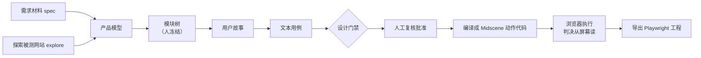

<h1 align="center">TestPilot</h1>

<p align="center">
  <b>把需求材料或对网站的探索，变成经人复核、判决落在屏幕上的端到端 UI 测试。</b>
</p>

<p align="center">
  简体中文 · <a href="README.en.md">English</a>
</p>

---

## 这是什么

TestPilot 读两种输入：一份需求材料（spec），或者对一个正在运行的被测网站的探索（explore）。它先整理出产品模型和模块树，再依次写出用户故事、文本用例，编译成 [Midscene](https://midscenejs.com/) 动作代码，在真实浏览器里执行，最后可以导出成 Playwright 工程。

它和「让 AI 直接写测试脚本」有这些不同：

- **模块树由人冻结。** 模型提出模块划分，人确认、冻结之后，故事和用例才往下生成，范围不会在中途漂移。
- **用例由人批准。** 文本用例要在「复核」里批准，批准过的才会编译、执行。
- **判决在屏幕上。** 产出的是端到端 UI 测试：用例驱动产品界面，再根据界面上看到的内容下判断，不调用被测站的接口。接口返回成功、屏幕上却没有那一行时，这类测试不会给出「通过」。
- **机检门禁。** 故事、用例和生成代码都要过确定性的门禁（结构、出处、判据、覆盖）。分数由工具算，不由模型自己打。
- **领域知识是项目数据。** 规则包、领域参考、环境画像都存在项目里，可以在界面的对话抽屉里聊出来，也可以自己指定。仓库不带任何领域预设。

## 流程



这条流程要用到两种模型：

| 角色 | 由谁提供 | 做什么 |
|---|---|---|
| 规划 | 宿主自己的模型（默认是本机登录的 Claude Code） | 产品模型、模块树、故事、用例 |
| 执行 | Midscene，使用 `server/.env` 里配置的视觉模型 | 在浏览器里定位元素、执行动作、读屏幕 |

## 快速开始

### 前置条件

- Node.js 22 或更高（安装依赖和启动服务要用同一个大版本）
- pnpm（仓库锁文件是 lockfile v9，用 pnpm 9 或 10）
- 已登录的 [Claude Code](https://docs.anthropic.com/en/docs/claude-code) CLI（`claude` 在 PATH 里，或者用 `TP_CLAUDE_BIN` 指定路径）
- 一个兼容 OpenAI 协议、支持视觉定位的模型端点，给 Midscene 用

### 1. 安装

```bash
git clone <this-repo> testpilot && cd testpilot
pnpm install --frozen-lockfile
```

这是一个 pnpm workspace，`server/`、`packages/*`、`apps/*` 都会一起装好。

### 2. 配置执行模型

```bash
cp server/.env.example server/.env
```

编辑 `server/.env`，至少填好执行模型：

```bash
MIDSCENE_MODEL_BASE_URL=http://127.0.0.1:8000/v1   # 旧名 OPENAI_BASE_URL 也可以
MIDSCENE_MODEL_API_KEY=...                         # 旧名 OPENAI_API_KEY 也可以
MIDSCENE_MODEL_NAME=your-vl-model
TP_AGENT_RUNTIME=claude-code                       # 不设时默认就是 claude-code
```

`TP_PLANNER_*` 只在 Penguin 运行时或内部流水线模式下才需要。Claude Code 会继承宿主自己的模型。项目设置页里保存的模型配置优先于环境变量。

检查环境是否齐全：

```bash
node scripts/testpilot-setup.mjs doctor --entry claude-code
```

### 3. 启动

```bash
pnpm server:dev   # API 服务，:5301
pnpm dev          # Web 界面，:5300
```

也可以用一条命令同时启动两个：`node scripts/testpilot-setup.mjs start`。然后打开 http://localhost:5300 。

### 4. 生成 Claude Code 插件

```bash
pnpm build:claude-plugin    # 等价于 node scripts/build-claude-plugin.mjs
```

这条命令从真源 `plugins/testpilot/` 生成 `plugins/testpilot-claude/`，里面有 skills、hooks（门禁）和 testpilot MCP 服务。Web 发起的生成会自动带上这个目录。

## 用法

### 从 Web 开始

1. 在「项目」里新建项目，填被测地址，并配置环境画像（登录前提、视口等）。
2. 在项目里放入需求材料，或者选择探索被测网站；按需在「产品规则包」「领域参考」里补充领域知识，也可以在对话抽屉里聊出来。
3. 在工作台发起一次生成运行。默认由本机 Claude Code 规划，新建运行表单里可以换运行时。一次运行登记之后，续跑时沿用同一个运行时。
4. 运行在模块树处停下，等你确认并冻结；之后依次生成故事和用例，并过设计门禁。
5. 在「复核」里逐条批准或退回用例。批准后，系统编译成 Midscene 动作代码并在浏览器里执行，结果在「运行报告」里查看，也可以导出成 Playwright 工程。

本地审核不需要登录。每次操作的来源和版本都会留痕。

### 从 Claude Code 开始

先保持 API 服务（:5301）在运行，然后二选一：

```bash
# 在本仓库里带门禁 hook 使用
claude --plugin-dir plugins/testpilot-claude

# 或者装进你自己的工作目录（写入 .mcp.json、.claude/skills/、.testpilot/）
node scripts/testpilot-setup.mjs install --entry claude-code --workspace <你的工作目录>
node scripts/testpilot-setup.mjs uninstall --workspace <你的工作目录>   # 只删除安装后没改过的文件
```

在会话里用自然语言说明你的目标，比如「用 TestPilot 为这个项目做一次生成」。`testpilot-run-c` skill 会带着宿主模型走完 模块 → 故事 → 用例 → 门禁 → 交人复核，产物和 Web 里看到的是同一份。

### 实验性运行时

- **Codex**：`pnpm build:codex-plugin` 生成 `plugins/testpilot-codex/`，或者用 `install --entry codex` 做项目级安装。
- **Penguin**：需要 Node 24 和 Penguin 服务，用 `install --entry penguin --agent-id <id>` 安装。

这两个运行时都不在初步交付的验收范围内。

## 安全

- 全局只有一张禁止名单：`server/harness.config.ts` 里的 `guard.denyHosts`（环境变量 `DENY_HOSTS` 只能往里追加）。名单上的地址在任何环境里都不会放行。
- 删除、完成、清理这类不可逆步骤**默认放行**，因为它们本身就是被测功能。运营方如果要在整台机器上拦截这类步骤，可以设置 `GUARD_STRICT=1`（或把 `guard.blockIrreversible` 设为 `true`），这时规则包里的 `sideEffectLabels` 才会生效。
- 请把被测对象放在测试环境里。已验收的被测对象是本地自建的 Vikunja 和 Hyperliquid 测试网（`https://app.hyperliquid-testnet.xyz/trade`）。

## 仓库结构

```
src/                      Web 界面（React + Rsbuild，:5300）
server/                   API 服务（Express + SQLite，:5301）、运行时适配、导出
  harness.config.ts       并发、预算、guard 等配置
packages/
  harness-core/           图执行、模型调用、配置解析、观测
  harness-testing/        领域建模、用例生成与门禁、代码生成、执行器
  testpilot-mcp/          stdio MCP 服务，宿主 agent 通过它调用 TestPilot
apps/
  agent/  runner/         运行编排与执行进程
plugins/
  testpilot/              skills 与 hooks 的真源
  testpilot-claude/       生成的 Claude Code 插件
  testpilot-codex/        生成的 Codex 插件（实验性）
extensions/               Penguin 评估扩展（实验性，初步交付不含）
scripts/                  安装诊断、插件构建、各项检查
docs/v3/                  现行文档
```

## 开发与验收

```bash
pnpm typecheck && pnpm test     # 各包 tsc 与 vitest
pnpm test:hooks                 # hook 子进程测试
pnpm check:drift                # 提示词与 skill 逐条对得上；插件副本与真源一致
pnpm check:host-parity          # 新 UI 路由必须分类，宿主入口覆盖率不能下降
pnpm check:domain-neutral       # 产品代码与 skill 里没有写死的领域内容
```

改了 `plugins/testpilot/skills/**` 或 `packages/harness-testing/src/casegen/prompts.ts` 之后，要跳版本 `plugins/testpilot/plugin.json` 里的 `skillVersions`，再重新生成插件（`pnpm build:claude-plugin`、`pnpm build:codex-plugin`），并确认 `pnpm check:drift` 通过。

## 文档

- [架构](docs/v3/00-架构.md)
- [数据契约](docs/v3/01-数据契约.md)
- [执行目标与接手指南](docs/v3/09-执行目标与接手指南.md)
- [安装与诊断](docs/v3/10-安装与诊断.md)
- [Claude Code 与 Codex 接入实操](docs/v3/14-Claude-Code与Codex接入实操.md)

## 路线图与不做的事

初步交付只包含 Web + Claude Code 这两个入口，以及上面列出的流程。自进化、经验与反例库、子 agent 并行、Gold 与记分板、论文研究线都已冻结，不在这次交付里。

## 许可

[MIT](LICENSE)
