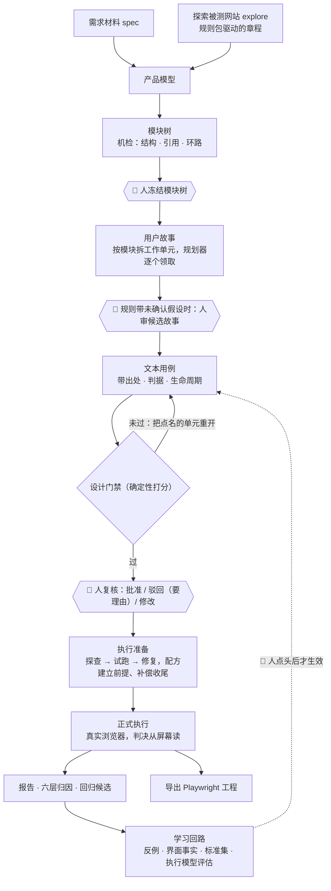
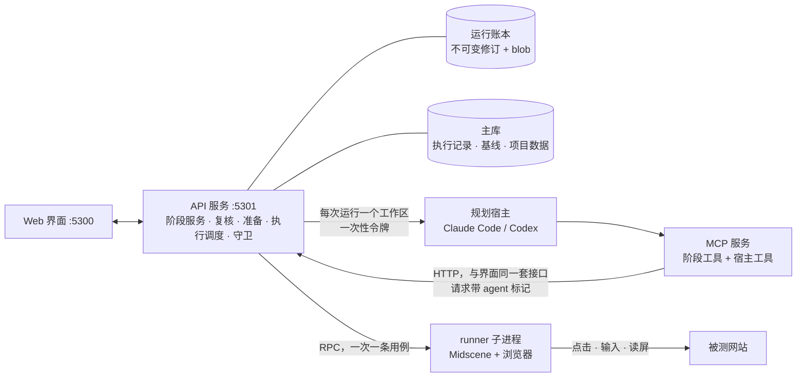

<h1 align="center">TestPilot</h1>

<p align="center">
  <b>一个做端到端 UI 测试的垂类 harness agent：模型负责提议，判决交给程序、屏幕和人。</b>
</p>

<p align="center">
  <a href="LICENSE"></a>
  = 22" src="https://img.shields.io/badge/node-%3E%3D22-339933.svg">
  
  
</p>

<p align="center">
  简体中文 · <a href="README.en.md">English</a>
</p>

---

**30 秒看点**

- **它在真实系统上跑过，不是 demo。** Hyperliquid 测试网（真实撮合的合约交易所）上，一次运行产出 89 条经人复核的用例。执行准备三天、13 批，从 25 条做到 **70/89 条验证通过**。测试账户最后核对：没有持仓、没有挂单，账户价值 984.02 → 979.90，差额是手续费与滑点，没有残留。
- **分数由工具算，不由模型写。** 门禁、判据、打分、执行判决都是确定性代码。模型能提议，不能给自己打分。它曾交来一份伪造的运行元数据（该写 `baseUrl` 的地方写了 `provider`，思考开关也报反了），被来源校验当场拒收（现在是对抗夹具 `fixtures/eval-cases/meta-forgery.json`）。
- **判决从屏幕读。** 用例驱动真实界面，再按界面上看到的内容判；不许调被测站接口下判断。「接口说成功、屏幕上却没有那一行」这种情况不会被判为通过。
- **每次失败都留证据，并反哺下一轮。** 失败按固定规则归到模型、上下文、工具、工作流、用例、产品六层之一；人批准过的驳回理由、执行里撞到的新界面事实，会自动回到下一次生成，但生效要人点头。

> 这是我一个人从 2026-07 做到现在的项目：353 次提交，约 11.8 万行 TypeScript（含测试），1,878 个自动测试全部通过。
> 下文每个数字都注明了出处（运行号、报告、提交），可以自己核对；做不到或失败了的也照实写在[诚实的部分](#诚实的部分失败了的没做到的)。

---

## 目录

1. [要解决的问题](#要解决的问题)
2. [我对 harness agent 的理解，以及它在这里怎么落地](#我对-harness-agent-的理解以及它在这里怎么落地)
3. [架构](#架构)
4. [模块设计](#模块设计)
5. [成果与证据](#成果与证据)
6. [数据集与可用于训练的过程数据](#数据集与可用于训练的过程数据)
7. [后续要完善的](#后续要完善的)
8. [快速开始](#快速开始)
9. [文档](#文档)

---

## 要解决的问题

让大模型直接写 E2E 测试，常见的结局是「一片绿，但什么都没证明」。我在做这个项目之前实测过三类问题：

| 问题 | 现象 | 这里的对策 |
|---|---|---|
| **假绿灯** | 自愈重试到通过就算绿；判官模型看一眼截图说「对」。同样四条用例跑三次，每次通过的不是同一条（记在 `exec/oracle.ts` 的设计注释里） | 判据分级：能由程序判的一律程序判；模型判的必须多次采样、按统计口径下结论；「没量到」和「通过」「失败」分开记 |
| **出处断了** | 一批 66 条用例引用了 12 条界面文案，只有 4 条能在需求材料里查到（[实测](docs/archive/spec/01-设计依据与实测数据.md)） | 每条用例带 `sourceRefs`，指向服务端检索分发过的原文块；界面文字写了材料里查不到的字，门禁当场点名 |
| **模型给自己打分** | 评测分数由 agent 写进文件，没人重算 | 打分、门禁、执行判决都是确定性代码；运行的模型、skill 版本、材料哈希冻结在账本里，缺一项就不打分 |

---

## 我对 harness agent 的理解，以及它在这里怎么落地

我对 harness 的定义：**模型之外、决定这个 agent 能不能被信任的一切运行时结构。** 我按六类运行时职责拆开看（参考综述 [arXiv 2606.20683](https://arxiv.org/pdf/2606.20683)），外加垂类特有、也最难的两格：**出处（grounding）**和**产物复用**。通用 agent 框架给得出前六格的骨架，后两格只能自己做。

| 职责 | 回答什么 | TestPilot 怎么做 | 代码 |
|---|---|---|---|
| **Observation 观察** | 怎么感知被测系统 | 两种入口：读需求材料（spec），或按规则包驱动的探索章程在真实浏览器里探索（explore），逐屏记录控件、状态转换与页面文字 | `harness-testing/src/exec/interactive.ts`、`domain/charter.ts` |
| **Context 上下文** | 什么信息、何时、以多大体量给模型 | 材料运行开始时冻结；检索按预算分发并**审计每一次分发**（替掉按 token 盲裁）；整跑不变的材料只发一次；执行语义常驻、说明按需读一层 | `server/src/retrievalAudit.ts`、`runStages.ts::loadRunInstructions`、`preparationGuidance.ts` |
| **Control 控制** | 谁决定下一步 | 服务端的阶段状态机；**服务端拆工作单元，规划器只能领**；预算、暂停、续跑、取消；冻结模块树、复核用例这些关口只能人过 | `workUnits.ts`、`workflowControls.ts`、`moduleStage.ts` |
| **Action 动作** | 怎么调工具、怎么产出 | 规划器通过 MCP 工具写产物，每次写入都过 schema；执行器一步只做一个界面动作；禁止名单守卫浏览器的每个请求、重定向和新窗口 | `packages/testpilot-mcp`、`exec/run.ts`、`guard.ts` |
| **State 状态** | 长时程的信息怎么留住 | **运行账本**：所有产物都是按内容寻址的不可变修订，带出处引用与作者身份（人 / agent / 系统）；运行的模型、skill、材料绑定在登记时冻结 | `server/src/runLedger.ts` |
| **Verification 验证** | 凭什么说做完了、做对了 | 设计门禁、代码门禁、分级判据（文字 / 计数 / 数值方程 / 跨步骤读数 / 多次采样判官）、生命周期收尾核对、人工复核 | `casegen/gate.ts`、`exec/oracle.ts`、`exec/decimalEquation.ts`、`exec/lifecycle.ts` |
| **Grounding 出处** *(垂类)* | 每条产出能不能指回出处 | 用例的 `sourceRefs` 必须是这次运行检索分发过的原文块；门禁 `literal-unsourced` 查界面文字是否在领域参考或材料里 | `workUnits.ts`、`gate.ts` |
| **Reuse 复用** *(垂类)* | 产物能不能沉淀、复用、参数化 | 准备配方经两条独立用例验证后才可复用；导出可独立运行的 Playwright 工程；标准测试集；反例与界面事实回流 | `preparationExperience.ts`、`export.ts`、`standardSets.ts` |

五条贯穿的设计原则：

1. **环在宿主，秤在工具。** 规划的循环交给 Claude Code / Codex 这样成熟的宿主 agent；打分、门禁、判决这杆秤留在确定性代码里，宿主碰不到。
2. **判决从屏幕读。** 这是 E2E 测试，不是接口测试；受限解码的判据枚举里根本没有「问接口」这一项。
3. **人签关键决定。** 冻结模块树、批准或驳回用例（驳回必须写理由）、决定回归候选、确认界面事实、冻结标准集、换执行模型，服务端都要求 `human`，宿主工具注册不到这些动作。
4. **领域知识是数据，不是代码。** 交易所的规则、界面事实都放在项目的规则包与领域参考里；`check:domain-neutral` 保证产品代码里一个领域词都没有。
5. **诚实的三态。** 通过、失败、没量到分开记；基础设施失败不算产品失败；残留资源宁可停批也不假装干净。

---

## 架构

### 一次运行的流水线


```mermaid
flowchart TD
  S["需求材料 spec"] --> PM["产品模型"]
  E["探索被测网站 explore<br/>规则包驱动的章程"] --> PM
  PM --> MT["模块树<br/>机检：结构 · 引用 · 环路"]
  MT --> FZ{{"👤 人冻结模块树"}}
  FZ --> ST["用户故事<br/>按模块拆工作单元，规划器逐个领取"]
  ST --> SR{{"👤 规则带未确认假设时：人审候选故事"}}
  SR --> TC["文本用例<br/>带出处 · 判据 · 生命周期"]
  TC --> G1{"设计门禁（确定性打分）"}
  G1 -- "未过：把点名的单元重开" --> TC
  G1 -- 过 --> RV{{"👤 人复核：批准 / 驳回（要理由）/ 修改"}}
  RV --> PR["执行准备<br/>探查 → 试跑 → 修复，配方建立前提、补偿收尾"]
  PR --> EX["正式执行<br/>真实浏览器，判决从屏幕读"]
  EX --> RP["报告 · 六层归因 · 回归候选"]
  EX --> PW["导出 Playwright 工程"]
  RP --> LR["学习回路<br/>反例 · 界面事实 · 标准集 · 执行模型评估"]
  LR -.->|"👤 人点头后才生效"| TC
```

### 进程与数据


```mermaid
flowchart LR
  W["Web 界面 :5300"] <--> API["API 服务 :5301<br/>阶段服务 · 复核 · 准备 · 执行调度 · 守卫"]
  API --- LG[("运行账本<br/>不可变修订 + blob")]
  API --- DB[("主库<br/>执行记录 · 基线 · 项目数据")]
  API -->|"每次运行一个工作区<br/>一次性令牌"| H["规划宿主<br/>Claude Code / Codex"]
  H --> M["MCP 服务<br/>阶段工具 + 宿主工具"]
  M -->|"HTTP，与界面同一套接口<br/>请求带 agent 标记"| API
  API -->|"RPC，一次一条用例"| R["runner 子进程<br/>Midscene + 浏览器"]
  R -->|"点击 · 输入 · 读屏"| T["被测网站"]
```

两种模型各管各的：**规划**用宿主自己的模型（本机登录的 Claude Code / Codex）；**执行**用 Midscene 驱动的视觉模型（项目里配置、可换、可评估）。运行一旦登记，这两者连同材料、规则包、领域参考一起冻结。

### 七层

| 层 | 目录 | 职责 |
|---|---|---|
| Web 界面 | `src/` | 画出账本里的运行、修订、复核与执行；承载人的决定 |
| API 服务 | `server/src/` | 阶段状态机、账本、工作单元、门禁调用、复核、准备、执行调度、学习回路 |
| 进程 | `apps/agent`、`apps/runner` | 受监管的子进程：规划编排、浏览器执行 |
| 领域包 | `packages/harness-testing` | 用例 schema 与门禁、判据、执行器、探索、代码生成、检索 |
| 通用底座 | `packages/harness-core` | 模型配置与客户端、子进程监管与 RPC、观测、评测统计、运行契约 |
| 宿主接入 | `packages/testpilot-mcp`、`plugins/testpilot` | stdio MCP、skills 与 hooks；插件副本由脚本生成 |
| 数据 | `server/.data/` | 主库、运行账本与 blob、事件、截图与报告 |

每个功能落在哪个文件的哪个函数，以及一次运行怎样穿过这七层，见 [分层功能实现](docs/v3/04-分层功能实现.md)。

---

## 模块设计

| 模块 | 职责 | 关键设计 |
|---|---|---|
| **运行账本** `runLedger.ts` | 所有产物的唯一真源 | 按内容寻址的不可变修订；出处引用必须指向已存在的修订；作者分人 / agent / 系统；已收尾的运行不拿今天的规则重判 |
| **工作单元循环** `workUnits.ts` | 把大任务切给规划器 | 服务端按冻结的模块树拆单元，规划器只能领；门禁没过就把被点名的单元重开，退回的信息里写明「改哪里、写什么」 |
| **设计门禁** `casegen/gate.ts` | 用例质量的确定性打分 | 十几条规则：判据含糊或易变、一步多动作、出处、负例比例、界面文字出处、跨步骤读数顺序……分数是两个比例的乘积，任何一半塌了分数就塌 |
| **分级判据** `exec/oracle.ts` · `decimalEquation.ts` · `judge.ts` | 判决 | 文字 / 计数 / 地址（tier 1）；前后读数关系、`reading` 记读数再跨步骤比较、按表格行读格子（tier 2）；判官多次采样按统计口径判（tier 3）。区间算术：显示精度内分不清的判「没量到」，不判通过 |
| **执行器** `exec/run.ts` | 在浏览器里跑一条用例 | 一步一个动作；挂在步骤上的断言当场判；界面没刷新就重读；常驻浮层关掉再试；每步截图、记页面文字 |
| **生命周期** `exec/lifecycle.ts` | 用例建的东西要收掉 | 只读 / 受控两类；资源身份、会话、持久设置（原值 → 还原 → 屏上核对）；收尾核不过就记残留、停批，可让环境的只读命令复核 |
| **执行准备** `preparation.ts` | 让批准的用例真的跑得起来 | 准备前裁决（前提做不出就当场挡）；探查 → 试跑 → 修复；配方建立前提、倒序补偿；只有 runner 的回执能判「验证通过」 |
| **规划宿主** `claudecode.ts` · `plannerHost.ts` | 起 Claude Code / Codex 当规划器 | 每次运行一个工作区与一次性令牌；插件带 hook；宿主进程里发往本服务的请求自动带 agent 标记，碰不到人的关口 |
| **学习回路** `regressionCandidates.ts` · `factCandidates.ts` · `standardSets.ts` · `standardEvaluation.ts` | 让数据自动反哺 | 驳回理由成为反例，随下一次运行冻结下发；新界面文字成为带证据的事实候选；真跑通过的用例冻结成标准集；执行模型在冻结集上比。**收集自动，生效要人** |
| **一致性检查** `scripts/check-*` | 让规矩不靠自觉 | 两套提示词逐条认领（drift）、宿主覆盖率只升不降（host-parity）、代码里没有领域词（domain-neutral）、三语文案齐全（i18n）、冻结运行重打分逐位相同（replay） |

---

## 成果与证据

### 在真实系统上的结果

被测对象：**Hyperliquid 测试网**（`app.hyperliquid-testnet.xyz`，真实撮合；主网在禁止名单上，同一个钱包在主网有真钱，永远不放行）。

| 结果 | 数字 | 出处 |
|---|---|---|
| 一次运行产出的已审核用例 | 89 条（P0 交易主链 38 / P1 保证金与杠杆 24 / P2 历史与账户 27） | 运行 `run-03387545`；[最终结果报告](docs/reports/testnet-preparation-final-2026-09-27.md) |
| 执行准备通过数，三天 13 批 | 25 → 33 → 41 → 51 → 54 → 58 → 62 → **70 / 89** | [准备基线](docs/reports/prep-baseline-2026-09-28.md)；提交 `b6d0836` |
| 没通过的 19 条，按原因 | 11 条是测试网给不出的前提（部分成交、故障注入、另一个账户），**判阻塞是对的**；其余是判据写法、待人定口径与设计冲突 | 同上报告 §2 |
| 真实交易后的账户 | 无持仓、无挂单；984.02 → 979.90（手续费与滑点） | 同上报告开头 |
| 生命周期契约 v2 | 同一批故事，门禁分 **0 → 0.857** | [接手指南 §7 · 2026-09-24](docs/v3/09-执行目标与接手指南.md) |
| 模块规划契约补齐之后 | 规划器读产品源码 15 → **0** 次，轮数 48 → 37，自报成本 $6.39 → $3.29（有混杂：基线含探索） | [交接日志 2026-09-16](docs/v3/history/09-交接日志-至2026-09-16.md) |
| 准备节点常驻提示词 | 9,011 → **3,325** 字符（其余改成按需读的 6 份说明；每个拒绝都带修法） | [实施文档 §8](docs/v3/15-节点提示词与领域知识重构实施.md) |
| 跨步骤读数判据 | 在账本里 **201 张真实持仓截图**上验证：逐仓「强平价 < 开仓价」52/52 成立；发现 PNL 与 Mark 列不是同一时刻的价（9/201 对不上），据此加了只比正负的比较 | 提交 `67f18ec` |
| 界面文字出处门禁 | 89 条用例离线复算：按当时材料点名 21 条，补上实测界面事实后只剩 5 条 | 提交 `1a9cea3` |
| 判官判据 | golden 9 条 × 2 遍，18/18 判对，54 次采样零分歧 | 接手指南 §7；`fixtures/judge-golden/` |

### 工程上可以自己核对的

```bash
pnpm install --frozen-lockfile
pnpm typecheck && pnpm test      # 1,878 个测试：harness-core 228 · harness-testing 834 · mcp 112 · agent 1 · runner 4 · server 699
pnpm test:hooks                  # 26 个 hook 子进程测试
node scripts/replay.mjs          # 冻结运行确定性重打分，分数与 expected 逐位相同
pnpm check:drift && pnpm check:domain-neutral && pnpm check:host-parity && pnpm check:i18n
```

- 提交历史完整公开（353 次，2026-07-04 起）；近期的提交信息都先写失败、再写改了什么，数字带来源。
- `fixtures/eval-cases/` 里有一组**对抗夹具**：诚实运行、伪造元数据、投毒材料，用来确认门禁拒该拒的、放该放的。
- 界面截图来自 2026-09-16 那次测试网运行（34 条故事、115 条用例）：

| 工作台 | 复核 | 归因报表 |
|---|---|---|
|  |  |  |

### 诚实的部分：失败了的、没做到的

- **正式执行没跑完。** 70 条准备通过的用例里，正式执行累计 24 条通过过；剩下的卡在执行模型的免费额度上：三家免费档先后撞上 402/429，额度按周恢复。这是基础设施问题，不是用例或产品问题。开跑前探测执行模型额度的功能，就是因此加的。
- **首轮试跑通过率只有 50.7%。** 最大一类失败（18/51）是「前提要的资源，用例没说清从哪来」。后来把执行语义常驻进用例节点的提示词；改完之后还没做回放对照，改善多少目前没有数据。
- **早期的配对评测没有显著结果。** 区分实验 p = 0.375（提交 `f40b5ca` 的阶段验收表）；判官与人工标注的一致性 κ 只有 0.235，判官系统性地比人严（复盘写在 `harness-core/src/eval/semantic.ts`）。这是后来「能程序判的一律程序判」这条原则的来由。
- **被测对象只有一个。** 领域中立是用检查脚本保证的，但还没在第二个产品上验证过。

---

## 数据集与可用于训练的过程数据

### 数据集

| 数据集 | 规模 | 用途 | 谁能改 |
|---|---|---|---|
| `benchmark/casegen/` | 冻结金标 16 项（4 项留出）+ 回放夹具 | 用例生成能力的确定性打分与回放 | 金标、留出集、评分说明只能人改，不进任何提示词 |
| 标准测试集（项目数据） | `run-03387545` 可起草 24 条 | 在同一批真跑通过的用例上比较执行模型等候选版本 | 自动起草，**只能人冻结**，冻结后带哈希不再变 |
| `fixtures/judge-golden/` | 9 条 | 判官判据的校准 | 人 |
| `fixtures/eval-cases/` | 诚实 / 伪造 / 投毒三类 | agent 运行级的对抗评测 | 人 |
| `examples/hyperliquid-testnet/` | 领域参考 + 规则包（带证据的界面实测事实） | 新项目的领域知识起点 | 人（存进项目才生效） |

### 过程数据：每一步都留下了，而且天然是可训练的形状

运行账本把整条流水线的每一步都存成不可变修订，**输入、动作、观察、判决、人的反馈**都有，并且彼此以出处引用相连：

| 数据 | 内容 | 存在哪 | 可以怎么用 |
|---|---|---|---|
| 规划轨迹 | 每个工作单元冻结的上下文（材料、检索分发、执行语义、反例）→ 模型产出 → schema 与门禁判决 → 被重开后的修订 | `context/*`、`units/*`、`validated/*`、`retrieval/*` 修订 | 规划器的监督微调；门禁判决当过程奖励 |
| 人的偏好 | 每条用例的批准 / 驳回 / 修改事件，驳回必带理由；故事审核、回归候选、事实确认的决定 | `case_approval_events`、`review/case/*`、`regression_suite`、`fact_candidates` | 偏好对（批准 vs 驳回 + 理由） |
| 执行轨迹 | 准备的每次探查与试跑：计划、逐步动作、**每一步的页面文字**、截图、判据结果、生命周期回执 | `preparation/<批次>/<用例>/{probe-N,round-N}/{plan,result}`、`artifacts/` | 界面定位与动作模型的训练；判据结果当可验证的结果奖励 |
| 模型调用 | 每次调用的角色、模型、用量、耗时、状态 | 结果里的 `modelRequests`、运行记录 | 成本与稳定性分析；换模型的对照 |
| 失败与归因 | 六层归因信号、失败分类、「没量到」的原因 | 报告修订、执行结果 | 失败分类器；困难样本挖掘 |
| 宿主会话 | 规划宿主（Claude Code）的完整对话与工具调用 | 本机 Claude Code 会话目录 | 工具使用轨迹；被服务端拒绝的次数与修法 |

以 `run-03387545` 一次运行为例：13 批准备，292 次探查、185 次试跑，每次都有逐步页面文字与判决。

**边界**：金标、留出集和评分说明不进训练，也不进提示词。被测站的密钥、钱包地址要脱敏；数据只来自测试网。把这些数据导成训练用 JSONL 的脚本还没写，见下一节。

---

## 后续要完善的

按优先级：

1. **跑完正式执行，补齐对照实验。** 在有额度的执行模型上跑完 `run-03387545` 剩下的 46 条；用阶段 0 的基线回放「执行语义常驻」「准备提示词瘦身」前后，拿首轮试跑通过率与被拒次数说话，没变好就回退。
2. **过程数据导出。** 写一个 `export-trajectories`：把账本按「输入 → 动作 → 观察 → 判决 → 人工反馈」导成 JSONL，带脱敏与留出集排除，附数据卡。
3. **学习回路扩到规划侧。** 现在只进化执行模型；下一步让提示词与准备说明的候选版本在冻结的标准集上比，胜出仍由人决定上线。
4. **第二个被测产品。** 验证「领域知识是数据」在另一个产品上成立，不改代码。
5. **执行进度可见。** 现在一批跑完才写逐条结果，中途被额度打断时，界面只看得到失败的批次。
6. **缺陷回归集自动执行**，并由失败原因生成新用例（驳回理由已作为反例交给生成）。
7. **本地审核的身份验证。** 刻意去掉请求头的裸 HTTP 仍能冒充本地操作员。
8. **就绪检查看项目选定的规划宿主。** 现在全绿也可能在建运行时失败。
9. **判官的模棱两可样本。** golden 9 条都界限分明，「多次采样能暴露不稳定」还没被数据检验。
10. **打开 CI。** 现在所有验收在本地跑。

更完整的清单见 [接手指南 §4](docs/v3/09-执行目标与接手指南.md) 与 [已知缺口](docs/v3/02-工作流-横向与纵向.md)（§10）。

---

## 快速开始

前置：Node.js 22+、pnpm 9/10、已登录的 [Claude Code](https://docs.anthropic.com/en/docs/claude-code) CLI（或 Codex），以及一个兼容 OpenAI 协议、支持视觉定位的模型端点给 Midscene 用。

```bash
git clone https://github.com/zyonlab/TestPilot.git testpilot && cd testpilot
pnpm install --frozen-lockfile
cp server/.env.example server/.env        # 至少填 MIDSCENE_MODEL_BASE_URL / _API_KEY / _NAME
node scripts/testpilot-setup.mjs doctor   # 列出缺什么
pnpm build:claude-plugin                  # 生成 Claude Code 插件（Web 发起运行时服务端会自动带上）
node scripts/testpilot-setup.mjs start    # API :5301 + Web :5300
```

打开 http://localhost:5300：新建项目，填被测地址、配置环境画像，选定规划宿主，然后在工作台发起运行。
也可以在自己的 Claude Code 会话里用插件驱动整条流程。安装、插件、配置项与排障见 [安装与诊断](docs/v3/10-安装与诊断.md) 和 [Claude Code 与 Codex 接入](docs/v3/14-Claude-Code与Codex接入实操.md)。

> 请只对你有权测试的环境运行。探索和执行会真的点击、提交、删除。全局禁止名单在 `server/harness.config.ts` 的 `guard.denyHosts`；本地复核不做身份验证，不要把服务暴露到公网。

---

## 文档

入口是 [docs/README.md](docs/README.md)，现行文档以中文为主：

| 想知道 | 看 |
|---|---|
| 产品能替谁做什么（43 条用户故事，每条带代码落点） | [03 · 用户故事](docs/v3/03-用户故事.md) |
| 每个功能落在哪一层、哪个函数 | [04 · 分层功能实现](docs/v3/04-分层功能实现.md) |
| 进程、包、流水线、账本、守卫 | [00 · 架构](docs/v3/00-架构.md) |
| 各产物的 schema 真源 | [01 · 数据契约](docs/v3/01-数据契约.md) |
| 一次运行怎么走、哪里等人、已知缺口 | [02 · 工作流](docs/v3/02-工作流-横向与纵向.md) |
| 执行语义、准备说明、跨步骤判据、学习回路的实施与验收 | [15 · 实施文档](docs/v3/15-节点提示词与领域知识重构实施.md) |
| 目标、现状、下一步、每次变更的交接记录 | [09 · 接手指南](docs/v3/09-执行目标与接手指南.md) |

`docs/v3/history/` 是早期的实验报告、台账与设计提案，只作追溯；代码注释里引用的 `docs/v3/history/NN §x` 就是设计来由。

## 致谢

[Midscene.js](https://midscenejs.com/)（视觉驱动的浏览器操作与判定）· [Model Context Protocol](https://modelcontextprotocol.io/)（宿主接入）· [Playwright](https://playwright.dev/)（导出工程）· [React Flow](https://reactflow.dev/)（工作台）

## 许可

[MIT](LICENSE)
