# 02 · 工作流：横向与纵向

> 2026-09-17 按 HEAD `e445d26` 的代码逐条核对。行号会漂移，以函数名为准；文档与代码冲突时以代码为准，并回来改这里。
>
> - **横向**：一次运行从创建到导出，经过哪些阶段、人在哪里把关、每一步读什么写什么、运行状态怎么变（§1–§4）。
> - **纵向**：五个关键操作从浏览器一路到账本、宿主进程、runner 和被测站点的完整调用链（§5–§9）。
> - 已知缺口集中在 §10。
> - 截图取自 2026-09-16 那次 Hyperliquid 测试网运行（Claude Code 规划、探索来源，115 条用例），图存在 `docs/assets/workflow/`。
>
> 阶段一览表与代码位置另见 [00 §5](00-架构.md#5-一次运行的阶段流水线)，产物 schema 见 [01](01-数据契约.md)。

## 0. 参与者与存储

| 参与者 | 位置 | 说明 |
|---|---|---|
| 浏览器 | `src/` | 所有请求走 `src/lib/workflowRuns.ts::workflowRequest`，前缀 `/api/projects/:pid/workflow-runs`。页面靠轮询刷新：`useProjectRuns` 每 3 秒一次，`WorkflowRuns` 每 4 秒一次 |
| API 服务 | `server/src/index.ts`，`runRoutes.ts` | 路由出错统一由 `runRoutes.ts::wrap` 处理：`GUARD_*` 返回 403，`LedgerError` 按自带的状态码与错误码返回，**其余异常一律变成 400 `run_request_invalid`** |
| 账本库 | `workflows.db`，正文在 `revision-blobs/` | `wf_runs`、`wf_run_registrations`、`artifact_revisions`、`workflow_events`、`workflow_node_states`、`workflow_controls`、`run_work_units`、`run_retrievals`、`reviewed_case_heads`、`case_approval_events/heads`、`decision_outbox`、`workflow_executions`、`role_spend`、`regression_candidates`、`regression_suite`、`run_memory` |
| 主库 | `testpilot.db`（`server/src/db.ts`） | `test_cases`（项目用例板）、`runs`（单条执行记录）、`baselines`、`perf_baselines`、`case_revision_bindings`、`run_write_grants`、`run_model_snapshots` |
| 规划宿主 | `server/src/claudecode.ts` | 每次运行起一个 `claude -p` 子进程，工作区在 `.data/host-workspaces/<runId>` |
| MCP 进程 | `packages/testpilot-mcp` | 由宿主拉起。阶段工具经 `run-gateway.ts` 带 Bearer 令牌转发，宿主工具（`host/registry.ts`）走 UI 同一套 HTTP 接口 |
| runner | `apps/runner` | 一次只跑一条用例，内部起 Midscene 与 puppeteer |
| 执行模型代理 | `harness-core/src/model/role-proxy.ts` | runner 内的本地 HTTP 代理，负责计数、预算和上游重试 |

---

# 横向

## 1. 全流程

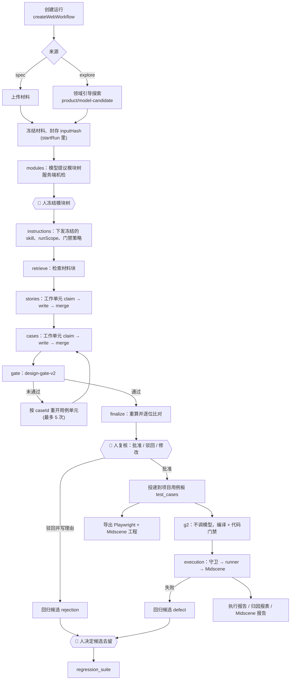
```mermaid
flowchart TD
  create["创建运行<br/>createWebWorkflow"] --> src{"来源"}
  src -- spec --> spec["上传材料"]
  src -- explore --> exp["领域引导探索<br/>product/model-candidate"]
  spec --> seal["冻结材料、封存 inputHash<br/>(startRun 里)"]
  exp --> seal
  seal --> modules["modules：模型提议模块树<br/>服务端机检"]
  modules --> freeze{{"👤 人冻结模块树"}}
  freeze --> ins["instructions：下发冻结的 skill、runScope、门禁策略"]
  ins --> ret["retrieve：检索材料块"]
  ret --> stories["stories：工作单元 claim → write → merge"]
  stories --> cases["cases：工作单元 claim → write → merge"]
  cases --> gate["gate：design-gate-v2"]
  gate -- 未通过 --> reopen["按 caseId 重开用例单元<br/>(最多 5 次)"] --> cases
  gate -- 通过 --> fin["finalize：重算并逐位比对"]
  fin --> review{{"👤 人复核：批准 / 驳回 / 修改"}}
  review -- 驳回并写理由 --> cand["回归候选 rejection"]
  review -- 批准 --> board["投递到项目用例板 test_cases"]
  board --> g2["g2：不调模型，编译 + 代码门禁"]
  g2 --> exec["execution：守卫 → runner → Midscene"]
  exec -- 失败 --> cand2["回归候选 defect"]
  cand --> decide{{"👤 人决定候选去留"}}
  cand2 --> decide
  decide --> suite["regression_suite"]
  exec --> report["执行报告 / 归因报表 / Midscene 报告"]
  board --> export["导出 Playwright + Midscene 工程"]
```

人把关的只有三处：**冻结模块树、复核用例、决定回归候选**。服务端对这三处都要求操作者是人（`actor.kind === "human"`），但「人」的判定方式是「请求不带 `Authorization` 头」，见 §10-1。

## 2. 各阶段读写

| 阶段 | 由谁推进 | 读 | 写 | 主要拒绝码 |
|---|---|---|---|---|
| 创建 `POST /` | 浏览器 | 请求体、项目规则包、领域参考 | `knowledge/*`、`knowledge/rulepack/*`，上传文件，可选 `product/model-candidate`、`validated/stories`；主库 `run_model_snapshots` | `explore_host_denied`、`spec_materials_required`、`explore_url_required`、`invalid_rule_pack`、`work_units_require_product_model`、`imported_stories_require_work_units`、`workflow_start_conflict`、`web_planner_runtime_unsupported`、`planner_runtime_unavailable:claude-code` |
| source | 服务端 `launchSource` | 规则包（roles 含 source）、`knowledge/*` | `context/source`、`exploration/observations`、`exploration/report`、`product/model-candidate`，可选 `report/exploration-partial` | `bound_rule_pack_hash_mismatch`、`exploration_returned_no_observations` |
| 冻结材料 | 服务端 `penguinRun.ts::startRun` | 上传目录 | `material`，封存 `inputHash` | — |
| modules | 规划器 `plan_modules` | 材料分节、产品模型 | `validated/modules`（`frozen:false`） | `begin_stage_required`、`module_plan_frozen` |
| modules/freeze | **人** | modules 回执 | 回执改为 `frozen:true`，节点 done；**不产生新修订** | `module_plan_freeze_requires_human`、`modules_required` |
| instructions | 规划器 | 已封存材料、skills、记忆、runScope | `validated/instructions`，钉住门禁策略 | `inputs_not_sealed`、`installed_skills_changed_register_new_run` |
| retrieve | 规划器 | 已封存材料 | `run_retrievals` 表（不是修订）；**不检查 begin_stage** | `instructions_required` |
| stories / cases | 规划器，经工作单元 | 冻结的模块树、词表、检索块；cases 还读 `validated/stories` | `run_work_units`，合并后写 `validated/stories`、`report/acceptance-index`、`validated/cases` | `module_plan_freeze_required`、`retrieve_spec_required`、`unit_not_claimed`、`units_incomplete`、`stories_frozen_after_case_design`、`cases_stories_revision_mismatch`、`stage_requires_units` |
| gate | 规划器 | cases、stories、钉住的策略 | `validated/gate`（回执带 `casesRevision`），可能重开单元 | 未通过时返回 blocked |
| finalize | 规划器 | 四份回执 | `validated/finalize`，运行进入 `waiting_review` | `gate_stale_rerun_required`、`gate_not_passed`、`cases_validation_failed` |
| review | **人** | finalize 后的 cases | `review/case/<id>`、`case_approval_*`、`decision_outbox` → 主库 `test_cases` | `finalized_skill_run_required`、`review_revision_conflict`、`review_case_identity_frozen` |
| g2 | 人或持令牌的宿主 | 已批准的复核修订 | `g2/v2/<approvalsHash>-<compilerHash>` | `approved_cases_required`、`case_revision_not_approved` |
| execution | 人或持令牌的宿主 | code 修订（每次都会重编比对）、环境与密钥、`exploration/report` | `workflow_executions`、`execution/<id>`；主库 `runs`、基线；`role_spend`；回归候选 | `execution_blocked_by_code_gate`、`execution_recompiles_differently`、`workflow_execution_active`、`environment_missing`、`unresolved_placeholders`、`GUARD_HOST`、`GUARD_IRREVERSIBLE` |

## 3. 运行状态机（`wf_runs.status`）

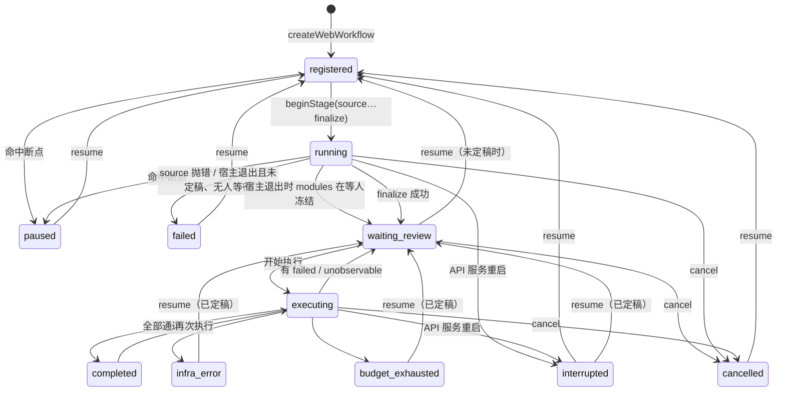
```mermaid
stateDiagram-v2
  [*] --> registered: createWebWorkflow
  registered --> running: beginStage(source…finalize)
  registered --> paused: 命中断点
  running --> paused: 命中断点
  running --> failed: source 抛错 / 宿主退出且未定稿、无人等待
  running --> waiting_review: 宿主退出时 modules 在等人冻结
  running --> waiting_review: finalize 成功
  running --> interrupted: API 服务重启
  paused --> registered: resume
  failed --> registered: resume
  interrupted --> registered: resume
  waiting_review --> registered: resume（未定稿时）
  waiting_review --> executing: 开始执行
  executing --> completed: 全部通过
  executing --> waiting_review: 有 failed / unobservable
  executing --> infra_error
  executing --> budget_exhausted
  executing --> interrupted: API 服务重启
  infra_error --> waiting_review: resume（已定稿）
  budget_exhausted --> waiting_review: resume（已定稿）
  interrupted --> waiting_review: resume（已定稿）
  completed --> executing: 再次执行
  waiting_review --> cancelled: cancel
  running --> cancelled: cancel
  executing --> cancelled: cancel
  cancelled --> registered: resume
```

要点：

- **写入点**：`registered` 由 `runLedger.ts::register` 写；`running` 由 `workflowControls.ts::beginStage` 写，只对 source 到 finalize 这六个节点生效，modules、g2、execution 不改运行状态；`waiting_review` 由 `runStages.ts::finalizeRun` 写；执行阶段的状态都由 `workflowExecution.ts::phase` 写，映射是 running→`executing`、passed→`completed`、failed/unobservable→`waiting_review`，其余原样写入；`interrupted` 在服务启动时由 `graphs.ts::reconcileOrphanedRuns`（规划）和 `recoverWorkflowExecutions`（执行）写；`blocked` 表示启动时账本完整性校验没过。
- **宿主进程退出后怎么判**：`penguinRun.ts::finish`。已定稿记为 `waiting_review`；有节点处于 `waiting_review`（通常是 modules 在等人冻结）也记为 `waiting_review`；其余记为 `failed`。Claude Code 的退出码不参与判定（`claudecode.ts` 只记 `exited`），见 §10-3。
- **复核不改变运行状态**，只改 `review` 节点。g2 也不看 review 节点，只看每条用例有没有批准记录。
- **重启后**：只有 `runtime === "penguin"` 的运行会被自动接回（`penguinRun.ts::reconcilePenguinRuns`），Claude Code 运行会一直停在 `interrupted`，要人点「继续运行」。

### 3.1 节点状态

`workflow_node_states` 每个 `(runId, node)` 只留一行，`(attempt, sequence)` 更大的事件覆盖旧的（`runLedger.ts::appendEvent`）。实际上 `attempt` 恒为 0，重试靠 `sequence` 递增来覆盖。`queued` 这个取值在服务端没有写入点。

| 节点 | 可能的 phase |
|---|---|
| source | running → done / failed |
| modules | running → blocked（机检 error）/ waiting_review（提议通过）→ done（人冻结） |
| instructions、stories、cases | running → done |
| gate | running → done / blocked（未通过） |
| finalize | running → waiting_review |
| review | waiting_review → done（全部有决定） |
| g2 | running → done（`ready_to_execute`）/ blocked |
| execution | running → done（passed）/ cancelled / failed（其余情况） |
| 任意受控节点 | blocked，消息为 `Breakpoint: paused before execution` |

## 4. 暂停、断点、续跑、取消

- **断点**：`POST /:runId/controls`，只有人能设，只能设在还没跑过的节点上（否则 409 `breakpoint_requires_untouched_node`）。受控节点共九个，定义在 `workflowControls.ts:9`，`review` 不在其中。规划器下次 `begin_stage` 撞上断点时，节点记为 blocked，运行改为 `paused`，工具返回 `{status:"paused"}`，任务话术要求规划器看到后立即停止。
- **预算**：账本路径的预算不在 controls 里。规划预算见 `penguinRun.ts` 的 `unitRunBudget`，执行预算见 `workflowExecution.ts` 的 `caseRunBudget`（`runBudget.ts`）。`PATCH …/budget` 只属于 §4.2 的图系统。
- **续跑** `workflowOps.ts::resumeProjectWorkflow`：
  - 输入还没封存（source 没走完）：只允许从 failed、cancelled、paused、interrupted 续跑，续跑时重新执行 `launchSource`。
  - 已定稿：直接改回 `waiting_review`。前端在执行按钮前会自动先调一次 resume（`ExecutionControls.tsx`）。
  - 其余情况：清除断点，状态改为 `registered`，然后 `startWebRun({resumeStage: pausedAt ?? checkpoint.next})`，用同一个工作区、同一个令牌起新的宿主会话。
  - `checkpoint.next`（`workflowCheckpoint`）是第一个没做完的阶段。source 和 modules 只在「走过但没走完」时才会被选中；g2 和 execution 不参与检查点。
  - 以下状态续跑会报 409 `workflow_not_resumable`：registered、running、executing、completed、blocked。
- **取消** `cancelProjectWorkflow`：依次停掉规划进程（Claude Code 子进程收到 SIGTERM），把执行中的批次标为 cancelled，abort 对应的 controller，并通知所有 runner 取消，最后把运行改为 `cancelled`。没有「只取消执行」的路由。

### 4.1 门禁打回

`gateRun` 没过时，`workUnits.ts::reopenUnitsFromGate` 找出带 `caseId` 的 warn 级 finding，把对应的 cases 单元重置为 `pending`（`repair.round + 1`，`attempt` 达到 5 的单元不再重开）。规划器下次 `claim_unit` 时会拿到 `repairBrief`，重写、合并之后要重新 `begin_stage gate`。如果用例改了而门禁没重跑，finalize 会报 `gate_stale_rerun_required`。

### 4.2 另一套图执行系统 `/api/wf/runs`

这是 v1/v2 时代的 DAG 运行时（`harness-core/src/graph/runtime.ts::runGraph`），跑在 `apps/agent` 子进程里，网关代码在 `server/src/graphs.ts`。它**还没退役**：

- `TP_RUNTIME=graph` 是回滚开关（`index.ts:241`）。默认情况下，`POST /api/wf/runs` 走的也是宿主运行时。
- 配对评测（`evals.ts::runArm`）、节点重跑、`CodeLine` 的 repair、`ProductMap` 的 spec 视图、命令面板与 Evals 页的运行列表，仍然直接用它。
- **它和主流程共用 `wf_runs` 表与事件总线**：`wf.run.finished` 的订阅会用 payload 里的状态覆盖任何运行；`reconcileOrphanedRuns` 会把账本运行也改成 `interrupted`。改这两处时，两边要一起看。
- `src/pages/Workspace.tsx`（旧画布）和 `src/pages/Artifacts.tsx` 没有被任何文件 import，是死代码。

---

# 纵向

## 5. 从 Web 新建运行，由 Claude Code 规划

**界面**：工作台上方选择运行、打开运行详情或新建运行；中间是八个阶段组成的流程图，节点下挂着该阶段的产物，右下角可以缩放。

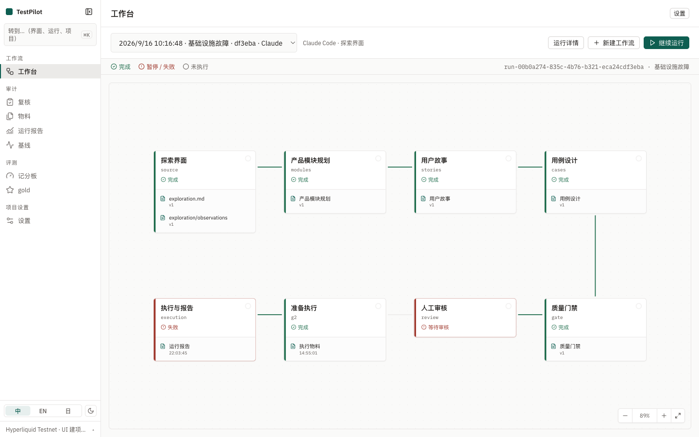
*工作台：阶段流程图，绿色为完成、红色为失败或等待*

点「新建工作流」后填写来源（规格文档或探索界面）、目标地址、领域知识、规则包、产物语言和规划运行时。

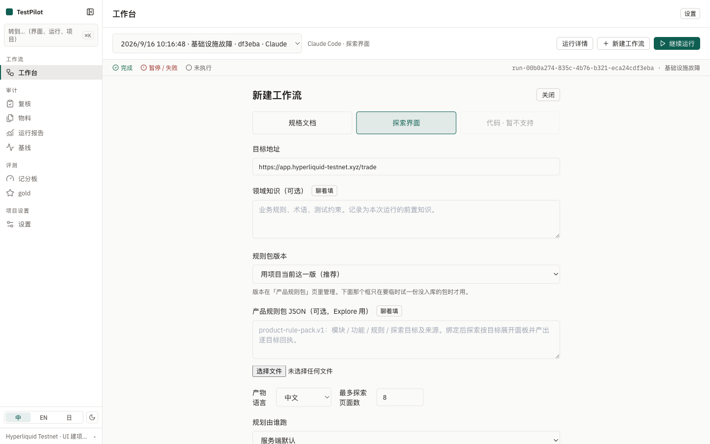
*新建工作流表单*

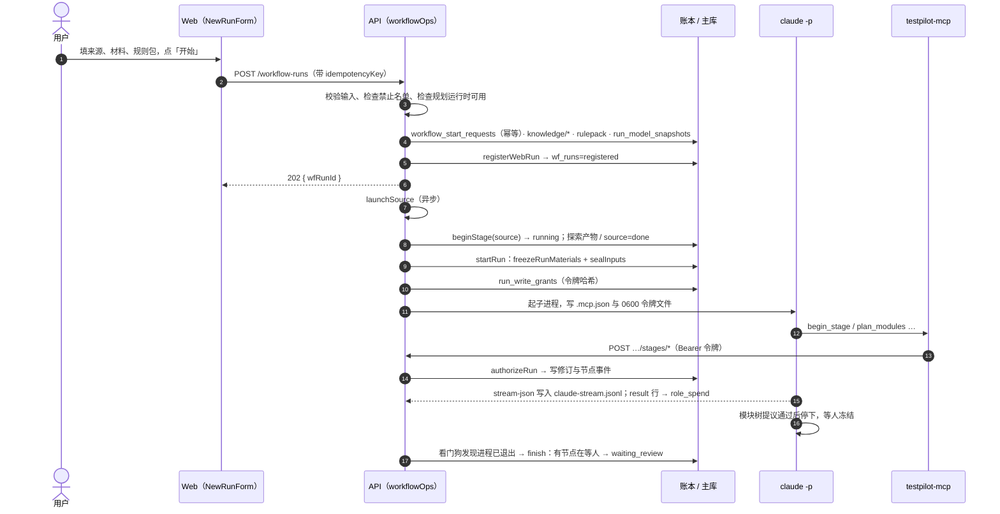
```mermaid
sequenceDiagram
  autonumber
  actor U as 用户
  participant W as Web（NewRunForm）
  participant A as API（workflowOps）
  participant L as 账本 / 主库
  participant C as claude -p
  participant M as testpilot-mcp
  U->>W: 填来源、材料、规则包，点「开始」
  W->>A: POST /workflow-runs（带 idempotencyKey）
  A->>A: 校验输入、检查禁止名单、检查规划运行时可用
  A->>L: workflow_start_requests（幂等）· knowledge/* · rulepack · run_model_snapshots
  A->>L: registerWebRun → wf_runs=registered
  A-->>W: 202 { wfRunId }
  A->>A: launchSource（异步）
  A->>L: beginStage(source) → running；探索产物 / source=done
  A->>L: startRun：freezeRunMaterials + sealInputs
  A->>L: run_write_grants（令牌哈希）
  A->>C: 起子进程，写 .mcp.json 与 0600 令牌文件
  C->>M: begin_stage / plan_modules …
  M->>A: POST …/stages/*（Bearer 令牌）
  A->>L: authorizeRun → 写修订与节点事件
  C-->>A: stream-json 写入 claude-stream.jsonl；result 行 → role_spend
  C->>C: 模块树提议通过后停下，等人冻结
  A->>L: 看门狗发现进程已退出 → finish：有节点在等人 → waiting_review
```

逐步说明与代码位置：

1. **表单**：`src/components/workbench/NewRunForm.tsx`，其中「工作单元」默认勾选（见 §10-2）。表单内容不变时复用同一个 `idempotencyKey`。
2. **`createWebWorkflow`**（`workflowOps.ts:30-107`）按顺序做这些事：
   1. 探索地址先过禁止名单（`explore_host_denied`）。
   2. 检查材料：重名、总大小、spec 至少一份。
   3. 校验规则包，用 `bindRulePack` 绑定。
   4. 如果导入了产品模型，检查它和规则包是否对得上。
   5. 检查开了工作单元的运行是否带产品模型：spec 来源又没有导入产品模型时，报 `work_units_require_product_model`（`workflowOps.ts:62`）。
   6. 用 `workflow_start_requests` 表做幂等：同一个键、内容不同时报 409 `workflow_start_conflict`。
   7. 确定规划运行时：Web 只接受 `claude-code` 和 `penguin`；本机找不到对应命令时报 `planner_runtime_unavailable`。
   8. `captureHostWebModels` 写执行模型快照。
   9. 上传文件落到 `.data/uploads/<runId>/`。
   10. `registerWebRun`。
   11. 异步调用 `launchSource`，接口立即返回 202。
3. **source**（`launchSource`）：spec 来源直接用材料；explore 来源走 `observeProduct`，中途失败时把已经采到的屏写成 `report/exploration-partial`。这里抛错会把 source 记为 failed、运行记为 `failed`（`workflowOps.ts:203`）。
4. **起宿主**（`penguinRun.ts::startRun` → `claudecode.ts::startRun`）：
   - 先冻结材料并封存 `inputHash`。这一步发生在这里，不在创建时。
   - 写运行令牌：主库只存哈希；明文写到 `.data/private-run-grants/<runId>.json`（权限 0600），`.mcp.json` 里只放环境变量 `TP_RUN_GRANT_FILE` 指向这个文件，**令牌本身不在 `.mcp.json` 里**。
   - 命令是 `claude -p … --output-format stream-json --verbose --permission-mode acceptEdits --allowedTools mcp__testpilot__* Read Write Edit "Bash(node *)" --mcp-config … --plugin-dir plugins/testpilot-claude`。
   - 任务话术来自 `runtime/skill-launch.ts`。
5. **阶段调用**：MCP 的阶段工具经 `run-gateway.ts` 转发，带 Bearer 令牌。服务端 `authorizeRun` 校验令牌：缺失返回 401 `run_credential_required`，不对返回 403 `run_credential_invalid`。然后 `requireStageStarted` 检查阶段是否已开始：运行被暂停、取消或中断时报 `run_requires_explicit_resume`，没调 `begin_stage` 时报 `begin_stage_required`。
6. **hooks**：`PreToolUse` 只拦 `Write|Edit|MultiEdit`，不拦 MCP 阶段工具，所以在 skill 模式下基本不触发。拦下的记录写到 `holds.jsonl`，不进账本。`Stop` hook（require-gate）会查 `stages/status`，最多提醒 3 次。
7. **结束**：`penguin.ts` 的看门狗在进程退出、超时（默认 60 分钟）或会话消失时回调 `finish`，状态按 §3 的规则确定。

## 6. 冻结模块树

**界面**：在工作台点「产品模块规划」节点，右侧抽屉里有「冻结这棵模块树」卡片。模块树等人冻结时这里是按钮；截图里这次运行已经冻结，卡片只显示结论。模块树本身在复核页顶部的「产品结构」里，也可以在模块节点的产物里看。

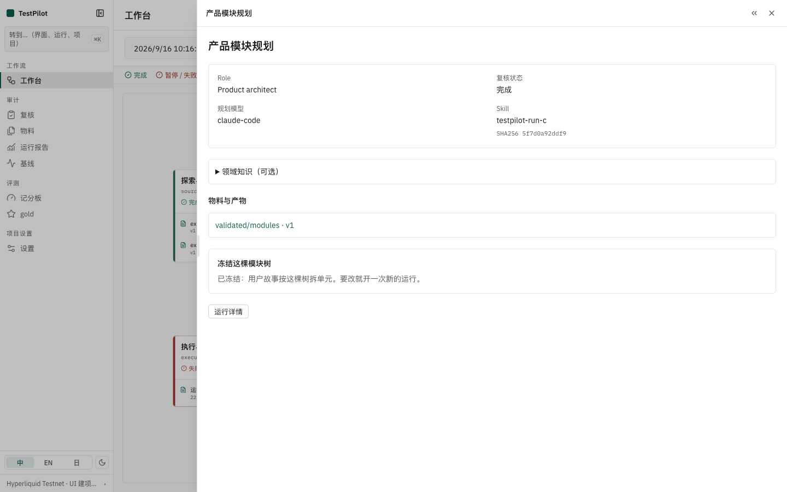
*模块节点详情：冻结卡片*

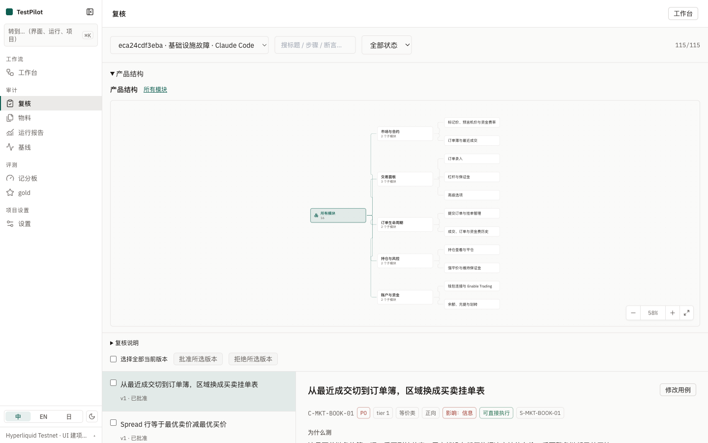
*产品结构：冻结后的模块树，点模块可筛选下方用例*

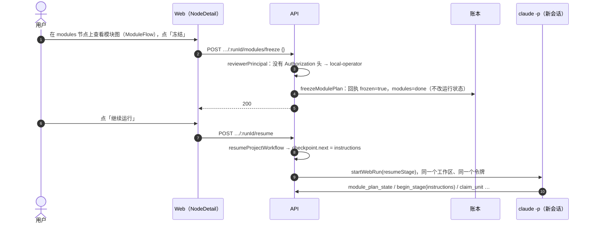
```mermaid
sequenceDiagram
  autonumber
  actor U as 用户
  participant W as Web（NodeDetail）
  participant A as API
  participant L as 账本
  participant C as claude -p（新会话）
  U->>W: 在 modules 节点上查看模块图（ModuleFlow），点「冻结」
  W->>A: POST …/:runId/modules/freeze  {}
  A->>A: reviewerPrincipal：没有 Authorization 头 → local-operator
  A->>L: freezeModulePlan：回执 frozen=true，modules=done（不改运行状态）
  A-->>W: 200
  U->>W: 点「继续运行」
  W->>A: POST …/:runId/resume
  A->>A: resumeProjectWorkflow → checkpoint.next = instructions
  A->>C: startWebRun(resumeStage)，同一个工作区、同一个令牌
  C->>A: module_plan_state / begin_stage(instructions) / claim_unit …
```

- 冻结按钮只在 modules 节点处于 `waiting_review` 时出现（`NodeDetail.tsx`）。请求体为空，界面上不能写备注。
- `reviewerPrincipal`（`reviewPrincipal.ts`）：带 `Authorization` 头的请求返回 403 `operator_action_required`，否则记为 `{kind:"human", id:"local-operator"}`。这只记录操作来源，不是身份认证（本地审核免认证，是 2026-09-10 的用户决定）。
- `freezeModulePlan`（`moduleStage.ts:184`）：没有模块树时报 `modules_required`。还没处理的 warn 级 finding 不阻止冻结。冻结只更新 `run_stage_receipts` 里的回执，不写新修订。
- **冻结之后规划器不会自己继续**，要人点「继续运行」。新会话通过 `module_plan_state`、`begin_stage`、`claim_unit` 得知树已冻结；树没冻结时，`claim_unit` 报 `module_plan_freeze_required`。

### 6.1 冻结之后：看用户故事

规划器按冻结的树逐个模块写故事。在工作台点「用户故事」节点下的产物，抽屉上半部分是模块树，每个模块标出故事数（为 0 时标黄），下面是故事列表，可以搜索。展开一条故事，可以看到它的目标、Given/When/Then 形式的验收准则、引用的功能与规则（`featureRefs`、`ruleRefs`），以及出处（材料里的哪一段）。

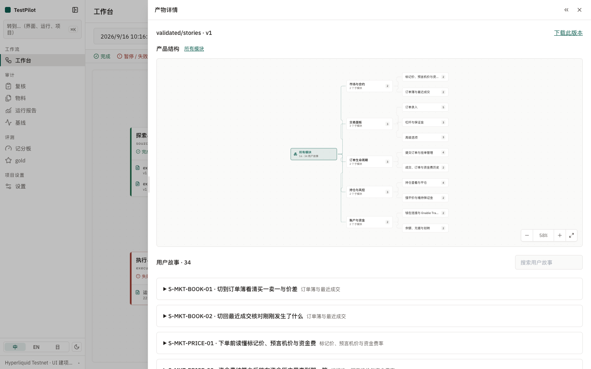
*用户故事产物：模块树与故事列表*

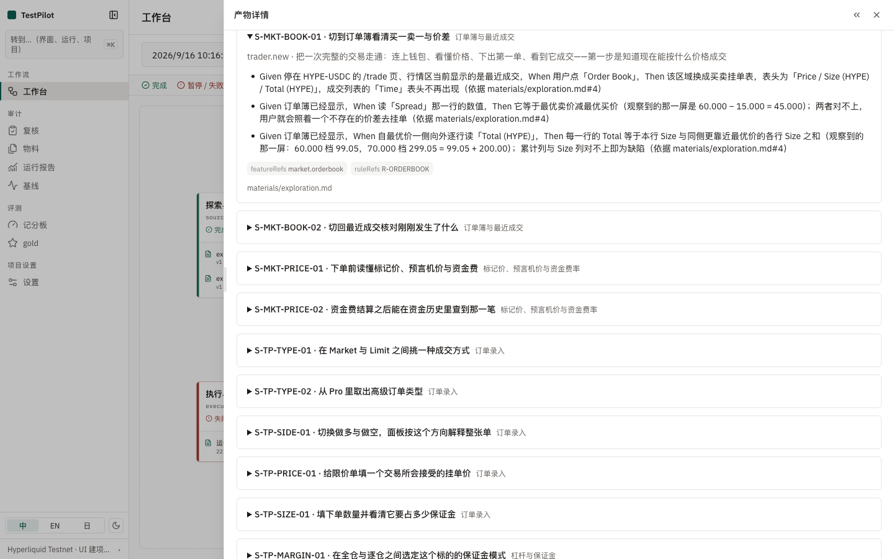
*展开一条用户故事：验收准则、功能与规则引用、出处*

## 7. 复核：批准、驳回、修改

**界面**：复核页左边是用例列表，可以按状态筛选、搜索、批量选中后批准或拒绝；右边是用例详情，包括为什么测、覆盖了哪条验收准则、前置条件、测试数据、步骤与判定。右上角「修改用例」对应下文的 PATCH。

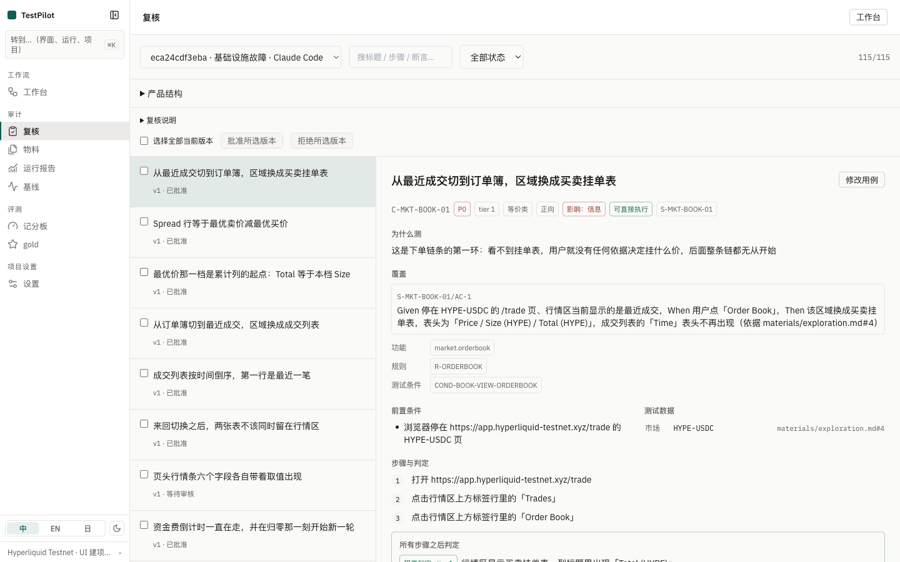
*复核页：用例列表与详情*

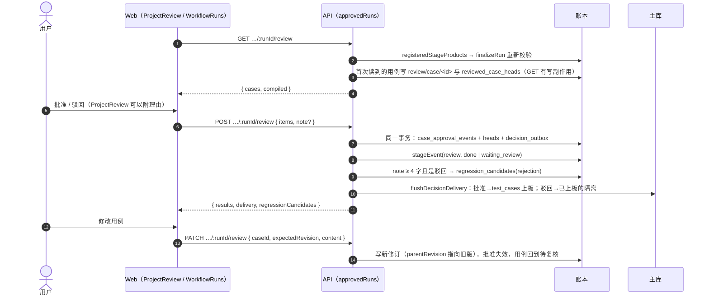
```mermaid
sequenceDiagram
  autonumber
  actor U as 用户
  participant W as Web（ProjectReview / WorkflowRuns）
  participant A as API（approvedRuns）
  participant L as 账本
  participant D as 主库
  W->>A: GET …/:runId/review
  A->>L: registeredStageProducts → finalizeRun 重新校验
  A->>L: 首次读到的用例写 review/case/<id> 与 reviewed_case_heads（GET 有写副作用）
  A-->>W: { cases, compiled }
  U->>W: 批准 / 驳回（ProjectReview 可以附理由）
  W->>A: POST …/:runId/review { items, note? }
  A->>L: 同一事务：case_approval_events + heads + decision_outbox
  A->>L: stageEvent(review, done | waiting_review)
  A->>L: note ≥ 4 字且是驳回 → regression_candidates(rejection)
  A->>D: flushDecisionDelivery：批准→test_cases 上板；驳回→已上板的隔离
  A-->>W: { results, delivery, regressionCandidates }
  U->>W: 修改用例
  W->>A: PATCH …/:runId/review { caseId, expectedRevision, content }
  A->>L: 写新修订（parentRevision 指向旧版），批准失效，用例回到待复核
```

- **每条结果单独判定**：提交的 revision 已不是当前头版时，该条返回 `status:"conflict"`，**HTTP 仍是 200**，前端提示「部分冲突」。决定与已有的相同时返回 `unchanged`。
- **投递**（`decisionDelivery.ts`）：
  - 用例板上的 id 为 `tc-rev-<sha256(revisionId)[:24]>`。
  - 如果某条 outbox 事件已经不是这条用例的当前批准，跳过，避免旧决定覆盖新决定。
  - 投递失败只让 `attempts` 加一，不抛错。启动时会补投一次，之后每 5 秒重试。
  - 注意：一次 POST 会投递**全局**所有没投递的 outbox 行，不只是本次运行的。
- **修改**：`reviseReviewedCase` 不允许改 `id` 或 `storyId`（`review_case_identity_frozen`）。版本链冲突时报 `review_revision_conflict`。
- **历史**：`GET …/review-history`。

## 8. 编译与执行

**界面**：在工作台点「执行与报告」或「准备执行」节点，抽屉下方是执行范围（勾选已批准的用例）和两个按钮：「生成批准版本的执行物料」对应 g2，「执行已批准物料」对应 execute。

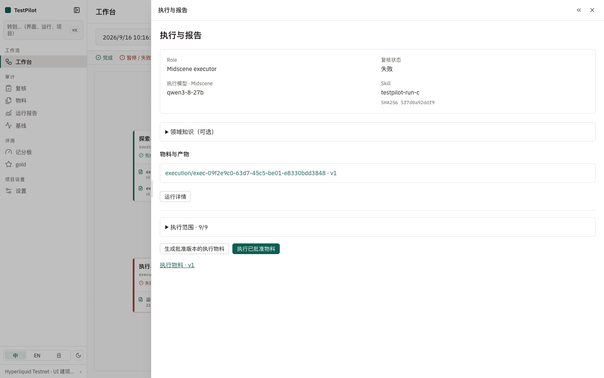
*执行节点详情：执行范围与编译、执行按钮*

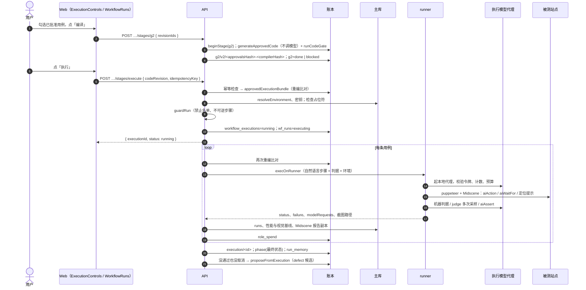
```mermaid
sequenceDiagram
  autonumber
  actor U as 用户
  participant W as Web（ExecutionControls / WorkflowRuns）
  participant A as API
  participant L as 账本
  participant D as 主库
  participant R as runner
  participant P as 执行模型代理
  participant S as 被测站点
  U->>W: 勾选已批准用例，点「编译」
  W->>A: POST …/stages/g2 { revisionIds }
  A->>L: beginStage(g2)；generateApprovedCode（不调模型）+ runCodeGate
  A->>L: g2/v2/<approvalsHash>-<compilerHash>；g2=done | blocked
  U->>W: 点「执行」
  W->>A: POST …/stages/execute { codeRevision, idempotencyKey }
  A->>L: 幂等检查 → approvedExecutionBundle（重编比对）
  A->>D: resolveEnvironment、密钥；检查占位符
  A->>A: guardRun（禁止名单、不可逆步骤）
  A->>L: workflow_executions=running；wf_runs=executing
  A-->>W: { executionId, status: running }
  loop 每条用例
    A->>L: 再次重编比对
    A->>R: execOnRunner（自然语言步骤 + 判据 + 环境）
    R->>P: 起本地代理，校验令牌、计数、预算
    R->>S: puppeteer + Midscene：aiAction / aiWaitFor / 定位提示
    R->>P: 机器判据 / judge 多次采样 / aiAssert
    R-->>A: status、failure、modelRequests、截图路径
    A->>D: runs、性能与视觉基线、Midscene 报告副本
    A->>L: role_spend
  end
  A->>L: execution/<id>；phase(最终状态)；run_memory
  A->>L: 没通过也没取消 → proposeFromExecution（defect 候选）
```

- **授权**：g2 和 execute 在请求**不带** `Authorization` 头时按本地操作员处理；**带**头时按运行令牌校验。所以宿主拿着运行令牌也能编译和执行。
- **g2**（`approvedRuns.ts::generateApprovedCode`）：
  - 基址取法：运行的 `sourceUrl`，其次运行的 `targetUrl`，最后项目的 `targetUrl`。
  - 每一步变成 `aiAction`；以 `waitFor:` 开头的步骤变成 `aiWaitFor`；没有判据时追加 `aiAssert(expected)`。
  - 内容相同就幂等返回已有修订。
  - handler 抛错时不会写 failed 事件，g2 节点会一直停在 `running`（§10-6）。
- **执行时跑的是用例里的自然语言步骤**，不是 g2 编出来的代码字符串。g2 代码只用于代码门禁和身份比对：重编的结果必须和当初的一致。
- **执行前的检查顺序**（`workflowExecution.ts::startWorkflowExecution`）：
  1. 幂等检查；
  2. 重编比对：代码门禁没过报 `execution_blocked_by_code_gate`，重编结果不一致报 `execution_recompiles_differently`；
  3. `caseIds` 是否都在产物里；
  4. 运行是否处于 cancelled 或 interrupted；
  5. 是否已有进行中的执行；
  6. 环境是否存在；
  7. 基址取法：环境 `baseUrl`，其次运行的 `sourceUrl`，再次运行的 `targetUrl`，最后项目的 `targetUrl`；
  8. 占位符是否都能解析；
  9. 守卫。
- **每条用例的执行**：
  - 每条都用一个新浏览器（不传 `sessionKey`）。执行前如果环境配置了 `TP_RESET_CMD`，先跑它（超时 60 秒）。
  - 前提里写明「未登录」时不带登录态（`caseStartsLoggedOut`）。
  - 只有基础设施类失败且可重试时才退避重试，最多 3 次，间隔 8、16、32 秒。可重试的码有 `MODEL_UNAVAILABLE`、`EXEC_ENV`、`EXEC_TIMEOUT`。
- **批次状态**：预算耗尽记为 `budget_exhausted`，基础设施失败（重试用尽后）记为 `infra_error`，这两种都会立即中止批次；其余用例累积成 `failed` 或 `unobservable`。选中但没跑到的用例补记为 `NOT_RUN`。
- **runner 内部**（`packages/harness-testing/src/exec/run.ts::executeRun`）：
  - 顺序是：登录、`settleOn` 等待页面就绪、步骤执行前取一次快照、逐步执行 `act`（每步后截图，并检查挂在这一步之后的 `afterStep` 断言），然后求值判据、执行 `postSteps`、采集性能。
  - 判据有三类：机器判据用 `evaluateOracle`；judge 判据用 `sampleJudge` 加 `aggregateJudge`；没有判据时用 `aiAssert`。
  - 失败按 `failure.ts::classifyFailure` 归类。
- **执行记录**（`workflowRunRecord.ts`）：写主库 `runs`，比较或建立性能基线和视觉基线，按时间窗口把 Midscene 报告复制到 `artifacts/reports/<runRecordId>.html`。这一步出错不影响执行本身。

## 9. 查看报告

**界面**：左侧导航「运行报告」列出每次执行。顶部是汇总，按失败类别计数；下面每条用例可以展开成六个 tab，右上角可以打开 Midscene 报告或跳回复核这条用例。

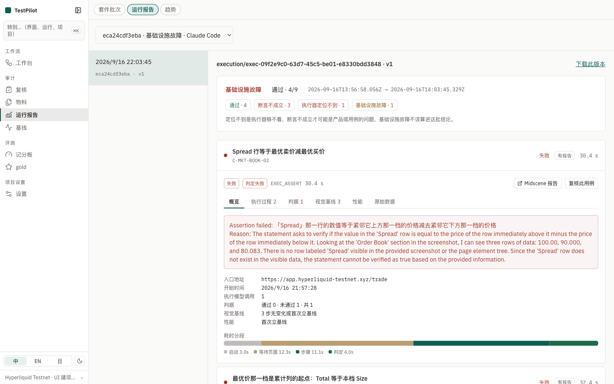
*运行报告：汇总与单条用例概览（耗时分段）*

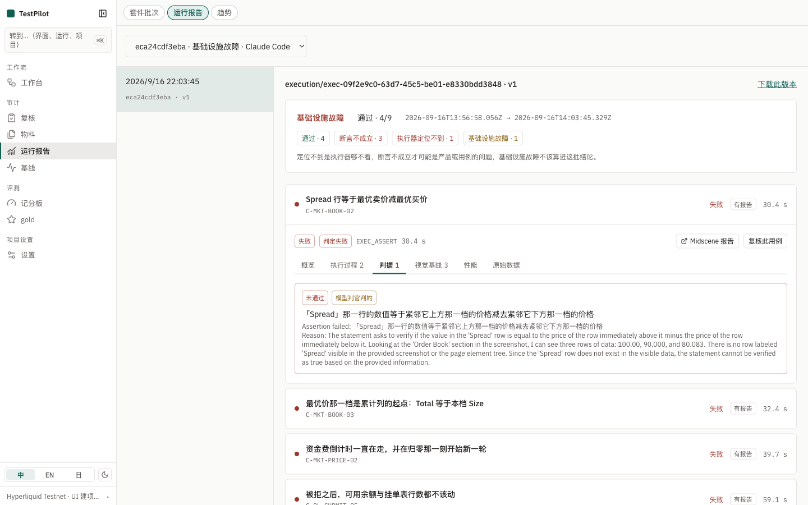
*判据 tab：模型判官的结论与理由*

工作台的「运行详情」抽屉里有各阶段状态、规划与执行成本、归因报表、执行记录与基线对比，以及回归候选。

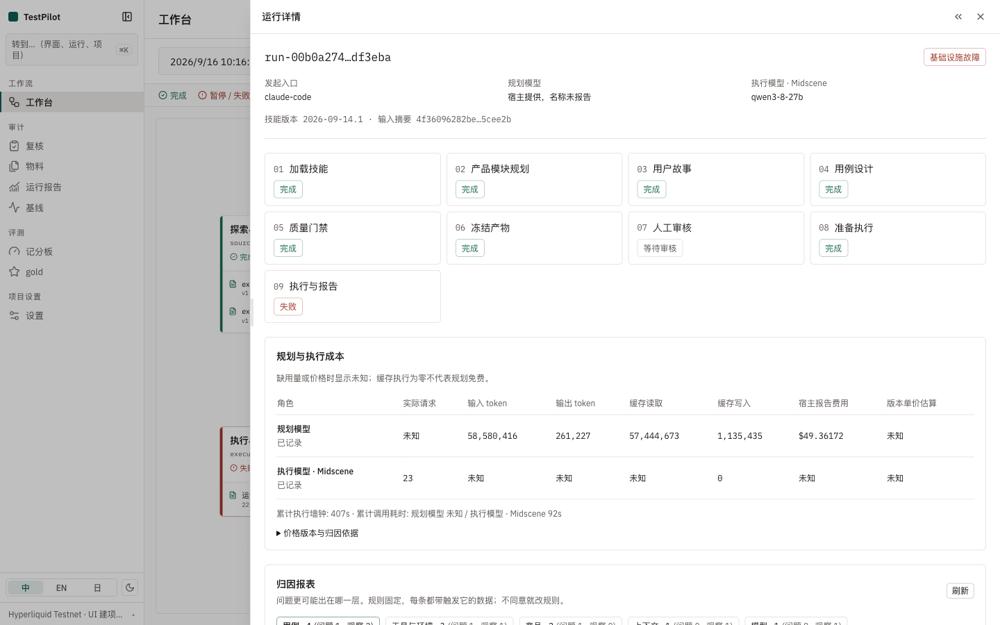
*运行详情：阶段状态与成本*

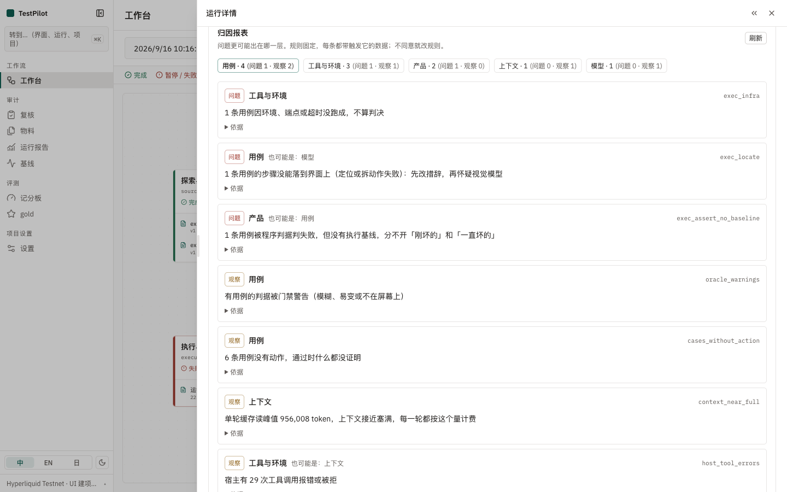
*归因报表：按层排序，每条带触发它的规则与依据*

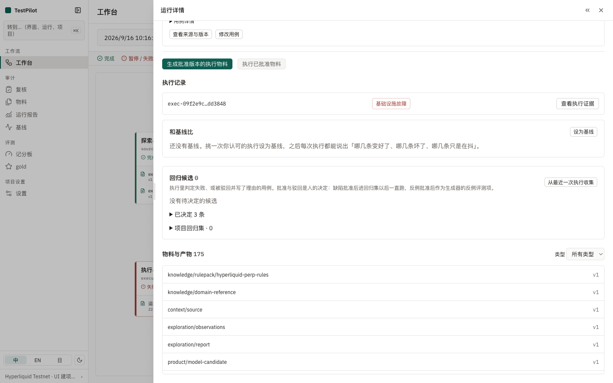
*执行记录、基线对比与回归候选*

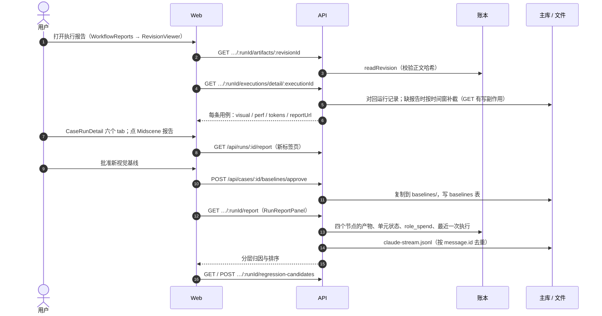
```mermaid
sequenceDiagram
  autonumber
  actor U as 用户
  participant W as Web
  participant A as API
  participant L as 账本
  participant D as 主库 / 文件
  U->>W: 打开执行报告（WorkflowReports → RevisionViewer）
  W->>A: GET …/:runId/artifacts/:revisionId
  A->>L: readRevision（校验正文哈希）
  W->>A: GET …/:runId/executions/detail/:executionId
  A->>D: 对回运行记录；缺报告时按时间窗补截（GET 有写副作用）
  A-->>W: 每条用例：visual / perf / tokens / reportUrl
  U->>W: CaseRunDetail 六个 tab；点 Midscene 报告
  W->>A: GET /api/runs/:id/report（新标签页）
  U->>W: 批准新视觉基线
  W->>A: POST /api/cases/:id/baselines/approve
  A->>D: 复制到 baselines/，写 baselines 表
  W->>A: GET …/:runId/report（RunReportPanel）
  A->>L: 四个节点的产物、单元状态、role_spend、最近一次执行
  A->>D: claude-stream.jsonl（按 message.id 去重）
  A-->>W: 分层归因与排序
  W->>A: GET / POST …/:runId/regression-candidates
```

- `StructuredCases` 请求详情失败时返回 null，页面退回原始的展开视图。
- `executionDetail` 按以下顺序对回运行记录：先用结果里的 `runRecordId`；没有时按 `caseId`、`wfRunId`、`startedAt` 在主库 `runs` 里查。
- `/api/runs/:id/report` 找不到报告时返回 404，正文是纯文本。
- 视觉基线批准经过 `intentPolicy`，带 `Authorization` 头时同样返回 403。`VisualSection` 不检查响应的 `res.ok`，出错时界面没有任何提示。
- 归因规则见 `runReport.ts::attribute`：基础设施问题归到 infra；judge 判定的失败归到模型层；没有基线、或持续失败且由机器判定的，归到产品层。
- 回归候选：`proposeFromExecution` 只收 `failed` 且归属为 assert 的用例，跳过 flaky。决定只能由人做，批准后写入 `regression_suite`。

---

## 10. 已知缺口（2026-09-17 核对）

这些问题都是读代码时发现的，**都还没修**。前两条影响「人把关」这条红线，建议优先处理。

1. **规划器能绕过人工关口**：规划会话的 MCP 进程无条件注册了宿主工具（`testpilot-mcp/src/server.ts` 里的 `registerHostDomains`），`--allowedTools mcp__testpilot__*` 也放行了它们。其中 `tp_stage.freeze_modules`、`tp_review.decide`、`tp_review.decide_candidate` 这几个工具没有 `needsRunGrant`，发请求时不带 `Authorization` 头，服务端就当成 `local-operator`。目前拦着的只有工具说明里的「人点头了再调」。可选的修法：规划会话不注册宿主工具；或者让这几个工具在有运行令牌的进程里直接拒绝。
2. **Web 用 spec 来源新建运行会被拒**：`NewRunForm` 默认勾选工作单元，而 `createWebWorkflow` 要求开了工作单元的 spec 运行必须导入产品模型（`workflowOps.ts:62`），表单又没有导入入口，所以用户不取消勾选就会收到 400 `work_units_require_product_model`。
3. **规划器干净停在半路也会被记成 `failed`**：对已登记的运行，看门狗在没定稿时只会回调 `failed`，`finish` 里给 `paused` 留的分支走不到。
4. **Claude Code 运行在重启后不会被接回**：会一直停在 `interrupted`。
5. **g2 路由不拦 `interrupted`**：路由只对 paused、cancelled、failed 短路，所以 interrupted 状态下 g2 仍会编译并写入节点状态；execute 由 `workflowExecution.ts` 拦下。
6. **g2 抛错后节点一直停在 `running`**：出错时没有写 failed 事件。
7. **从 `WorkflowRuns` 页驳回不带理由**：这个页面提交复核时不传 `note`，所以从这里驳回永远不会产生反例候选。只有 `ProjectReview` 可以写理由。
8. **有 GET 带写副作用**：`GET /review` 会写 `review/case/*`；`GET executions/detail` 会复制报告文件并写 `runs.reportPath`。
9. **执行前重编过多**：每次执行至少重编 3 次，另外每条用例 2 次。结果之所以不变，是靠「内容相同就幂等返回」撑着的。
10. **真实错误被吞掉**：`ProfileStoreError`、密钥解密失败这类非 `LedgerError` 的异常，会被统一压成 400 `run_request_invalid`，前端看不到真实原因。
11. **图系统与账本相互覆盖状态**：`wf.run.finished` 的订阅会覆盖任何运行的状态（§4.2）。
12. **规划预算没有传给 Claude Code**：`claudecode.ts` 不接收预算参数，所以 Claude Code 规划只受看门狗的超时（默认 60 分钟）约束。宿主进程失败时，失败一律记在 source 节点上。
13. **`saveRun` 会覆盖登记信息**：它整体替换 `wf_runs.json`，`register()` 写进去的 `principal`、`template`、`parentRunId` 会丢失。功能上没受影响，因为界面改从登记表读这些字段。
14. **门禁打回后续跑能否写完用例，代码里确定不了**：打回后 cases 节点仍是 `done`，`checkpoint.next` 会指向 `gate`，重开的用例单元要靠规划器自己去领，这一点代码里确定不了，需要实测。
