# 02 · 工作流：横向与纵向

> 2026-09-17 按 HEAD `e445d26` 的代码逐条核对；2026-09-28 按 `7c7a298` 重新核对一遍（新建运行改走运行计划与项目规划宿主、候选故事审核、执行准备取代 g2 成为 Web 的默认编译入口、§10 逐条复查）。行号会漂移，以函数名为准；文档与代码冲突时以代码为准，并回来改这里。
>
> - **横向**：一次运行从创建到导出，经过哪些阶段、人在哪里把关、每一步读什么写什么、运行状态怎么变（§1–§4）。
> - **纵向**：六个关键操作从浏览器一路到账本、宿主进程、runner 和被测站点的完整调用链（§5–§9，执行准备在 §8.1）。
> - 已知缺口集中在 §10。
> - 截图取自 2026-09-16 那次 Hyperliquid 测试网运行（Claude Code 规划、探索来源，115 条用例），图存在 `docs/assets/workflow/`。
>
> 阶段一览表与代码位置另见 [00 §5](00-架构.md#5-一次运行的阶段流水线)，产物 schema 见 [01](01-数据契约.md)。

## 0. 参与者与存储

| 参与者 | 位置 | 说明 |
|---|---|---|
| 浏览器 | `src/` | 请求走 `src/lib/workflowRuns.ts::workflowRequest`，运行相关的前缀是 `/api/projects/:pid/workflow-runs`，新建运行走 `/api/projects/:pid/assets/plans`。页面靠轮询刷新：`useProjectRuns` 每 3 秒一次，`WorkflowRuns` 每 4 秒一次，`PlannerHost` 每 30 秒查一次宿主登录态 |
| API 服务 | `server/src/index.ts`，`runRoutes.ts`，`projectAssetRoutes.ts` | 路由出错统一由 `runRoutes.ts::wrap` 处理：`GUARD_*` 返回 403，`LedgerError` 按自带的状态码与错误码返回，**其余异常一律变成 400 `run_request_invalid`** |
| 账本库 | `workflows.db`，正文在 `revision-blobs/` | `wf_runs`、`wf_run_registrations`、`artifact_revisions`、`workflow_events`、`workflow_node_states`、`workflow_controls`、`workflow_start_requests`、`run_stage_receipts`、`run_work_units`、`run_retrievals`、`reviewed_case_heads`、`case_approval_events/heads`、`decision_outbox`、`preparation_batches`、`project_run_plans`、`workflow_executions`、`role_spend`、`regression_candidates`、`regression_suite`、`run_memory` |
| 主库 | `testpilot.db`（`server/src/db.ts`） | `test_cases`（项目用例板）、`runs`（单条执行记录）、`baselines`、`perf_baselines`、`case_revision_bindings`、`run_write_grants`（令牌哈希 + 加密的令牌）、`run_model_snapshots`、`project_planner_hosts`（项目选定的规划宿主） |
| 规划宿主 | `server/src/claudecode.ts`、`codex.ts`（Penguin 在 `penguin.ts`） | 每次运行起一个 `claude -p`（或 `codex exec`）子进程，工作区在 `.data/host-workspaces/<runId>`；执行准备复用同一个工作区 |
| MCP 进程 | `packages/testpilot-mcp` | 由宿主拉起。阶段工具经 `run-gateway.ts` 带 Bearer 令牌转发，宿主工具（`host/registry.ts`）走 UI 同一套 HTTP 接口 |
| runner | `apps/runner` | 一次只跑一条用例，内部起 Midscene 与 puppeteer |
| 执行模型代理 | `harness-core/src/model/role-proxy.ts` | runner 内的本地 HTTP 代理，负责计数、预算和上游重试 |

---

# 横向

## 1. 全流程

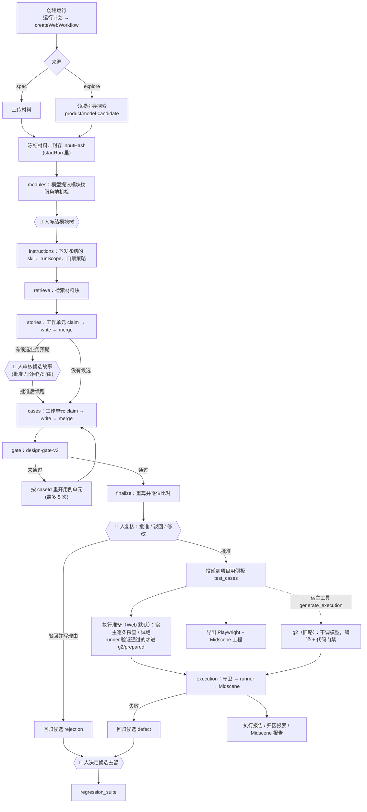
```mermaid
flowchart TD
  create["创建运行<br/>运行计划 → createWebWorkflow"] --> src{"来源"}
  src -- spec --> spec["上传材料"]
  src -- explore --> exp["领域引导探索<br/>product/model-candidate"]
  spec --> seal["冻结材料、封存 inputHash<br/>(startRun 里)"]
  exp --> seal
  seal --> modules["modules：模型提议模块树<br/>服务端机检"]
  modules --> freeze{{"👤 人冻结模块树"}}
  freeze --> ins["instructions：下发冻结的 skill、runScope、门禁策略"]
  ins --> ret["retrieve：检索材料块"]
  ret --> stories["stories：工作单元 claim → write → merge"]
  stories -- 有候选业务预期 --> storyReview{{"👤 人审核候选故事<br/>(批准 / 驳回写理由)"}}
  storyReview -- 批准后续跑 --> cases
  stories -- 没有候选 --> cases["cases：工作单元 claim → write → merge"]
  cases --> gate["gate：design-gate-v2"]
  gate -- 未通过 --> reopen["按 caseId 重开用例单元<br/>(最多 5 次)"] --> cases
  gate -- 通过 --> fin["finalize：重算并逐位比对"]
  fin --> review{{"👤 人复核：批准 / 驳回 / 修改"}}
  review -- 驳回并写理由 --> cand["回归候选 rejection"]
  review -- 批准 --> board["投递到项目用例板 test_cases"]
  board --> prep["执行准备（Web 默认）：宿主逐条探查 / 试跑<br/>runner 验证通过的才进 g2/prepared"]
  board -. 宿主工具 generate_execution .-> g2["g2（旧路）：不调模型，编译 + 代码门禁"]
  prep --> exec["execution：守卫 → runner → Midscene"]
  g2 --> exec
  exec -- 失败 --> cand2["回归候选 defect"]
  cand --> decide{{"👤 人决定候选去留"}}
  cand2 --> decide
  decide --> suite["regression_suite"]
  exec --> report["执行报告 / 归因报表 / Midscene 报告"]
  board --> export["导出 Playwright + Midscene 工程"]
```

人把关的固定三处：**冻结模块树、复核用例、决定回归候选**。另有一处**视情况出现**：故事里带 `requirementDraft`（候选业务预期，例如引用的规则是未确认假设，`storyReview.ts::markCandidateStories`）时，用例设计前要人在故事节点批准或驳回（`storyReview.ts::approveStoryRequirements` / `rejectStoryRequirements`，驳回同样要 ≥4 字理由）；没有候选就不停。服务端对这几处都要求操作者是人（`actor.kind === "human"`），「人」的判定方式是「请求不带 `Authorization` 头、也不带 `x-testpilot-actor` 头」（`reviewPrincipal.ts`），见 §10-1。

## 2. 各阶段读写

| 阶段 | 由谁推进 | 读 | 写 | 主要拒绝码 |
|---|---|---|---|---|
| 创建（Web：`POST …/assets/plans` 预览 → `POST …/assets/plans/:id/start`；API：`POST /workflow-runs`） | 浏览器 | 请求体、项目规则包、领域参考、项目选定的规划宿主 | `project_run_plans`，`knowledge/*`、`knowledge/rulepack/*`，上传文件，可选 `product/model-candidate`、`validated/stories`；主库 `run_model_snapshots` | `explore_host_denied`、`duplicate_material_name`、`total_materials_too_large`、`text_material_required`、`spec_materials_required`、`explore_url_required`、`invalid_rule_pack`、`work_units_require_product_model`、`imported_stories_require_work_units`、`workflow_start_conflict`、`planner_host_selection_required`、`planner_host_not_ready`、`web_planner_runtime_unsupported`、`planner_runtime_unavailable:<runtime>`、`project_configuration_changed_replan` |
| source | 服务端 `launchSource` | 规则包（roles 含 source）、`knowledge/*` | `context/source`、`exploration/observations`、`exploration/report`、`product/model-candidate`，可选 `report/exploration-partial` | `bound_rule_pack_hash_mismatch`、`exploration_returned_no_observations` |
| 冻结材料 | 服务端 `penguinRun.ts::startRun` | 上传目录 | `material`，封存 `inputHash` | — |
| modules | 规划器 `plan_modules` | 材料分节、产品模型 | `validated/modules`（`frozen:false`） | `begin_stage_required`、`module_plan_frozen` |
| modules/freeze | **人** | modules 回执 | 回执改为 `frozen:true`，节点 done；**不产生新修订** | `module_plan_freeze_requires_human`、`modules_required` |
| instructions | 规划器 | 已封存材料、skills、记忆、runScope | `validated/instructions`，钉住门禁策略 | `inputs_not_sealed`、`installed_skills_changed_register_new_run` |
| retrieve | 规划器 | 已封存材料 | `run_retrievals` 表（不是修订）；**不检查 begin_stage** | `instructions_required` |
| stories / cases | 规划器，经工作单元 | 冻结的模块树、词表、检索块；cases 还读 `validated/stories` | `run_work_units`，合并后写 `validated/stories`、`report/acceptance-index`、`validated/cases` | `module_plan_freeze_required`（`claim_unit`）、`module_plan_requires_human_freeze`（阶段调用）、`story_requirements_need_review`、`retrieve_spec_required`、`unit_not_claimed`、`units_incomplete`、`stories_frozen_after_case_design`、`cases_stories_revision_mismatch`、`stage_requires_units` |
| 候选故事审核 | **人**（仅当故事带 `requirementDraft`） | 最新 `validated/stories` | `review/story-requirements` 或 `review/story-requirements-rejected`；批准后运行改为 `paused` | `story_revision_changed`、`host_still_running`、`story_requirements_not_pending`、`rejection_requires_reason` |
| gate | 规划器 | cases、stories、钉住的策略 | `validated/gate`（回执带 `casesRevision`），可能重开单元 | 未通过时返回 blocked |
| finalize | 规划器 | 四份回执 | `validated/finalize`，运行进入 `waiting_review` | `gate_stale_rerun_required`、`gate_not_passed`、`cases_validation_failed` |
| review | **人** | finalize 后的 cases | `review/case/<id>`、`case_approval_*`、`decision_outbox` → 主库 `test_cases` | `finalized_skill_run_required`、`review_revision_conflict`、`review_case_identity_frozen`、`rejection_requires_reason` |
| 执行准备 `POST …/preparation/start` | **人**起批次，宿主经 `preparation_step` 逐条做 | 已批准的复核修订、环境、领域参考、配方经验 | `preparation_batches`，`preparation/*` 修订，结束时 `g2/prepared/<batchId>`（`compilation: host-prepared-v1`）；运行 `running` → `waiting_review` | `workflow_active`、`run_requires_explicit_resume`、`approved_cases_required`、`case_revision_not_approved`、`executor_model_unavailable`、`preparation_batch_changed`、`preparation_not_running` 等（修法附在错误后，`preparationGuidance.ts::ERROR_FIXES`） |
| g2（旧路） | 人或持令牌的宿主（MCP `generate_execution`） | 已批准的复核修订 | `g2/v2/<approvalsHash>-<compilerHash>` | `approved_cases_required`、`case_revision_not_approved`、`execution_not_ready` |
| execution | 人或持令牌的宿主 | code 修订（g2/v2 每次都会重编比对；`host-prepared-v1` 核对准备证据）、环境与密钥、`exploration/report` | `workflow_executions`、`execution/<id>`；主库 `runs`、基线；`role_spend`；回归候选 | `execution_blocked_by_code_gate`、`execution_recompiles_differently`、`preparation_evidence_changed`、`execution_case_not_in_bundle`、`workflow_execution_active`、`environment_missing`、`execution_not_ready`、`unresolved_placeholders`、`GUARD_HOST`、`GUARD_IRREVERSIBLE` |

## 3. 运行状态机（`wf_runs.status`）

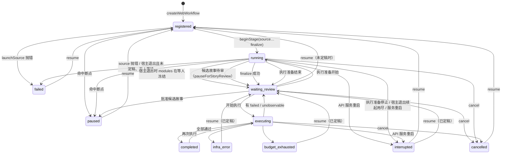
```mermaid
stateDiagram-v2
  [*] --> registered: createWebWorkflow
  registered --> running: beginStage(source…finalize)
  registered --> paused: 命中断点
  registered --> failed: launchSource 抛错
  running --> paused: 命中断点
  running --> failed: source 抛错 / 宿主退出且未定稿、无人等待
  running --> waiting_review: 宿主退出时 modules 在等人冻结
  running --> waiting_review: 候选故事待审（pauseForStoryReview）
  running --> waiting_review: finalize 成功
  running --> interrupted: API 服务重启
  waiting_review --> paused: 批准候选故事
  paused --> registered: resume
  failed --> registered: resume
  interrupted --> registered: resume
  waiting_review --> registered: resume（未定稿时）
  waiting_review --> running: 执行准备开始
  running --> waiting_review: 执行准备结束
  running --> interrupted: 执行准备停止 / 宿主退出续起用尽 / 服务重启
  waiting_review --> executing: 开始执行
  executing --> completed: 全部通过
  executing --> waiting_review: 有 failed / unobservable
  executing --> infra_error
  executing --> budget_exhausted
  executing --> interrupted: API 服务重启
  infra_error --> waiting_review: resume（已定稿）
  budget_exhausted --> waiting_review: resume（已定稿）
  interrupted --> waiting_review: resume（已定稿）
  completed --> executing: 再次执行
  waiting_review --> cancelled: cancel
  running --> cancelled: cancel
  executing --> cancelled: cancel
  cancelled --> registered: resume
```

要点：

- **写入点**：`registered` 由 `runLedger.ts::register` 写；`running` 由 `workflowControls.ts::beginStage` 写，只对 source、instructions、stories、cases、gate、finalize 这六个节点生效，modules、g2、execution 不改运行状态；`beginStage` 见运行处于 paused/cancelled/failed/interrupted 时直接返回原状态、不写事件；`waiting_review` 由 `runStages.ts::finalizeRun`、`storyReview.ts::pauseForStoryReview`（候选故事待审）和 `preparation.ts` 的批次收尾写；批准候选故事时 `approveStoryRequirements` 把运行改成 `paused`，等人点「继续运行」；执行准备 `startPreparation` 把运行改成 `running`，`cancelPreparation` 与 `recoverPreparations` 改成 `interrupted`；执行阶段的状态都由 `workflowExecution.ts::phase` 写，映射是 running→`executing`、passed→`completed`、failed/unobservable→`waiting_review`，其余原样写入；`interrupted` 在服务启动时由 `graphs.ts::reconcileOrphanedRuns`（规划）、`recoverWorkflowExecutions`（执行）和 `recoverPreparations`（准备）写；`blocked` 表示启动时账本完整性校验没过（`runService.ts::recoverRunProjections`）。
- **宿主进程退出后怎么判**：`penguinRun.ts::finish`。运行已是 paused/cancelled 就保持；已定稿记为 `waiting_review`；有节点处于 `waiting_review`（modules 在等人冻结，或 stories 在等人审候选故事）也记为 `waiting_review`；其余看看门狗的回调，`failed` 记 `failed`，`done` 记 `paused`。收尾时把仍挂在 running/queued 的节点改成 blocked（等人）或 failed。Claude Code 的退出码不参与判定（`claudecode.ts` 只记 `exited`，额度被拒时记下 `stopReason`），见 §10-3。
- **复核不改变运行状态**，只改 `review` 节点。g2 与执行准备也不看 review 节点，只看每条用例有没有批准记录。
- **重启后**：只有 `runtime === "penguin"` 的运行会被自动接回（`penguinRun.ts::reconcilePenguinRuns`），Claude Code / Codex 运行会一直停在 `interrupted`，要人点「继续运行」。

### 3.1 节点状态

`workflow_node_states` 每个 `(runId, node)` 只留一行，`(attempt, sequence)` 更大的事件覆盖旧的（`runLedger.ts::appendEvent`）。实际上 `attempt` 恒为 0，重试靠 `sequence` 递增来覆盖。`queued` 由续跑（`resumeProjectWorkflow`，消息 `Continuation requested…`）与从节点重跑（`rerunProjectNode`）写。

| 节点 | 可能的 phase |
|---|---|
| source | queued → running → done / failed |
| modules | running → blocked（机检 error）/ waiting_review（提议通过）→ done（人冻结） |
| instructions、cases | running → done |
| stories | running → done；有候选业务预期时 waiting_review → done（人批准；驳回仍停在 waiting_review） |
| cases、gate、finalize、g2、execution | 候选故事待审时，挂着的 queued/running 会被改成 blocked（`pauseForStoryReview`） |
| gate | running → done / blocked（未通过） |
| finalize | running → waiting_review |
| review | waiting_review → done（全部有决定） |
| g2 | 执行准备：running（逐条进度消息）→ done（全部验证）/ blocked（部分完成）/ cancelled（停止）；旧路 `stages/g2`：running → done（`ready_to_execute`）/ blocked（未过或抛错） |
| execution | running → done（passed）/ cancelled / failed（其余情况） |
| 任意受控节点 | blocked，消息为 `Breakpoint: paused before execution` |

## 4. 暂停、断点、续跑、取消

- **断点**：`POST /:runId/controls`，只有人能设，只能设在还没跑过的节点上（否则 409 `breakpoint_requires_untouched_node`）。受控节点共九个，是 `workflowControls.ts` 顶部的 `nodes`，`review` 不在其中。规划器下次 `begin_stage` 撞上断点时，节点记为 blocked，运行改为 `paused`，工具返回 `{status:"paused"}`，任务话术要求规划器看到后立即停止。
- **`begin_stage` 的另外两种 paused**：模块树提议了但没冻结时，stories 往后的节点返回 `{status:"paused", code:"module_plan_requires_human_freeze"}`；候选故事待审时，cases 往后的节点返回 `code:"story_requirements_need_review"` 并把运行改为 `waiting_review`。这两种都不写断点。
- **预算**：账本路径的预算不在 controls 里。规划预算见 `penguinRun.ts` 的 `unitRunBudget`，执行预算见 `workflowExecution.ts` 的 `caseRunBudget`（`runBudget.ts`）。`PATCH …/budget` 只属于 §4.2 的图系统。
- **续跑** `workflowOps.ts::resumeProjectWorkflow`（`POST /:runId/resume`，body 可带 `mode:"next-node"`，只跑下一个节点就停，由 `configureNextNode` 补断点实现）：
  - 输入还没封存（source 没走完）：只允许从 failed、cancelled、paused、interrupted 续跑，续跑时重新执行 `launchSource`。
  - 候选故事还在待审：`storyReview.ts::guardStoryResume` 先拦（宿主还在跑报 `host_still_running`，否则重新停到待审并报 `story_requirements_need_review`）；从节点重跑出来的运行若故事与业务输入没变，沿用父运行的批准。
  - 已定稿：状态是 paused、cancelled、interrupted、failed、infra_error、budget_exhausted 之一时直接改回 `waiting_review`。前端在执行准备与执行按钮前，见这几种状态会自动先调一次 resume（`ExecutionControls.tsx`）。
  - 宿主自己登记（不是 Web 发起）的运行：只把状态改回 `registered`，返回 `continuation: "continue_in_original_host"`，要回原宿主接着做。
  - 其余情况：清除断点，节点记 queued，状态改为 `registered`，然后 `startWebRun({resumeStage: pausedAt ?? checkpoint.next})`，用同一个工作区、同一个令牌起新的宿主会话。
  - `checkpoint.next`（`workflowCheckpoint`）是第一个没做完的阶段。source 和 modules 只在「走过但没走完」时才会被选中；g2 和 execution 不参与检查点。
  - 以下状态续跑会报 409 `workflow_not_resumable`：registered、running、executing、completed、blocked，以及已定稿的 waiting_review。
- **从节点重跑** `rerunProjectNode`（`POST /:runId/rerun`，node 取 source/modules/stories/cases/gate）：不改原运行，另建一个新运行，复制上游产物与回执、只跑这一个节点（同样靠 `configureNextNode`）。只对 Web 发起、当前没在跑、上游都 done 的运行可用；body 可带 `planner` 换规划宿主。故事被驳回过时，驳回理由作为 `knowledge/story-review-feedback.md` 带进新运行。
- **取消** `cancelProjectWorkflow`：先把运行改为 `cancelled`，再依次停掉执行准备、探索会话、规划进程（Claude Code / Codex 子进程收到 SIGTERM，Penguin 与探索规划器各自取消），把执行中的批次标为 cancelled、abort 对应的 controller 并通知 runner 取消，最后再写一次 `cancelled`。没有「只取消执行」或「只停执行准备」的路由；执行准备在宿主续起用尽、额度重置晚于预算截止、预算耗尽时由自己的看守定时器调 `cancelPreparation`，运行记 `interrupted`。

### 4.1 门禁打回

`gateRun` 没过时，`workUnits.ts::reopenUnitsFromGate` 找出带 `caseId` 的 warn 级 finding，把对应的 cases 单元重置为 `pending`（`repair.round + 1`，`attempt` 达到 5 的单元不再重开）。规划器下次 `claim_unit` 时会拿到 `repairBrief`，重写、合并之后要重新 `begin_stage gate`。如果用例改了而门禁没重跑，finalize 会报 `gate_stale_rerun_required`。

### 4.2 另一套图执行系统 `/api/wf/runs`

这是 v1/v2 时代的 DAG 运行时（`harness-core/src/graph/runtime.ts::runGraph`），跑在 `apps/agent` 子进程里，网关代码在 `server/src/graphs.ts`。它**还没退役**：

- `TP_RUNTIME=graph` 是回滚开关（`index.ts` 里的 `RUNTIME` 常量）。默认情况下，`POST /api/wf/runs` 走的也是宿主运行时。
- 配对评测（`evals.ts::runArm`）、节点重跑、`CodeLine` 的 repair、`ProductMap` 的 spec 视图、命令面板与 Evals 页的运行列表，仍然直接用它。
- **它和主流程共用 `wf_runs` 表与事件总线**：`wf.run.finished` 的订阅会用 payload 里的状态覆盖任何运行；`reconcileOrphanedRuns` 会把账本运行也改成 `interrupted`。改这两处时，两边要一起看。
- 旧画布 `src/pages/Workspace.tsx` 和 `src/pages/Artifacts.tsx` 已删除（2026-09-28 核对时不存在）。

---

# 纵向

## 5. 从 Web 新建运行，由 Claude Code 规划

**界面**：工作台上方选择运行、打开运行详情或新建运行；中间是八个阶段组成的流程图，节点下挂着该阶段的产物，右下角可以缩放。

*工作台：阶段流程图，绿色为完成、红色为失败或等待*

点「新建工作流」后，先在表单顶部选**规划宿主**（`PlannerHost`：本机已登录的 Codex 或 Claude Code，按项目记住），再填写来源（规格文档或探索界面）、目标地址、运行模式（clean / incremental / rebuild）、领域知识、规则包和产物语言。截图是 2026-09-16 的旧表单，那时还是「规划运行时」下拉。

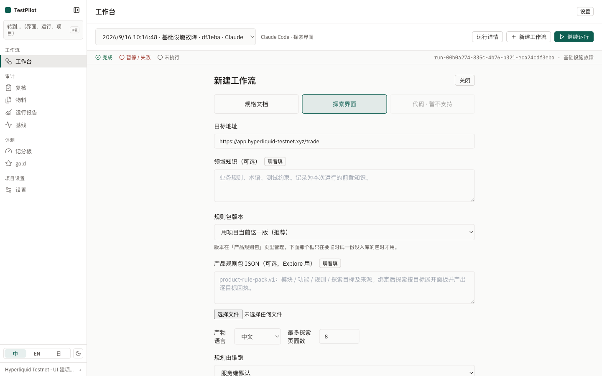
*新建工作流表单（2026-09-16 截图，规划宿主选择器之前）*

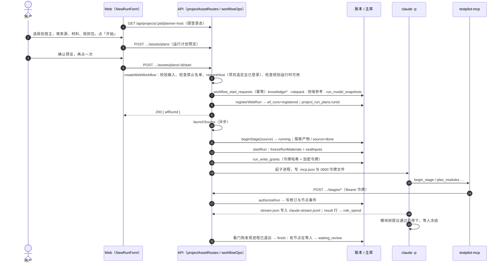
```mermaid
sequenceDiagram
  autonumber
  actor U as 用户
  participant W as Web（NewRunForm）
  participant A as API（projectAssetRoutes / workflowOps）
  participant L as 账本 / 主库
  participant C as claude -p
  participant M as testpilot-mcp
  W->>A: GET /api/projects/:pid/planner-host（探登录态）
  U->>W: 选规划宿主，填来源、材料、规则包，点「开始」
  W->>A: POST …/assets/plans（运行计划预览）
  U->>W: 确认预览，再点一次
  W->>A: POST …/assets/plans/:id/start
  A->>A: createWebWorkflow：校验输入、检查禁止名单、requireHost（项目选定且已登录）、检查规划运行时可用
  A->>L: workflow_start_requests（幂等）· knowledge/* · rulepack · 领域参考 · run_model_snapshots
  A->>L: registerWebRun → wf_runs=registered；project_run_plans.runId
  A-->>W: 200 { wfRunId }
  A->>A: launchSource（异步）
  A->>L: beginStage(source) → running；探索产物 / source=done
  A->>L: startRun：freezeRunMaterials + sealInputs
  A->>L: run_write_grants（令牌哈希 + 加密令牌）
  A->>C: 起子进程，写 .mcp.json 与 0600 令牌文件
  C->>M: begin_stage / plan_modules …
  M->>A: POST …/stages/*（Bearer 令牌）
  A->>L: authorizeRun → 写修订与节点事件
  C-->>A: stream-json 写入 claude-stream.jsonl；result 行 → role_spend
  C->>C: 模块树提议通过后停下，等人冻结
  A->>L: 看门狗发现进程已退出 → finish：有节点在等人 → waiting_review
```

逐步说明与代码位置：

1. **表单**：`src/components/workbench/NewRunForm.tsx`，其中「工作单元」默认勾选（见 §10-2）。表单固定发 `planner:'connected'`，由服务端取项目选定的宿主；宿主没就绪（`PlannerHost` 的 `onReady` 为假）时「开始」按钮不起作用。第一次提交只建运行计划（`projectRunPlans.ts::createProjectRunPlan`）并显示预览，内容不变再提交一次才真正开跑。
2. **规划宿主**（`plannerHost.ts`）：`probeHost` 用 `claude auth status --json` / `codex login status` 探登录态（超时 8 秒）；`hostStatus` 在项目没选过、且只有一个已登录宿主时自动选它，两个都登录时要人选一次（`POST /api/projects/:id/planner-host`，存 `project_planner_hosts`）；`requireHost` 没选中报 409 `planner_host_selection_required`，选中的没登录报 `planner_host_not_ready`。Penguin 不在这个选择器里，只有 API 调用方显式传 `planner:"penguin"` 才用。
3. **`createWebWorkflow`**（`workflowOps.ts`，由 `POST …/assets/plans/:id/start` 以计划里存的配置调用；`projectPlanInputs` 发现项目配置变了会报 `project_configuration_changed_replan`）按顺序做这些事：
   1. 探索地址先过禁止名单（`explore_host_denied`）。
   2. 检查材料：重名、总大小、只收 `.md`/`.txt`、spec 至少一份。
   3. 取知识库里选中的领域知识与规则包（不选就用项目当前那一份），校验规则包。
   4. 如果导入了产品模型，检查它和规则包是否对得上。
   5. 检查开了工作单元的运行是否带产品模型：spec 来源又没有导入产品模型时，报 `work_units_require_product_model`。
   6. 用 `workflow_start_requests` 表做幂等：同一个键、内容不同时报 409 `workflow_start_conflict`。
   7. 确定规划运行时：`connected` 走 `requireHost`，否则用请求里的 `planner` 或 `TP_AGENT_RUNTIME`（不设为 `claude-code`）；只接受 `claude-code`、`codex`、`penguin`，本机 `--version` 跑不起来时报 `planner_runtime_unavailable:<runtime>`。
   8. `captureHostWebModels`（Penguin 用 `captureWebModels`）写执行模型快照。
   9. 上传文件落到 `.data/uploads/<runId>/`。
   10. `registerWebRun`，写 `knowledge/*`，`bindRulePack`，`bindDomainReference`（项目当前的领域参考冻结绑定进运行）。
   11. 异步调用 `launchSource`，接口立即返回 `{wfRunId}`（计划路由 200；直接 `POST /workflow-runs` 为 202）。
4. **source**（`launchSource`）：spec 来源直接用材料；explore 来源走 `observeProduct`，中途失败时把已经采到的屏写成 `report/exploration-partial`。这里抛错会把 source 记为 failed、运行记为 `failed`（`launchSource` 末尾的 catch）。
5. **起宿主**（`penguinRun.ts::startRun` → `claudecode.ts::startRun` 或 `codex.ts::startRun`）：
   - 先冻结材料并封存 `inputHash`（`runService.ts::freezeRunMaterials`）。这一步发生在这里，不在创建时。
   - 写运行令牌（`runtime/skill-launch.ts::prepareSkillLaunch`）：主库存哈希和加密后的令牌；明文写到 `.data/private-run-grants/<runId>.json`（权限 0600），`.mcp.json` 里只放环境变量 `TP_RUN_GRANT_FILE` 指向这个文件，**令牌本身不在 `.mcp.json` 里**。
   - Claude Code 命令是 `claude -p … --output-format stream-json --verbose --permission-mode acceptEdits --allowedTools mcp__testpilot__* Read Write Edit "Bash(node *)" --mcp-config … --plugin-dir plugins/testpilot-claude`（`claudecode.ts::claudeArgs`；插件目录没生成就不带 `--plugin-dir`）。子进程环境带上 `hostActorEnv`，见 §10-1。
   - 任务话术来自 `runtime/skill-launch.ts`。
6. **阶段调用**：MCP 的阶段工具经 `run-gateway.ts` 转发，带 Bearer 令牌。服务端 `authorizeRun` 校验令牌：缺失返回 401 `run_credential_required`，不对返回 403 `run_credential_invalid`。然后 `requireStageStarted` 检查：cases 往后的节点先要求候选故事已审（`story_requirements_need_review`）；运行被暂停、取消或中断时报 `run_requires_explicit_resume`；模块树未冻结时 stories 往后报 `module_plan_requires_human_freeze`；Web 发起的运行（`stageControlVersion: 1`）没调 `begin_stage` 时报 `begin_stage_required`。
7. **hooks**：`PreToolUse` 只拦 `Write|Edit|MultiEdit`，不拦 MCP 阶段工具，所以在 skill 模式下基本不触发。拦下的记录写到 `holds.jsonl`，不进账本。`Stop` hook（require-gate）会查 `stages/status`，最多提醒 3 次（`MAX_NUDGES`）。
8. **结束**：`penguin.ts::watchRun` 的看门狗在进程退出、超时（默认 60 分钟）或会话消失时回调 `finish`，状态按 §3 的规则确定。宿主额度被拒（stream 里的 `rate_limit_event`）时，停止原因写成一句人话并记下重置时刻（`claudecode.ts::hostStopReasonOf`）。

## 6. 冻结模块树

**界面**：在工作台点「产品模块规划」节点，右侧抽屉里有「冻结这棵模块树」卡片。模块树等人冻结时这里是按钮；截图里这次运行已经冻结，卡片只显示结论。模块树本身在复核页顶部的「产品结构」里，也可以在模块节点的产物里看。

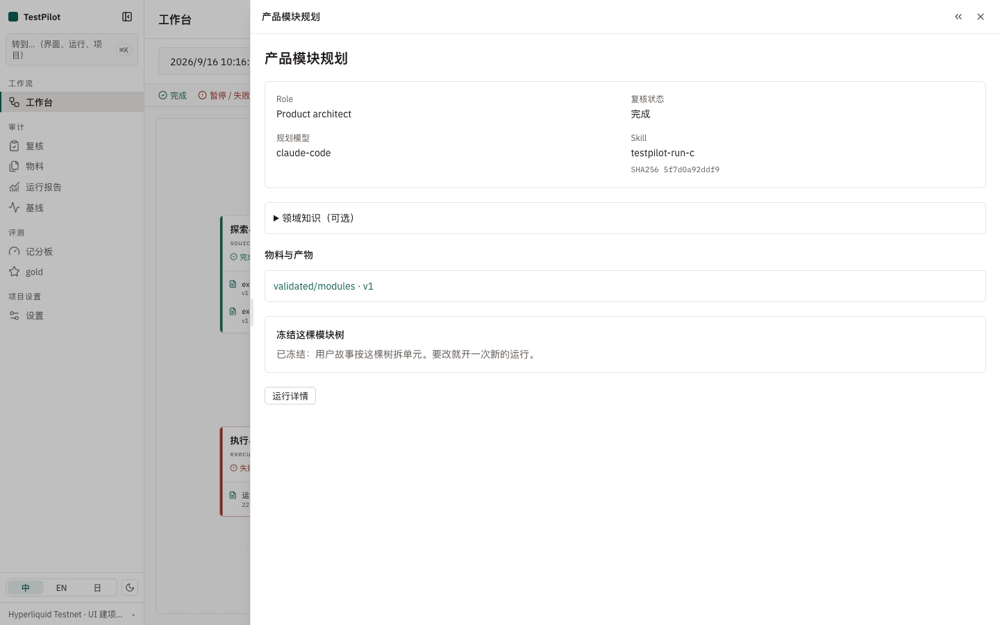
*模块节点详情：冻结卡片*

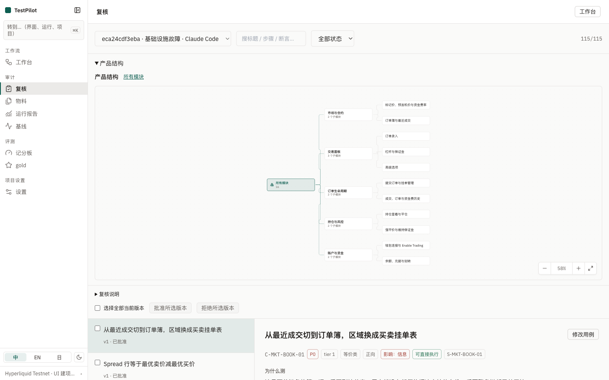
*产品结构：冻结后的模块树，点模块可筛选下方用例*

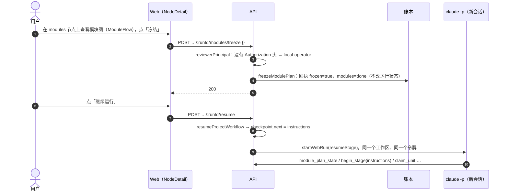
```mermaid
sequenceDiagram
  autonumber
  actor U as 用户
  participant W as Web（NodeDetail）
  participant A as API
  participant L as 账本
  participant C as claude -p（新会话）
  U->>W: 在 modules 节点上查看模块图（ModuleFlow），点「冻结」
  W->>A: POST …/:runId/modules/freeze  {}
  A->>A: reviewerPrincipal：没有 Authorization 头 → local-operator
  A->>L: freezeModulePlan：回执 frozen=true，modules=done（不改运行状态）
  A-->>W: 200
  U->>W: 点「继续运行」
  W->>A: POST …/:runId/resume
  A->>A: resumeProjectWorkflow → checkpoint.next = instructions
  A->>C: startWebRun(resumeStage)，同一个工作区、同一个令牌
  C->>A: module_plan_state / begin_stage(instructions) / claim_unit …
```

- 冻结按钮只在 modules 节点处于 `waiting_review` 时出现（`NodeDetail.tsx`）。界面发的请求体为空；接口接受可选的 `note`（存成回执里的 `frozenNote`），界面上没有输入框。
- `reviewerPrincipal`（`reviewPrincipal.ts`）：带 `Authorization` 头或 `x-testpilot-actor` 头的请求返回 403 `operator_action_required`，否则记为 `{kind:"human", id:"local-operator"}`。这只记录操作来源，不是身份认证（本地审核免认证，是 2026-09-10 的用户决定）。
- `moduleStage.ts::freezeModulePlan`：没有模块树时报 `modules_required`；已冻结的再冻一次返回 `alreadyFrozen`。还没处理的 warn 级 finding 不阻止冻结。冻结只更新 `run_stage_receipts` 里的回执，不写新修订。
- **冻结之后规划器不会自己继续**，要人点「继续运行」。新会话通过 `module_plan_state`、`begin_stage`、`claim_unit` 得知树已冻结；树没冻结时，`claim_unit` 报 `module_plan_freeze_required`，`begin_stage` 返回 paused（`module_plan_requires_human_freeze`）。

### 6.1 冻结之后：看用户故事

规划器按冻结的树逐个模块写故事。在工作台点「用户故事」节点下的产物，抽屉上半部分是模块树，每个模块标出故事数（为 0 时标黄），下面是故事列表，可以搜索。展开一条故事，可以看到它的目标、Given/When/Then 形式的验收准则、引用的功能与规则（`featureRefs`、`ruleRefs`），以及出处（材料里的哪一段）。

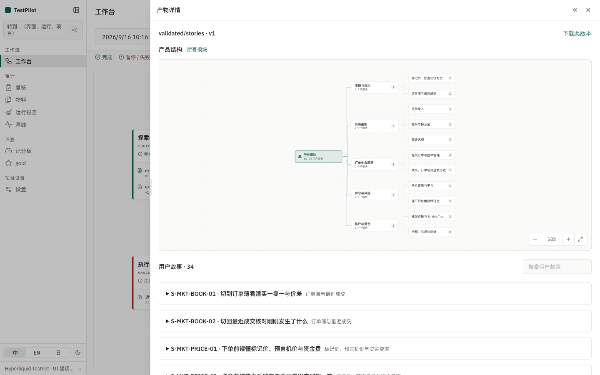
*用户故事产物：模块树与故事列表*

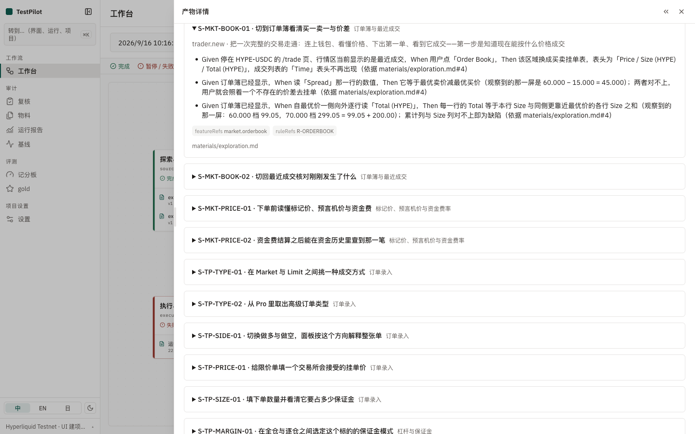
*展开一条用户故事：验收准则、功能与规则引用、出处*

### 6.2 候选故事审核（视情况出现）

故事写完、合并成 `validated/stories` 之后，如果有故事带 `requirementDraft`（引用的规则是未确认假设，或整个规则包都是假设，`storyReview.ts::markCandidateStories`），运行在用例设计之前停下：

- 规划器下一次 `begin_stage(cases…)` 拿到 `{status:"paused", code:"story_requirements_need_review"}`，`pauseForStoryReview` 把 stories 节点记 `waiting_review`、运行记 `waiting_review`；直接调阶段工具报 409 `story_requirements_need_review`。
- 人在故事节点的审核卡片（`StoryRequirementsReview.tsx`）上看候选业务预期与问题：批准写 `review/story-requirements`，stories 节点 done，运行改为 `paused`，再点「继续运行」；驳回要写 ≥4 字理由（`rejection_requires_reason`），写 `review/story-requirements-rejected`，故事仍待审——要改故事就从故事节点重跑，理由会带进新运行。
- 宿主还在跑时两个动作都报 `host_still_running`；故事版本变了报 `story_revision_changed`。
- 路由：`GET …/:runId/story-requirements`、`POST …/story-requirements/approve`、`POST …/story-requirements/reject`，都要求人（`reviewerPrincipal`）。宿主工具里没有这两个动作。

## 7. 复核：批准、驳回、修改

**界面**：复核页左边是用例列表，可以按状态筛选、搜索、批量选中后批准或拒绝；右边是用例详情，包括为什么测、覆盖了哪条验收准则、前置条件、测试数据、步骤与判定。右上角「修改用例」对应下文的 PATCH。

*复核页：用例列表与详情*

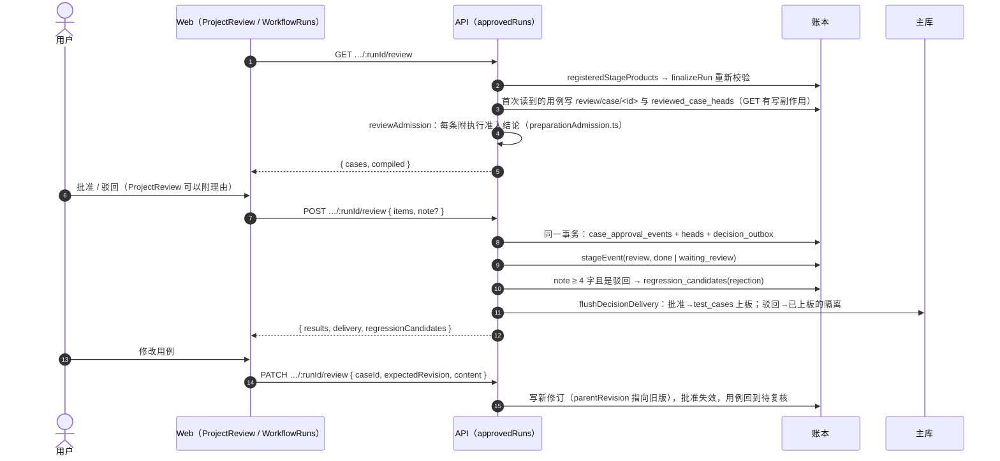
```mermaid
sequenceDiagram
  autonumber
  actor U as 用户
  participant W as Web（ProjectReview / WorkflowRuns）
  participant A as API（approvedRuns）
  participant L as 账本
  participant D as 主库
  W->>A: GET …/:runId/review
  A->>L: registeredStageProducts → finalizeRun 重新校验
  A->>L: 首次读到的用例写 review/case/<id> 与 reviewed_case_heads（GET 有写副作用）
  A->>A: reviewAdmission：每条附执行准入结论（preparationAdmission.ts）
  A-->>W: { cases, compiled }
  U->>W: 批准 / 驳回（ProjectReview 可以附理由）
  W->>A: POST …/:runId/review { items, note? }
  A->>L: 同一事务：case_approval_events + heads + decision_outbox
  A->>L: stageEvent(review, done | waiting_review)
  A->>L: note ≥ 4 字且是驳回 → regression_candidates(rejection)
  A->>D: flushDecisionDelivery：批准→test_cases 上板；驳回→已上板的隔离
  A-->>W: { results, delivery, regressionCandidates }
  U->>W: 修改用例
  W->>A: PATCH …/:runId/review { caseId, expectedRevision, content }
  A->>L: 写新修订（parentRevision 指向旧版），批准失效，用例回到待复核
```

- **每条结果单独判定**：提交的 revision 已不是当前头版时，该条返回 `status:"conflict"`，**HTTP 仍是 200**，前端提示「部分冲突」。决定与已有的相同时返回 `unchanged`。
- **投递**（`decisionDelivery.ts`）：
  - 用例板上的 id 为 `tc-rev-<sha256(revisionId)[:24]>`。
  - 如果某条 outbox 事件已经不是这条用例的当前批准，跳过，避免旧决定覆盖新决定。
  - 投递失败只让 `attempts` 加一，不抛错。启动时会补投一次，之后每 5 秒重试。
  - 注意：一次 POST 会投递**全局**所有没投递的 outbox 行，不只是本次运行的。
- **驳回必须写理由**：一批里只要有 `rejected`，`note` 去掉首尾空白后不足 4 个字就报 400 `rejection_requires_reason`（`approvedRuns.ts::decideRevisions`）。理由是反例候选的唯一来源——`proposeFromRejections` 也用同一个 4 个字的门槛。批准不受影响。
- **修改**：`reviseReviewedCase` 不允许改 `id` 或 `storyId`（`review_case_identity_frozen`）。版本链冲突时报 `review_revision_conflict`。把 `readiness.execution` 改成 `ready` 而用例还有执行阻碍时报 `execution_not_ready`。
- **准入**：`GET /review` 的每条用例带 `admission`（`preparationAdmission.ts::admissionIssues`）：readiness 标了不可执行、未绑定的环境变量、生命周期问题、门禁里 `setting-undeclared` / `step-compound` 两条 warn——这些对着用例正文与环境就能判「准备不出来」，执行准备会直接把它们记 blocked，不开浏览器。
- **历史**：`GET …/review-history`。

## 8. 编译与执行

**界面**：在工作台点「执行与报告」或「准备执行」节点，抽屉下方是执行范围（勾选已批准的用例）、准备方式（「重试未通过项（保留本批已通过）」/「全部重新验证（新批次）」）和两个按钮：「开始 / 继续逐条准备与验证」对应执行准备（`POST …/preparation/start`，见 §8.1），「执行已批准物料」对应 execute。**Web 不再调 `stages/g2`**；那条静态编译的旧路只剩宿主工具 `generate_execution` 在用，旧运行上只有静态编译产物的 g2 节点会显示为 blocked（「旧版仅静态编译…请启动执行准备」，`runLedger.ts`）。截图是 2026-09-16 的旧按钮文案。

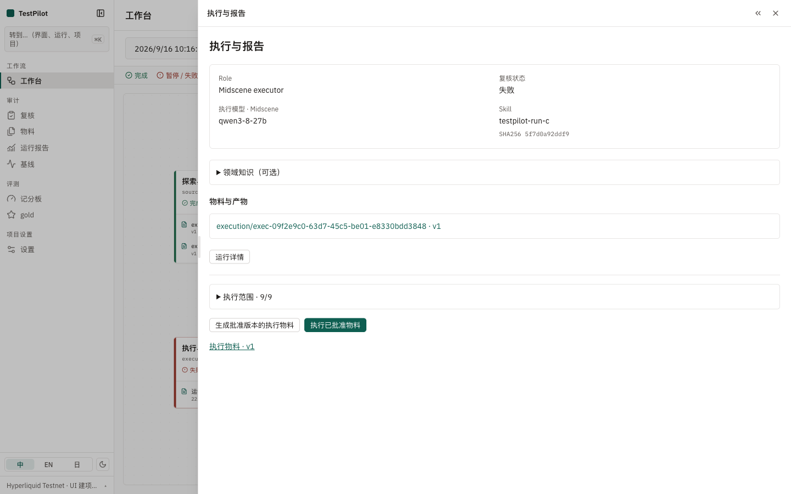
*执行节点详情：执行范围与编译、执行按钮（2026-09-16 截图）*

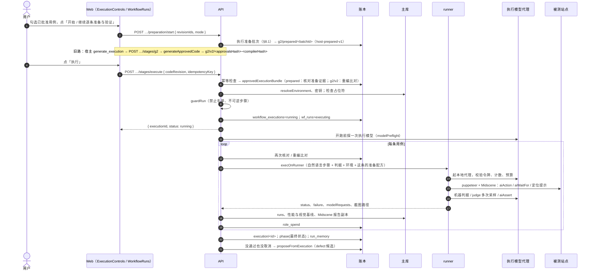
```mermaid
sequenceDiagram
  autonumber
  actor U as 用户
  participant W as Web（ExecutionControls / WorkflowRuns）
  participant A as API
  participant L as 账本
  participant D as 主库
  participant R as runner
  participant P as 执行模型代理
  participant S as 被测站点
  U->>W: 勾选已批准用例，点「开始 / 继续逐条准备与验证」
  W->>A: POST …/preparation/start { revisionIds, mode }
  A->>L: 执行准备批次（§8.1）→ g2/prepared/<batchId>（host-prepared-v1）
  Note over W,A: 旧路：宿主 generate_execution → POST …/stages/g2 → generateApprovedCode → g2/v2/<approvalsHash>-<compilerHash>
  U->>W: 点「执行」
  W->>A: POST …/stages/execute { codeRevision, idempotencyKey }
  A->>L: 幂等检查 → approvedExecutionBundle（prepared：核对准备证据；g2/v2：重编比对）
  A->>D: resolveEnvironment、密钥；检查占位符
  A->>A: guardRun（禁止名单、不可逆步骤）
  A->>L: workflow_executions=running；wf_runs=executing
  A-->>W: { executionId, status: running }
  A->>P: 开跑前探一次执行模型（modelPreflight）
  loop 每条用例
    A->>L: 再次核对 / 重编比对
    A->>R: execOnRunner（自然语言步骤 + 判据 + 环境 + 这条的准备配方）
    R->>P: 起本地代理，校验令牌、计数、预算
    R->>S: puppeteer + Midscene：aiAction / aiWaitFor / 定位提示
    R->>P: 机器判据 / judge 多次采样 / aiAssert
    R-->>A: status、failure、modelRequests、截图路径
    A->>D: runs、性能与视觉基线、Midscene 报告副本
    A->>L: role_spend
  end
  A->>L: execution/<id>；phase(最终状态)；run_memory
  A->>L: 没通过也没取消 → proposeFromExecution（defect 候选）
```

- **授权**：g2 和 execute 在请求**不带** `Authorization` 头时按本地操作员处理；**带**头时按运行令牌校验。所以宿主拿着运行令牌也能编译和执行。执行准备的起批次（`preparation/start`）只认人，逐条推进（`preparation/step`）只认运行令牌。
- **g2 旧路**（`approvedRuns.ts::generateApprovedCode`）：
  - 基址取法：运行的 `sourceUrl`，其次运行的 `targetUrl`，最后项目的 `targetUrl`。
  - 选中的用例有执行阻碍（`executionBlockers`）时报 `execution_not_ready`。
  - 每一步变成 `aiAction`；以 `waitFor:` 开头的步骤变成 `aiWaitFor`；没有判据时追加 `aiAssert(expected)`。
  - 内容相同就幂等返回已有修订；每次另写一份 `compilation-observation/*` 计时回执。
  - handler 抛错时路由会把 g2 节点记 blocked（消息是错误码，非 `LedgerError` 时是 `preparation_failed`），不再停在 running。
- **执行时跑的是用例里的自然语言步骤**，不是编出来的代码字符串。代码只用于代码门禁和身份比对：g2/v2 要求重编的结果和当初一致；`host-prepared-v1` 要求批次里每条已验证用例的计划、结果与批准都没变（`preparation.ts::validatePreparedBundle`，不一致报 `preparation_evidence_changed`），不重编。
- **执行前的检查顺序**（`workflowExecution.ts::startWorkflowExecution`）：
  1. 幂等检查；
  2. `approvedExecutionBundle`：g2/v2 重编比对，代码门禁没过报 `execution_blocked_by_code_gate`，重编结果不一致报 `execution_recompiles_differently`；prepared 核对准备证据；
  3. `caseIds` 是否都在产物里（`execution_case_not_in_bundle`）；
  4. 运行是否处于 cancelled 或 interrupted；
  5. 是否已有进行中的执行；
  6. 环境是否存在；
  7. 基址取法：环境 `baseUrl`，其次运行的 `sourceUrl`，再次运行的 `targetUrl`，最后项目的 `targetUrl`；
  8. 执行阻碍（`execution_not_ready`，prepared 产物跳过这一步——准备已经逐条验证过）；
  9. 占位符是否都能解析（连同准备配方里的步骤）；
  10. 守卫（连同准备配方里的步骤）。
- **开跑前**：用运行绑定的执行模型发一次最小调用（`modelPreflight.ts::executorPreflight`），端点明确说不（401/402/403/429）就在第一条用例之前停（503 `executor_model_unavailable`，批次记 `infra_error`），带回服务商原话；连不上、超时这类判断不了的照常开跑。执行准备起批次时也探一次（`assertExecutorAvailable`）。标准集评估发起的执行改用候选模型（只在那一次执行里换，见 docs/v3/15 阶段 9）。
- **每条用例的执行**：
  - 每条都用一个新浏览器（不传 `sessionKey`）。执行前如果环境配置了 `TP_RESET_CMD`，先跑它（超时 60 秒）。
  - 一条跑完留下了没清理的资源（lifecycle `pendingResources` 非空）本来整批停。环境配置了只读核对命令 `TP_VERIFY_CLEAN_CMD` 时先跑它（资源清单以 JSON 放在 `TP_PENDING_RESOURCES`，超时 60 秒）：退出码 0 = 确认没留下，不停批，复核结果记在这条结果的 `residueCheck`；1 或其他一律照样停。准备批次同一口径（确认干净时不隔离该用例，照常进修复）。Hyperliquid 测试网的例子是 `examples/hyperliquid-testnet/verify-clean.mjs`。
  - 前提里写明「未登录」时不带登录态（`caseStartsLoggedOut`）。
  - 只有基础设施类失败且可重试时才退避重试，最多 3 次，间隔 8、16、32 秒。可重试的码有 `MODEL_UNAVAILABLE`、`EXEC_ENV`、`EXEC_TIMEOUT`。
- **批次状态**：预算耗尽记为 `budget_exhausted`，基础设施失败（重试用尽后）记为 `infra_error`，这两种都会立即中止批次；其余用例累积成 `failed` 或 `unobservable`。选中但没跑到的用例补记为 `NOT_RUN`。
- **runner 内部**（`packages/harness-testing/src/exec/run.ts::executeRun`）：
  - 顺序是：登录、`settleOn` 等待页面就绪、步骤执行前取一次快照、逐步执行 `act`（每步后截图，并检查挂在这一步之后的 `afterStep` 断言），然后求值判据、执行 `postSteps`、采集性能。
  - 判据有三类：机器判据用 `evaluateOracle`；judge 判据用 `sampleJudge` 加 `aggregateJudge`；没有判据时用 `aiAssert`。
  - 一条用例一份 `readings`：`reading` 判据在它的 afterStep 记读数（读不到先等几轮），后面引用它的 `decimal-equation` 从里取；挂在步骤上的 `text`、`decimal-equation` 不过时重读几次再判。
  - 每出一个结果，失败原因与核对说明里提到、领域参考没有的界面字面值记成界面事实候选（`factCandidates.ts`，不影响执行）。
  - 失败按 `failure.ts::classifyFailure` 归类。
- **执行记录**（`workflowRunRecord.ts`）：写主库 `runs`，比较或建立性能基线和视觉基线，按时间窗口把 Midscene 报告复制到 `artifacts/reports/<runRecordId>.html`。这一步出错不影响执行本身。
- **进度**：每条跑完，execution 节点追加一条 running 事件，消息是 `n/m · caseId · 状态`；重试等待也记一条。逐条结果本身要等整批结束才写进 `execution/<id>`，见 §10-15。

### 8.1 执行准备（`preparation.ts`）

审核通过的用例在正式执行前，由规划宿主逐条对着真环境探查、试跑，**只有 runner 跑出来的证据能把一条标成 verified**。它取代了 g2 在 Web 上的位置。

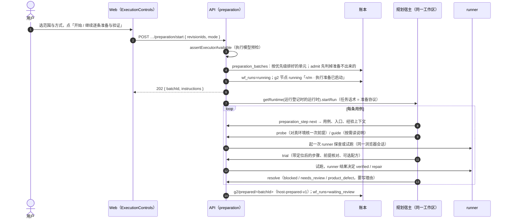
```mermaid
sequenceDiagram
  autonumber
  actor U as 用户
  participant W as Web（ExecutionControls）
  participant A as API（preparation）
  participant L as 账本
  participant C as 规划宿主（同一工作区）
  participant R as runner
  U->>W: 选范围与方式，点「开始 / 继续逐条准备与验证」
  W->>A: POST …/preparation/start { revisionIds, mode }
  A->>A: assertExecutorAvailable（执行模型预检）
  A->>L: preparation_batches：按优先级排好的单元；admit 先判掉准备不出来的
  A->>L: wf_runs=running；g2 节点 running「n/m · 执行准备已启动」
  A-->>W: 202 { batchId, instructions }
  A->>C: getRuntime(运行登记时的运行时).startRun（任务话术 = 准备协议）
  loop 每条用例
    C->>A: preparation_step next → 用例、入口、经验上下文
    C->>A: probe（对真环境核一次前提）/ guide（按需读说明）
    A->>R: 起一次 runner 探查或试跑（同一浏览器会话）
    C->>A: trial（带定位后的步骤、前提核对、可选配方）
    A->>R: 试跑，runner 结果决定 verified / repair
    C->>A: resolve（blocked / needs_review / product_defect，要写理由）
  end
  A->>L: g2/prepared/<batchId>（host-prepared-v1）；wf_runs=waiting_review
```

- **起批次**（`startPreparation`）：运行在 running/executing/registered/queued 时报 `workflow_active`，在 cancelled/paused/interrupted 时报 `run_requires_explicit_resume`（Web 会先自动 resume）。用例按 P0 → P1 → P2 排（`casegen` 的 `executionPriority`），同档前提少的先跑。范围与批准都没变时沿用上一批（`mode:"retry"`，已验证的与因留下资源被隔离的原样保留）；`mode:"all"` 新建批次全部重验。每条最多 `maxRounds` 轮（默认 3，上限 5），批次预算取 `caseRunBudget`。
- **准入**（`admit` → `preparationAdmission.ts::admissionIssues`）：readiness 标了不可执行、引用了没绑定的环境变量、生命周期问题、门禁 `setting-undeclared` / `step-compound` 的用例，不花探查直接记 blocked，理由写清缺什么。
- **逐条推进**（`preparationStep`，MCP `preparation_step`）：动作有 `next`、`probe`、`trial`、`resolve`、`discover`、`guide`。`guide` 返回六份短说明之一（prerequisites、recipe、numeric、trial、experience、blocked，`preparationGuidance.ts::GUIDES`）；被拒时错误后面附修法（`ERROR_FIXES`）。服务端冻结的东西：判据（`approved_oracle_frozen`）、收尾步骤（`cleanup_steps_removed`）、生命周期绑定的步骤、前提证据（`prerequisite_evidence_frozen`）；有前提的用例必须先 probe 才能 trial；同一条最多探 3 次；判 `product_defect` 要有一次非基础设施的真实失败试跑。
- **配方**：要先造状态的用例可以带受控配方（`recipe`）或引用已有配方（`recipeRef`，`preparationExperience.ts`）；配方里不许出现密钥值（`recipe_contains_secret`），只能提供用例声明的状态。
- **宿主中途退出**：看守定时器每 3 秒查一次。宿主会话结束而还有没做完的用例、预算没用完时自动续起，最多 3 次；这段时间里有用例得出结论就清零重计。Claude Code 撞了额度就等到重置时刻再续（不占续起次数），重置晚于预算截止就停。续起用尽或预算耗尽时 `cancelPreparation`，批次与运行记 `interrupted`，已做完的用例保留。
- **收尾**（`finish`）：所有单元都到终态后，把 verified 的用例（步骤换成准备时定位过的版本、带准备配方）写成 `g2/prepared/<batchId>`，`compilation: "host-prepared-v1"`；全部 verified 时 g2 节点 done，否则 blocked（「部分完成」）；运行改回 `waiting_review`。
- **重启**：`recoverPreparations` 把还在 running 的批次与运行记 `interrupted`，正在试跑的单元退回 repair。
- **执行**：`compiledReadiness` 选 g2 节点最近一次 done 的代码修订（没有就取最新的 code 修订）；执行时每条用例把自己的准备配方交给 runner（`opts.preparation`）。

## 9. 查看报告

**界面**：左侧导航「运行报告」列出每次执行。顶部是汇总，按失败类别计数；下面每条用例可以展开成六个 tab，右上角可以打开 Midscene 报告或跳回复核这条用例。

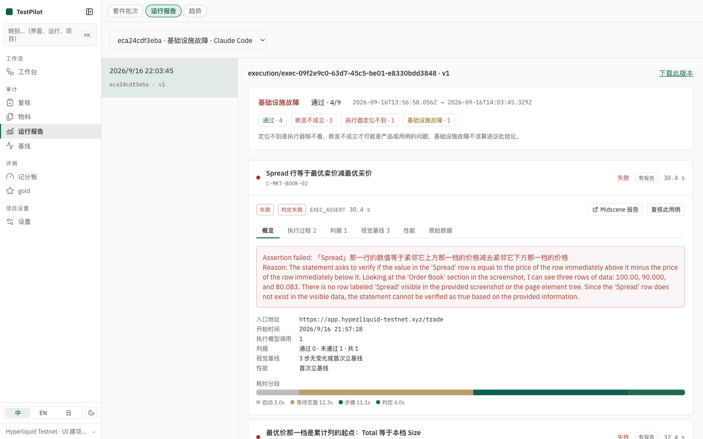
*运行报告：汇总与单条用例概览（耗时分段）*

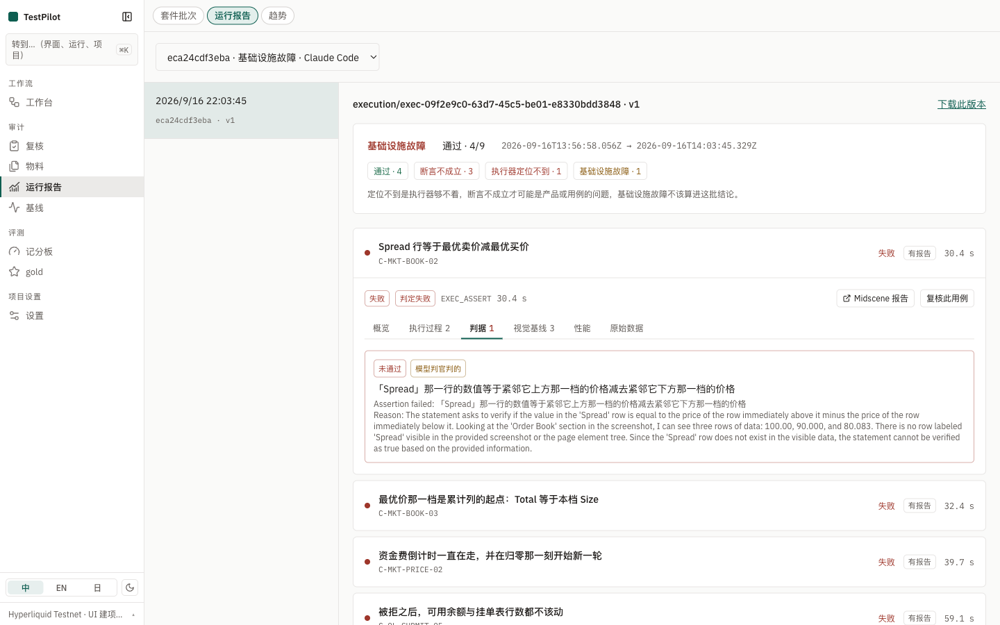
*判据 tab：模型判官的结论与理由*

执行过程 tab 里，每一步都有被测页面的截图、定位提示是否命中，以及挂在这一步之后的判定；这些截图同时是视觉基线，下次执行按步比对。Midscene 自己的报告可以逐帧回看，从「Midscene 报告」按钮打开，走的是 `GET /api/runs/:id/report`。

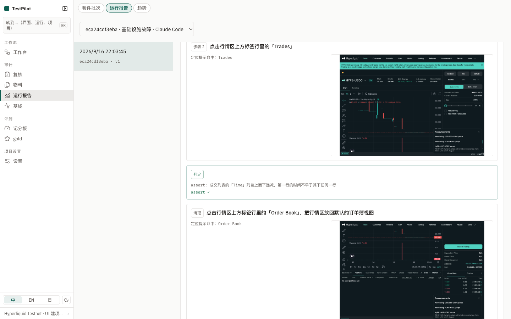
*执行过程 tab：每步的页面截图与判定（C-MKT-BOOK-05，通过）*

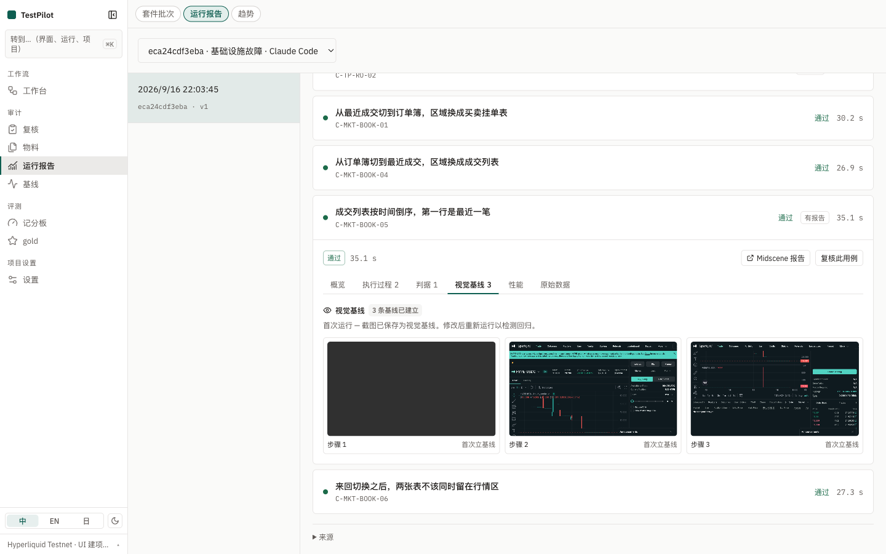
*视觉基线 tab：首次执行立基线，之后按步比对*

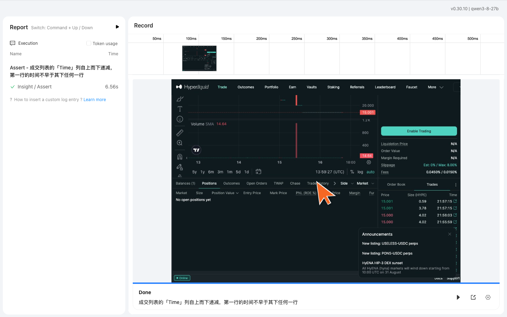
*Midscene 报告：断言在测试网页面上通过，可以逐帧回看点击落点*

工作台的「运行详情」抽屉里有各阶段状态、规划与执行成本、归因报表、执行记录与基线对比，以及回归候选。

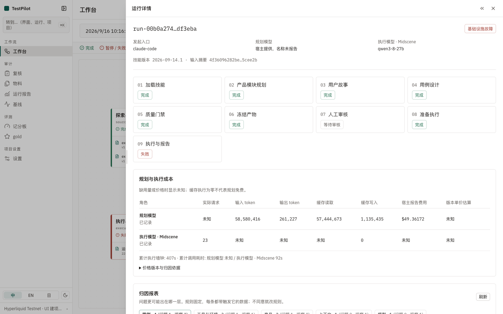
*运行详情：阶段状态与成本*

*归因报表：按层排序，每条带触发它的规则与依据*

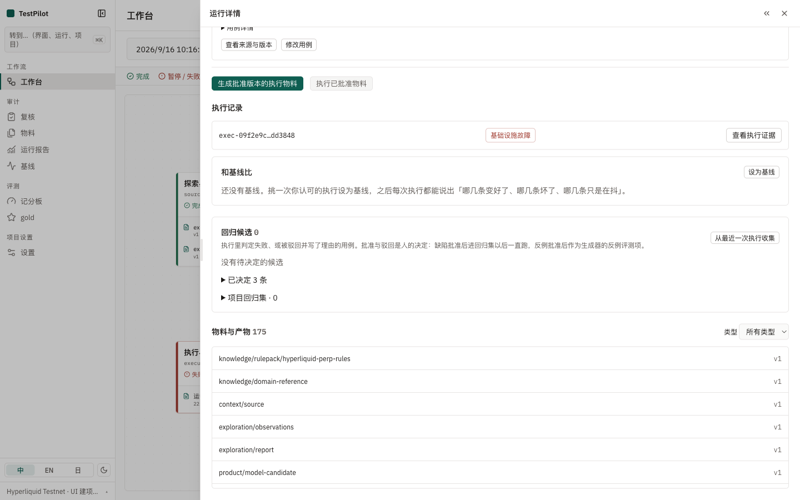
*执行记录、基线对比与回归候选*

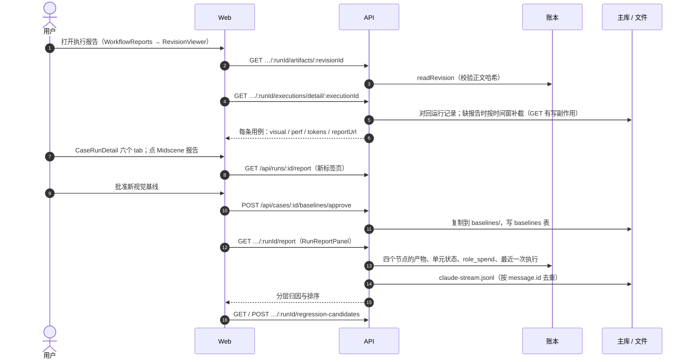
```mermaid
sequenceDiagram
  autonumber
  actor U as 用户
  participant W as Web
  participant A as API
  participant L as 账本
  participant D as 主库 / 文件
  U->>W: 打开执行报告（WorkflowReports → RevisionViewer）
  W->>A: GET …/:runId/artifacts/:revisionId
  A->>L: readRevision（校验正文哈希）
  W->>A: GET …/:runId/executions/detail/:executionId
  A->>D: 对回运行记录；缺报告时按时间窗补截（GET 有写副作用）
  A-->>W: 每条用例：visual / perf / tokens / reportUrl
  U->>W: CaseRunDetail 六个 tab；点 Midscene 报告
  W->>A: GET /api/runs/:id/report（新标签页）
  U->>W: 批准新视觉基线
  W->>A: POST /api/cases/:id/baselines/approve
  A->>D: 复制到 baselines/，写 baselines 表
  W->>A: GET …/:runId/report（RunReportPanel）
  A->>L: 四个节点的产物、单元状态、role_spend、最近一次执行
  A->>D: claude-stream.jsonl（按 message.id 去重）
  A-->>W: 分层归因与排序
  W->>A: GET / POST …/:runId/regression-candidates
```

- `StructuredCases` 请求详情失败时返回 null，页面退回原始的展开视图。
- `executionDetail` 按以下顺序对回运行记录：先用结果里的 `runRecordId`；没有时按 `caseId`、`wfRunId`、`startedAt` 在主库 `runs` 里查。
- `/api/runs/:id/report` 找不到报告时返回 404，正文是纯文本。
- 视觉基线批准经过 `intentPolicy`，带 `Authorization` 头时同样返回 403。`VisualSection` 不检查响应的 `res.ok`，出错时界面没有任何提示。
- 归因规则见 `runReport.ts::attribute`：基础设施问题归到 infra；judge 判定的失败归到模型层；没有基线、或持续失败且由机器判定的，归到产品层。
- 回归候选：`proposeFromExecution` 只收 `failed` 且归属为 assert 的用例，跳过 flaky。决定只能由人做，批准后写入 `regression_suite`。

---

## 10. 已知缺口（2026-09-17 核对，2026-09-28 按 `7c7a298` 逐条复查）

这些问题都是读代码时发现的。修好的划掉并注明日期与依据，没修的保留。第 1 条影响「人把关」这条红线，建议优先处理。

1. ~~**规划器能经 MCP 绕过人工关口**：规划会话的 MCP 进程注册了 `tp_stage.freeze_modules`、`tp_review.decide`、`tp_review.decide_candidate`，调用时不带 `Authorization` 头，服务端当成 `local-operator`。~~ —— 2026-09-28 核对已修：`host/registry.ts` 里这些动作（以及 `amend`、`set_baseline`、`approve_visual_baseline` 等）都标了 `operatorOnly`，`host/tools.ts::registerHostDomains` 注册时就把它们过滤掉，调用路径上也再拦一次（`operator_action_required`）；候选故事的批准/驳回本来就不在宿主工具里。
   **仍然存在的部分**：规划器还能用 `node`/`curl` 直接发 HTTP。服务端起的规划宿主（Claude Code / Codex / Penguin）进程树里，node 的 fetch/http、curl、wget 发往 TestPilot 服务的请求会自动带 `x-testpilot-actor: planner-host`（`server/src/runtime/hostActorTag.ts`），`reviewerPrincipal` 见到它就拒。这挡的是「顺手」，挡不住蓄意去掉请求头——那需要身份验证，本地审核免登录的决定（2026-09-10）没变。
2. **Web 用 spec 来源新建运行会被拒**（2026-09-28 仍在）：`NewRunForm` 默认勾选工作单元，而 `createWebWorkflow` 要求开了工作单元的 spec 运行必须导入产品模型，表单又没有导入入口，所以用户不取消勾选就会收到 400 `work_units_require_product_model`（在第二次提交、`assets/plans/:id/start` 时才报）。
3. **规划器干净停在半路也会被记成 `failed`**（仍在）：`finish` 里的 `paused` 分支要看门狗回调 `done`，而看门狗只在「已定稿」或「运行已是 paused/waiting_review、或有节点在等人」时回调 `done`（`penguin.ts::watchRun` 的 `expectedPause`）；其余没定稿就退出的一律回调 `failed`。
4. **Claude Code / Codex 运行在重启后不会被接回**（仍在）：`reconcilePenguinRuns` 只接 `runtime === "penguin"`，其余一直停在 `interrupted`，要人点「继续运行」。
5. **g2 路由不拦 `interrupted`**（仍在）：`beginStage` 见 interrupted 直接返回原状态，而路由只对 paused、cancelled、failed 短路，所以 interrupted 状态下 `stages/g2` 仍会编译并写节点状态；execute 由 `workflowExecution.ts` 拦下，Web 的执行准备由 `startPreparation` 拦下（`run_requires_explicit_resume`）。Web 已不走 g2，只剩宿主工具 `generate_execution` 会撞到。
6. ~~**g2 抛错后节点一直停在 `running`**~~ —— 2026-09-28 核对已修：`runRoutes.ts` 的 stage 路由在 g2 handler 抛错时写 g2=blocked（消息是错误码，非 `LedgerError` 时是 `preparation_failed`）再抛。
7. ~~**从 `WorkflowRuns` 页驳回不带理由**~~ —— 2026-09-19 已修：两个复核界面都有「驳回理由」输入框，理由不足 4 个字时驳回按钮禁用；服务端 `decideRevisions` 也会拦（400 `rejection_requires_reason`），所以宿主工具走同一条路也绕不过去。批准不需要理由。
8. **有 GET 带写副作用**（仍在）：`GET /review` 会写 `review/case/*`；`GET executions/detail` 会复制报告文件并写 `runs.reportPath`。
9. **执行前重编过多**（缩小，仍在）：g2/v2 产物每次执行至少重编 3 次，另外每条用例 2 次，靠「内容相同就幂等返回」撑着结果不变。Web 默认的 `host-prepared-v1` 产物不重编，改为同样频率地核对准备证据（`validatePreparedBundle`，2026-09-27 为此加了修订缓存）。
10. **真实错误被吞掉**（仍在）：`ProfileStoreError`、密钥解密失败这类非 `LedgerError` 的异常，会被统一压成 400 `run_request_invalid`，前端看不到真实原因（守卫的 `GUARD_*` 已单独放行成 403 带原因）。
11. **图系统与账本相互覆盖状态**（仍在）：`graphs.ts` 里 `wf.run.finished` 的订阅会用 payload 状态覆盖任何运行（§4.2）。
12. **规划预算没有传给 Claude Code**（仍在）：`claudecode.ts::startRun` 不接收预算参数，所以 Claude Code 规划只受看门狗的超时（默认 60 分钟）约束；执行准备传进去的 `budget` 同样被忽略，准备批次的截止由它自己的看守定时器管。~~宿主进程失败时，失败一律记在 source 节点上。~~ —— 2026-09-28 核对：`finish` 现在把仍挂在 running/queued 的节点各自改成 failed 或 blocked，只有 `launchSource` 里起宿主失败才记在 source 上。
13. **`saveRun` 会覆盖登记信息**（仍在）：它整体替换 `wf_runs.json`，`penguinRun.ts::startRun` 那一次写入不展开旧 detail，`register()` 写进去的 `principal`、`template`、`parentRunId` 会丢失。功能上没受影响，因为界面改从登记表读这些字段。
14. **门禁打回后续跑能否写完用例，代码里确定不了**（仍在）：`reopenUnitsFromGate` 只把单元改回 pending，cases 节点仍是 `done`，`checkpoint.next` 会指向 `gate`，重开的用例单元要靠规划器自己去领，需要实测。
15. **执行进行中看不到逐条结果**（2026-09-28 实测，仍在）：执行详情的用例列表要等整批结束才写进 `execution/<id>`，跑着的时候是空的；逐条结果只在主库 `runs` 表里，节点事件里只有 `n/m · caseId · 状态` 这样的进度消息。一批被 429 中途停下时，界面上只看得到一串 `infra_error` 批次，看不出累计有多少条通过过。
16. **就绪检查与 doctor 还按 `TP_AGENT_RUNTIME` 判规划**（2026-09-28 新发现）：Web 表单改成了项目级规划宿主（`plannerHost.ts`，查的是登录态），而 `/api/readiness` 的 planner 项和 `testpilot-setup.mjs doctor --entry web` 仍只看 `TP_AGENT_RUNTIME`（且 doctor 把 `codex` 当成非法值）、只查 `--version`。结果是：doctor/就绪全绿，建运行仍可能报 `planner_host_selection_required` 或 `planner_host_not_ready`。
