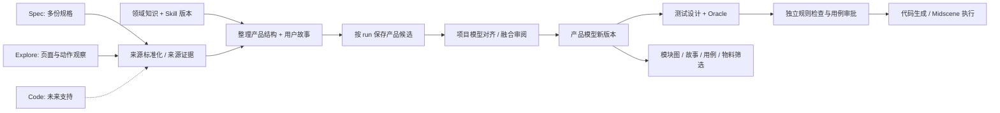

# 产品结构、多入口融合与角色知识契约

> 2026-09-10 · 本轮用户决策与 Claude 接手设计。原型已接入可审阅交互；本文件的数据契约与运行时隔离是正式实施目标，不代表生产服务已经实现。继续保留自动生成测试用例的垂直 Harness Agent、Web / 宿主双运行方式、规划 / Midscene 双模型及论文级评估目标。

## 1. 本次设计结论

**“产品结构 + 用户故事”是整理故事节点的联合产物，也是项目长期积累的产品模型。** Flow 是运行入口；结构图是物料审阅与大列表筛选入口，两者共用版本与来源。

产品结构采用树表示主模块、子模块、功能；用户故事通过多对多关系关联功能和模块。跨模块流程单独建图。不要把同一个跨模块故事复制到几个模块，也不要把页面清单当成功能或用户故事。

Spec 表达产品要求，Explore 表达观察到的实际行为，Code 未来表达实现线索。不同入口的产出先作为候选，与项目产品模型对齐、去重、审阅冲突，再形成新版本；观察不能直接改写需求，代码行为也不能自动成为正确性判据。

前置知识与 Skill 都需要，但应区分：知识提供规则、术语、边界和出处；Skill 提供处理方法、指令及可能的工具依赖。Role 决定职责和权限；Agent / 宿主是承载它的执行上下文。**换一个角色名称或提示词不构成隔离。**

## 2. 本轮原型可操作路径

原型为 [现有 HTML 工作台](../reports/testpilot-review-prototype.html)。刷新后使用。

1. Flow 选历史 run → 点击节点下方的 artifact，或“更多 → 本次全部物料”。物料页的“运行物料”也保留同一 run 的查看入口。
2. 规格物料展示已嵌入正文；代码展示对应归档内容；门禁、判据、覆盖和修复可进入原有详情。没有原始内容的地方明确说明缺失，原始数据收进“数据与来源”。
3. 故事物料显示“产品结构 + 用户故事”。旧 `wf-mt0xaw2g` 只保留 20 故事计数，未嵌入完整明细；可另开从规格重建的 22 故事产品文档，标注重建参考，不改变旧 run 产量。
4. 新 run → 开始执行 → Spec / Explore / Code。Spec 支持上传 Markdown / TXT / JSON，多份、每份 2 MB、最多 20 份；可移除或查看。Explore 填写 HTTP(S) 地址与探索限制。Code 显示暂不支持。PDF / Word 解析暂不支持，错误明确展示。
5. 在创建表单或“物料 → 领域知识”添加知识 / Skill，上传文本或登记路径、标识，选择适用模块与节点。知识引用保存为候选，未解析的引用标记待解析；上传 `SKILL.md` 不运行其中的脚本。
6. 新 run 的整理故事节点完成后，可查看结构化产品文档示例：主模块 → 子模块 → 功能 → 故事。新模拟 run 使用内置规格示例展示结构，没有对用户上传材料执行模型提取。
7. 项目产品结构延续原有模块图；选择模块后可再筛子模块、功能。用例复核增加“按产品结构筛选”，直接过滤下方队列，保留原有队列 / 详情布局。
8. 产品文档 → 融合审阅 → 选择本项目候选 run → 逐项处理字段冲突 → 保存新版本。相同实体按稳定 ID 合并、关联和来源去重；跨项目、悬空父节点、循环层级、无效故事关联被拒绝。原型不做语义同义词自动匹配。
9. 导出产品功能文档，包含带锚点的模块层级图、功能关联、唯一故事详情与来源；没有脚本或外部依赖。所有本轮新增运行、材料、知识及融合版本仅本会话保存。

原型并未调用模型、访问探索地址、执行上传 Skill、启动真实服务或产生真实研究结果。六个主模块和 22 故事是现有规格样例；大规模数据的性能与真实抽取质量需要单独验收。

## 3. 用户故事与端到端流程

| 用户故事 | 主路径 | 验收要点 |
|---|---|---|
| 产品 / QA 从规格开始 | 创建 Spec run → 上传多个规格 → 绑定领域知识 → 整理结构与故事 → 审阅 → 设计用例 | 每条需求保留源文档、段落及版本；未覆盖材料可见 |
| QA 从实际产品补充 | Explore run → 配置目标和权限 → 观察 → 生成候选结构 / 故事 → 和项目版本对照 | 页面事实、业务能力、推测分开；探索范围不越权 |
| Review 大型产品 | 总体图 → 主模块 → 子模块 → 功能 → 故事 / 用例队列 → 原文 / 证据 | 同一结构版本驱动各列表，搜索命中后定位到路径 |
| 跨模块业务审阅 | 选择关联模块 → 看到同一故事 → 展开旅程和相关功能 | 唯一 storyId，统计按去重实体；主责模块和参与模块明确 |
| 领域专家维护知识 | 上传规则 / 指定知识包或 Skill → 设置适用模块、角色 → 保存版本 → 新 run 冻结 | 旧 run 不变；候选与已批准规则、有效期、来源明确 |
| 多入口补全 | 选择 Spec / Explore 候选 → 实体对齐 → 冲突审阅 → 新产品模型版本 | 保留来源分歧，不把观察直接升级为验收标准 |
| Harness 开发调试 | 选择 run → 节点 Role / Skill / 知识快照 → 单节点 / 多节点 / 断点续跑 | 沿用原 run 定义、材料和知识版本；已完成节点不重复 |
| 研究者评估进化 | 冻结产品与领域基准 → 修改一个能力版本 → 隔离对照 → 人工晋升 | 原型改善不算算法提升；模型、预算、数据和评估器可追溯 |

建议正式流程：



融合审阅属于项目模型管理，不需要把每次运行都扩展成可自由编辑的复杂图。默认流程可在整理故事后形成可审阅检查点；首次运行或需求变更明显时等待结构确认，再开展高成本设计。连续补充来源可以单跑来源与故事节点。

## 4. 产品模型与数据边界

正式实现建议扩展已有 StoryBundle，增加 schemaVersion，兼容迁移旧格式。下列名称是目标设计，不是当前服务已经支持的字段。

```typescript
type SourceKind = 'spec' | 'explore' | 'code';
type SourceRef = {
  revisionId: string; chunkId?: string; runId?: string;
  kind: SourceKind; locator: string; contentHash: string;
  assertion: 'required' | 'observed' | 'implemented' | 'inferred';
};
type ProductNode = {
  id: string; projectId: string; parentId: string | null;
  kind: 'module' | 'submodule' | 'feature';
  name: string; description: string; sourceRefs: SourceRef[];
  status: 'candidate' | 'approved' | 'deprecated';
};
type ProductStory = {
  id: string; title: string; actor: string; goal: string; benefit: string;
  primaryModuleId: string; relatedModuleIds: string[]; featureIds: string[];
  acceptance: { id: string; text: string; sourceRefs: SourceRef[] }[];
  journeyIds: string[]; sourceRefs: SourceRef[];
};
type ProductBundle = {
  schemaVersion: 2; projectId: string; revisionId: string;
  parentRevision: string | null; sourceRunIds: string[];
  nodes: ProductNode[]; stories: ProductStory[];
  journeys: { id: string; storyIds: string[]; transitions: unknown[] }[];
  conflicts: { id: string; entityId: string; field: string; sourceRefs: SourceRef[] }[];
};
```

- 模块树层数不在数据库写死为三层；`parentId` 支持更深子模块，禁止环和跨项目父节点。UI 默认逐层展开，初屏只加载主模块及聚合数量。
- Feature 是可测试的产品能力；Story 是某类用户为达成目标串联这些能力，不要求一功能只能有一故事。当前原型的一故事一功能是样例整理方式，不能成为生产约束。
- Journey 描述跨模块业务顺序，与模块树分开；故事可关联多个旅程。模块数量不能直接当作故事覆盖分母。
- 用例冻结 `productRevisionId / storyRevisionId / featureIds / criterionIds`；批量审批、报告、物料检索共用结构选择器。全项目统计对 caseId / storyId 去重，模块内可同时包含主责与参与关联。
- 模型版本变化对已审批用例产生影响分析或待重验标记，不静默回写断言。旧执行结果继续绑定其原审批版本。
- Artifact viewer 根据真实 artifact kind / mediaType 选择结构、Markdown、代码、表格或证据预览；显示 runId、nodeId、revision、sourceRefs，不能仅提供摘要 JSON。
- 大应用按子树懒加载、队列分页 / 虚拟化、搜索定位、可折叠分支；主路径只展示一到三个层级。验收需包含千级功能、跨模块旅程、同名不同模块与移动窄屏场景。

## 5. 多入口融合规则

1. **先统一实体，保留事实类型。** 同名不保证同一功能。稳定 ID 优先；没有 ID 时给出名称、父路径、验收内容和来源的对齐候选，由用户确认，不自动删旧实体。
2. **新增互补内容。** 未发现的功能、异常路径或用户旅程新增为候选，保留来源链。Spec 与 Explore 的同一能力可合并实体，但其 required 与 observed 声明仍分别保存。
3. **冲突不覆盖。** 例如规格要求“数量必须大于 0”，页面却接受负数，应形成产品缺陷或规格待确认，不能以“最新观察”为准替换需求。正式融合需字段级解决记录和审核人。
4. **版本并发保护。** 提交带 baseRevision / idempotencyKey；基准已变则要求重算差异。融合事件引用全部输入 revision；旧 run 和物料不可变。
5. **审批后影响追踪。** 新版本触及的功能 / 验收点，映射到故事、用例与执行缓存，标为待评审 / 待重验。未触及的结果仍可按完整输入与模型指纹复用。
6. **每个入口单独评估贡献。** 区分新增真实覆盖、重复、误补、冲突和审阅成本；材料越多、故事越多不等于质量越高。

## 6. 领域知识与 finance Skill

可以支持金融领域 Skill，但不把“finance”当作一个已存在、已安装或已验证的通用能力。先登记用户实际提供的包、来源与版本。原型没有访问或读取用户其他产品中的私有 Skill。

Agent Skills 标准以 `SKILL.md` 描述技能，还可包含脚本、参考文档、资源和兼容性声明；因此 Skill 不等同于领域事实文件。[Agent Skills 规范](https://agentskills.io/specification)

Claude Code 在标准之上提供宿主扩展能力。可移植的文本与参考资料可以纳入 TestPilot 的版本化材料，宿主专属字段、工具、脚本与动态上下文必须由适配层校验；不能假设不同宿主的执行语义一致。[Claude Code Skills 文档](https://code.claude.com/docs/en/skills)

建议领域配置使用两张清单：

| 配置 | 字段与行为 |
|---|---|
| KnowledgePack | 名称、版本、sourceRefs、内容 hash、适用产品 / 模块、规则有效期、术语 / 边界 / 反例 / oracle、candidate / approved |
| SkillBinding | skillId、包路径 / 来源、版本 / digest、角色范围、所需脚本 / MCP / 运行环境、权限、resolved / incompatible / blocked 状态 |

按需装载：项目事实与通用术语 → 本模块领域规则 → 当前 Role 的方法 Skill → 当前节点输入 / 检索片段。记录实际加载的资源及 hash、检索预算和被截断内容。引用待解析只算配置完成，不能算模型已经读取。

以金融领域为例，通用财务报表分析 Skill 不一定适用于永续合约测试。需要进一步提供产品自己的数量精度、保证金模式、费用、只减仓、交易规则版本，以及可执行判据。Skill 给方法，权威材料给规则，独立 oracle 给验证；具体交易或金融规则在正式接入时仍需按来源核验。

## 7. 当前职责评估与隔离目标

已检查的本地实现：

- `packages/harness-testing/src/casegen/types.ts` 的 StoryBundle 已有 modules、flows、stories、specText 和 derivedFrom；不是从零设计。但故事主要通过 activity / flowId 关联，仍需稳定层级节点、多功能、多模块和版本关系契约。
- `server/src/runStages.ts` 的 `loadRunInstructions` 校验资产 digest、下发 run-c / stories / design 相关 Skill 与 memory，并记录实际下发信息。它不是按每个节点单独发放能力的完整隔离器。
- `server/src/runtime/skill-launch.ts` 在宿主模式发出整个登记 run 的阶段任务，并要求按工具顺序写 stories / cases。是否创建隔离的子上下文仍取决于实际宿主适配，并非换 Role 名即可保证。
- `packages/harness-core/src/run-contracts.ts` 已有材料 revision、模型绑定、skill / memory digest 和事件。contextPolicy 当前主要是 memory scoped / off；仍需每节点 ContextManifest、KnowledgeBinding、工具授权与加载证据。
- 原型曾把 source.spec 绑定到 testpilot-explore，现已修正为内置文档解析。正式插件和提示词本轮未修改，避免将设计试验误算成已发布能力。

| 节点 / 职责 | 专属输入与知识 | 写入边界 | 隔离要求 |
|---|---|---|---|
| Spec 材料解析 | 文档、格式、来源定位、术语 | SourceBundle | 确定性解析优先，不需要强行创建独立 LLM agent |
| Explore 产品探索 | 范围、登录 / 环境引用、允许操作、领域术语 | ObservationBundle | 浏览能力限域；记录实际动作和页面证据 |
| 产品分析 / 故事整理 | 来源声明、产品基准、业务规则、对齐 Skill | ProductBundle 候选 | 新节点上下文，不写批准版，不自行化解业务冲突 |
| 测试设计 | 本范围故事与功能、规则、方法、oracle | CaseBundle 候选 | 不读取 gold / 留出答案；不继承无关整个对话 |
| 用例检查 / 审阅 | 固定检查表、批准事实、独立判据 | Finding / 审阅建议 | 确定性门禁优先；若用 LLM，独立会话，不接收生成者自评分 |
| 代码生成 | 已批准用例、Midscene 方法、执行端约束 | 代码候选 | 不改验收条件、不替换 oracle |
| 代码检查与执行 | 固定规则、能力策略、执行数据 | gate / execution / evidence | 规则门禁与 Midscene 执行权限分离 |
| 有界修复 | 失败证据、原批准断言、轮次预算 | 修复候选 | 不通过放宽断言获取成功，不读取或修改评估答案 |
| 研究评估与晋升 | 冻结基准、独立标签、评估器、统计计划 | evaluation / 人工发布决定 | 与生成 workspace、权限和账本分开；PenguinHarness 管理实验 |

采用“一个编排器 + 每个有需要的 LLM 阶段一个受限上下文 + 确定性工具”。不需要为每个节点创建一个常驻 agent。规划与执行仍是两个模型角色，不是每个业务 Role 配一个模型。

ContextManifest 至少冻结：nodeId / attempt / roleVersion、skillDigests、knowledgeRevisions、sourceChunkIds、productRevision、toolGrant、tokenBudget、实际加载证明。后续知识修订不改变旧 run；因权限或解析缺失无法续跑时，应明确阻断或创建新的 run，不能偷换快照。

## 8. 论文级目标与自进化验证

这是候选研究方向，不能仅凭结构图、角色数或 Skill 绑定声称创新或性能提升。与 [12 · 论文与受控自进化](12-论文级研究与受控自进化.md) 合并执行。

| 研究问题 | 对照条件 | 主要指标与约束 |
|---|---|---|
| 多入口是否提升有效测试覆盖 | Spec-only、Explore-only、Spec+Explore 融合；固定预算与能力 | 独立真实需求 / 缺陷覆盖、无依据断言、重复率、有效执行率、成本；Code 暂不入组 |
| 分层产品模型是否有价值 | 平面 story 列表 vs 层级功能 + 跨模块关系 | 跨模块旅程覆盖、遗漏 / 重复、审阅完成时间；相同源材料和模型预算 |
| 专属领域知识是否有效 | 无知识、全局同包、按角色 / 模块检索、加入 Skill | 规则违反、边界质量、oracle 可执行性 / 正确率、token 与调用成本；不让领域包含测试集答案 |
| 上下文隔离是否有效 | 同会话多 Role vs 隔离 ContextManifest | 冲突发现、信息越权、生成自评污染、失败恢复；隔离带来的调用开销也计算 |
| 自进化是否可泛化 | 冻结基准版 vs 只修改一个 Skill / 检索策略版本 | 按项目划分留出集，多次运行、配对统计、效应量和置信区间；失败计划、预算中止全部保留 |

先完成独立标签和数据泄漏审计，再优化 Skill；训练 / 优化数据、调参数据、最终留出项目分开。逐条记录人类改写量、接受率、断言来源、执行稳定性。候选的融合版本、提示词、检索规则不能修改 gold、评估器或晋升门槛。当前原型模拟材料不得进入评估集。

## 9. 正式实施顺序与验收

PC-01～08 已映射到 [13 · 实施台账](13-UI与论文路线任务台账.md) 的 P 任务；下表保留需求与验收依据，不再独立维护状态。

以下 PC 任务是本轮新增拆分，不替代 N / P 原有任务编号，也不将其自动标为完成。

| 顺序 | 任务 | 原型状态 | 生产验收 |
|---|---|---|---|
| PC-01 | Artifact viewer 与 run / revision 统一读取 | 可查看归档正文、结构参考、代码、检查详情 | 任意真实 run 的物料可打开；缺失内容有原因；不跨项目 / run |
| PC-02 | SourceKind 与材料导入契约 | Spec 上传文本 / Explore 配置 / Code 禁用 | 上传服务、解析器、内容 hash、引用权限；入口与宿主分字段 |
| PC-03 | ProductBundle v2 与旧格式迁移 | 层级和关联示例、HTML 导出 | 稳定 ID、任意子树、跨模块故事、journey、schema 迁移、无重复 / 悬空 / 环 |
| PC-04 | 所有大列表复用产品结构筛选 | 结构页与用例复核已接入 | 用例 / 物料 / 报告共享 revision 与作用域；千级数据和键盘交互验收 |
| PC-05 | KnowledgePack / SkillBinding 管理 | 文本读取、引用、角色 / 模块绑定、版本快照 | 私有材料权限、包解析、依赖兼容、实际加载证明；主流宿主适配 |
| PC-06 | ContextManifest 与阶段权限 | 原型冻结职责、专属知识与工具策略 | 服务与宿主隔离上下文、工具授权、写入验证、留出数据不可见 |
| PC-07 | 多入口融合与影响分析 | 稳定 ID 合并、字段冲突、版本留存 | 语义对齐候选、声明级来源、并发控制、人工审阅、旧审批失效分析 |
| PC-08 | 对照研究与受控进化 | 已落研究设计，无提升证据 | 独立基准、留出项目、预注册指标、多次重复、成本公平、审阅研究 |

优先复用现有 artifact_revisions、run registration、sourceRefs 和冻结审批机制。不要另建与现有运行账本平行的第二套存储。先校正契约与真实物料可见性，再移植 UI；最后接入角色隔离和研究。每个任务交付目标、边界、验证记录与剩余项，方便 Claude 快速接续。

## 10. 最新导航约束（2026-09-10）

工作台不再提供“流程 / 产品结构”并列切换；侧栏不再单列工作流执行记录。run 在工作台选择，产品结构经整理故事节点的产物进入。未运行节点只说明预期输出；结构筛选仍供物料和用例复核共享。生产实现与原型演示均应遵循这一入口关系。
