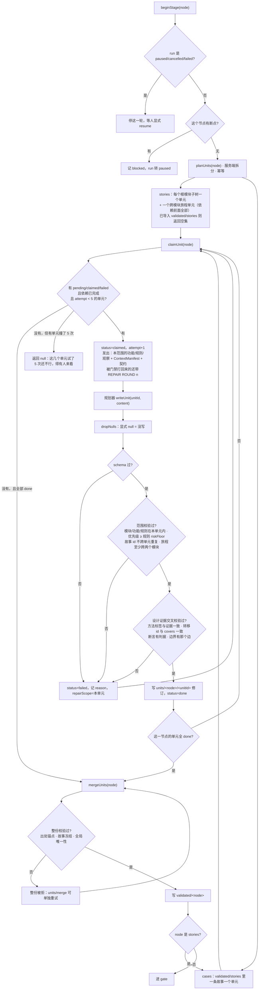
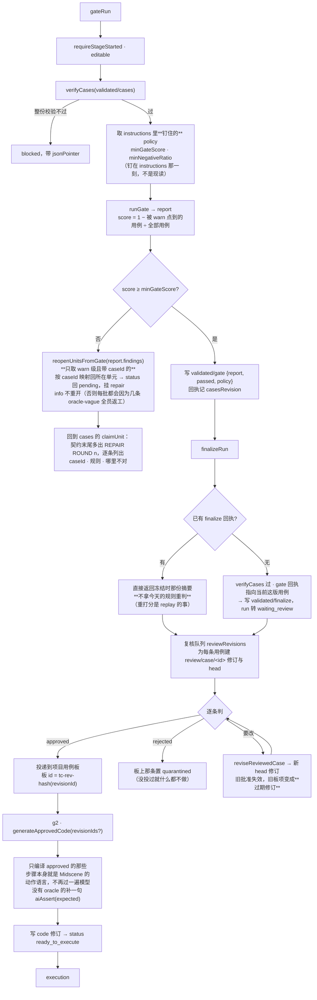
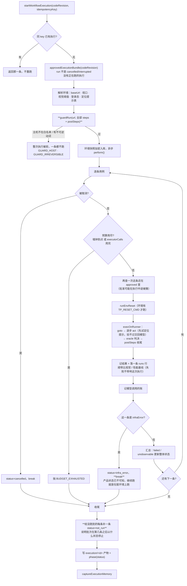

# 22 · 单元循环实现与 Hyperliquid 主网双臂对照（过夜循环状态）

> 2026-09-11 起。用户要求：把 20/21 未实现的单元循环（WorkUnit）做出来；以 https://app.hyperliquid.xyz/trade 合约交易单页为基准；同一份探索证据上，**Claude 本人作为规划宿主产出一份物料，Penguin 运行时产出一份**；对比（一）任务拆分过程与结果，（二）每个节点的物料质量。本文件是循环的状态板，每一轮只推进一个阶段并回写。

## 0. 硬边界

- 主网只做只读 UI 激活：不连钱包、不签名、不下单、不改任何账户设置；charter 里 `sideEffect: state-change` 与「Connect / Confirm / Enable Trading」一律 blocked。
- 不 commit / push；不动 Gold / human-labels / held-out / rubric；改 `prompts.ts` 或 `plugins/testpilot/skills/**` 时跳版本并跑 drift。
- 两臂共用同一份冻结探索证据（exploration.md + exploration/report + product/model-candidate + 规则包），只比规划，不比探索。
- 我这一臂加载的专业物料：`plugins/testpilot/skills/testpilot-stories`、`testpilot-design/*`（含 REFERENCE-domain-perp）、20 §5–8、21 §4–6 的角色提示，以及 Hyperliquid 官方文档（订单类型 / 保证金 / 清算 / 资金费率 / tick-lot）。Penguin 臂只拿系统正常下发的东西，不额外喂。

## 1. 阶段与状态

| # | 阶段 | 状态 | 产物 / 备注 |
|---|---|---|---|
| A | 主网页面控件清单（Chrome 只读） | **done** | `docs/v3/evidence/hl-mainnet-2026-09-11/controls.json` |
| B | 规则包 `fixtures/hyperliquid-mainnet/rules.json` | **done** | v2026-09-11.2：10 模块 / 21 功能 / 23 规则（normative 18、observed 3、hypothesis 2）/ 26 目标；validateRulePack 曾拒掉我 4 条越级主张 |
| C | WorkUnit 机制：账本表、planUnits / claim / write / merge、MCP 工具、HTTP 路由 | **done** | `server/src/workUnits.ts`，7 项测试通过；`claim_unit` / `write_unit` / `unit_status` 三个 MCP 工具；整份写入在开单元的 run 上被拒 |
| D | 规划器接口：Penguin / 宿主话术改成领单元 | **done** | `unitGenerationMessage`；`penguinRun.startRun` 在 `params.workUnits===1` 时改用它 |
| E | 冻结探索 | **done** | 真实主网 2 分钟：18 状态 / 23 走过的边 / 15 目标激活 / 0 次状态变更动作；功能 confirmed 4、inconclusive 8、unverified 5、blocked 4、conflicted 0 |
| F | 臂 1（Claude 本人） | **done** | run `run-a77e2f04`：6 故事单元 + 22 用例单元 = 28 个单元，22 故事 / 68 用例，门禁 1.0（98 条 info），waiting_review |
| G | 臂 2（Penguin） | **done** | 第 1 次 `run-30f55b8f` 被 10 分钟墙钟掐断；修好预算后 `run-cd1af852` 完成：28 个单元全部一次通过，22 故事 / 67 用例，门禁 1.0（1 条 warn），waiting_review |
| H | 参考拆分（WBS） | **done** | 本文 §3 |
| I | 对照报告 | **done** | 本文 §4，数据 `evidence/hl-mainnet-2026-09-11/compare/compare.json` |

## 2. 循环日志（新条目在上）

- 2026-09-11 · 审核 → 编译 → 执行。135 条审核后拒 2 条（方法标错 / 判据与断言不符），两条臂编译均 ready_to_execute。执行只跑只读子集：两次都被执行模型端点掐断（5 次探测全部返回空内容），在此之前暴露了三件事——执行器在无语义 DOM 上定位不到控件、我的账户面板用例前置条件漏写「需已连接账户」、一次端点故障会正确地被记为 infra_error 而不是用例失败。端点故障期间用浏览器做了确定性人工复核：14 条可程序判定的公开断言全部为真；已拒的那条 TC-TP-01-4 断言也确实错了（默认有效期是 IOC 不是 GTC）。
- 2026-09-11 · G 与 I 完成，两条臂对齐。Penguin 重跑后 28 个单元**全部一次通过**，22 故事 / 67 用例，门禁 1.0；我这边 4 个单元被服务端拒过再重写。两批物料形状差得很清楚：我更多接口判据（33 对 11）、tier 3 更少（5 对 27）、负例比例达标（0.338 对 0.254）；Penguin 覆盖更全（21/21 功能、23/23 规则，我 20/21、21/23）、步骤更实（2.66 步对 1.71 步）。两批都拿了 1.0——Penguin 那批负例不足并被记了 warn，但那条 warn 没有 caseId，进不了分数的分子。
- 2026-09-11 · 预算事故与修复。Penguin 臂第一次跑到第 10 个单元被掐断，`run-budget.json` 写着 `wallMs: 600000`——那是给「一次写整份」定的 10 分钟，而单元循环一个单元至少 claim + retrieve + write 三次调用。**一个会因为拆得更细而被自己的预算杀掉的机制等于没有这个机制。** 修法：`unitRunBudget(units)` 按单元数放大（每单元 12 次调用 / 4 分钟，上限 2000 次 / 6 小时），显式配了 `TP_RUN_MAX_MS` 或 `TP_PLANNER_MAX_CALLS` 就以 env 为准；预算要真的交到 `rt.startRun` 手上，只写进运行详情不算。第二次跑拿到 324 次调用 / 108 分钟。顺带发现 `PenguinStartInput.budget`（记录用的 calls/usd/ms）和 `RunBudget` 是两个形状，之前改错了地方。
- 2026-09-11 · F 完成。22 个用例单元逐条写入，68 条用例。服务端在三处拦下我：① 三条用例的优先级低于所引规则的 P0 风险下限；② 一条用例引用了本故事范围外的功能 `order.reduce-only`；③ 整份合并时出处门禁指出 9 条用例引用了本次没取过的材料段 `exploration.md#9`。前两处按单元修复重写，第三处按提示取回那一段再合并。为此补了一个可重试的合并入口（`units/merge` / MCP `merge_units`）——此前最后一个单元写完就触发合并，合并失败时没有重试入口。门禁 1.0，但 98 条 info（method-mismatch 37、no-transition 36、oracle-vague 20、tier 5）：**分数只统计 warn，全是 info 时满分掩盖了这些缺口**，正是 20 §4 说的那条。
- 2026-09-11 · F 故事阶段完成。6 个单元（market / trade-panel / order-lifecycle / position-risk / account / journeys）逐个领取并写入，全部一次通过校验，服务端合并出 22 条故事。单元上下文：最小 4.4KB（account），最大 46KB（journeys，只拿故事索引不拿正文），其余 6.7–20KB。
- 2026-09-11 · E 完成。主网真实探索两次失败一次通过：① 采集器把裸 `<button>` 按 HTML 默认值判成 submit，charter 的不点提交策略把整个交易面板挡掉；② 禁点词表里的方向词把「Buy / Long」「Sell / Short」挡掉，而它们是 ui-only 的方向切换。修法：`submit` 只在 `<form>` 内成立；词表去掉方向词，改用「命中任何 state-change 目标就拒绝」的交叉检查。交叉检查随后抓到我自己写的 T-SUBMIT 模式 `^(Buy|Sell) ` 过宽。
- 2026-09-11 · 新增 inconclusive。主网这一页的 tab / 勾选全是无 ARIA、class 为构建哈希的 div，采集器一条选中态都取不到；第一版把 6 条规则判成 conflicted，而页面其实全部正常响应。现在按**通道**判：整次探索一条 stateChanged 都没有 → 依赖它的期望是 inconclusive（看不见），不是 contradicted（产品错）。
- 2026-09-11 · C/D 完成。WorkUnit 表 + planUnits（故事按主模块子树、跨模块旅程单元依赖它们；用例一条故事一个）+ claimUnit（只给本单元的功能/规则/观察 + ContextManifest + contract）+ writeUnit（越界、缺角色/验收、重复 id、P0 下限逐条拒绝并给 jsonPointer）+ mergeUnits（代码合并后走原整份校验）。`Story` / `TextCase` 加 `featureRefs` / `ruleRefs`。7 项服务端测试通过。
- 2026-09-11 · A 完成。主网 /trade 只读采集：整页仅 27 个按 ARIA 角色可见的控件，Market/Limit/Pro、Buy/Sell、Reduce Only、TP/SL、底部面板 tab 全是无 role 的 `div`，Price/Size 输入框无 label/placeholder。据此给探索器加了两条采集能力：输入框取兄弟文字当文案；charter 模式下按目标文案补采 `cursor:pointer` 叶子元素。清单见 evidence/hl-mainnet-2026-09-11/controls-observed.md。
- 2026-09-11 · 启动。API 5301（qwen3-8-27b）、runner、agent、Penguin server 在跑，无执行中的任务。

## 3. 参考拆分（我作为领域分析员独立给出的 WBS）

先说清楚这份拆分的依据：ISTQB CTFL 4.0.1 第 4、5 章的测试分析与设计流程（测试条件 → 覆盖项 → 测试用例），加上永续合约产品的模块划分（市场 / 交易面板 / 订单生命周期 / 持仓风控 / 账户资金），再叠上本项目 20 §7 的资金风险优先级。**拆分轴选的是"业务模块 + 单条故事"，不是"页面 / 屏幕"**——按屏幕拆会把同一条 route 上的整个交易面板压成一个单元，正是原探索犯的错。

| 层 | 单元 | 为什么是一个单元 | 上下文只需要 |
|---|---|---|---|
| L0 | 领域规则包 | 一次性、跨全局；规则的适用性判断需要看到全部来源 | 官方文档 + 产品版本 |
| L1 | 每个主模块的探索 charter | 目标按模块聚类，预算才不会被全局导航吃掉 | 该模块的功能与规则 |
| L2 | 每个主模块的产品模型片段 | 功能的验证状态只取决于该模块的回执 | 该模块的回执 + 规则 |
| L3 | 每个主模块的用户故事 | 一条故事属于一个主责模块；跨模块的另起一层 | 该模块的功能 / 规则 / 观察 |
| L3' | 跨模块旅程故事 | 它们的价值恰恰在于串起多个模块，不能在模块单元里写 | 各模块故事的**索引**（ID + 标题），不要正文 |
| L4 | 每条故事的测试设计 | 设计方法、边界、判定表都是对着一条故事的验收条件做的 | 该故事 + 它引用的规则原文 + fixture 能力 |
| L5 | 每条用例的独立审阅 | 审阅要独立于生成上下文 | 用例 + 规则原文 |
| L6 | 每个目标工程的集成 | 集成绑定的是仓库与框架，不是故事 | 批准版本 + 工程契约 |

三条硬约束（拆分对不对就看它们）：

1. **单元的上下文必须随产品规模保持有界。** 判据：加一个模块，已有单元的上下文不变。
2. **合并必须是代码做的。** 判据：把两个单元的输出交换顺序，合并结果只在数组顺序上不同。
3. **越界必须被拒绝，而不是被容忍。** 判据：在 A 模块的单元里写 B 模块的故事，服务端报错并指出字段路径。

本轮实现的 L1–L4 与这份参考一致；L0 做成了创建 run 时绑定的规则包，L5、L6 未实施。代码实际的 `planUnits` 与上表的差别只有一处：L2 产品模型没有按模块拆成单元，而是由代码在探索回执上一次性算出（`buildProductModel`）——因为它是确定性的，没有模型参与，拆不拆都不影响上下文预算。

## 4. 对照结果

### 4.1 拆分过程（谁在拆、拆成什么）

| | 参考拆分（§3，我按领域方法给的） | 代码 `planUnits` 实际拆的 | 臂 1（我）实际走的 | 臂 2（Penguin）实际走的 |
|---|---|---|---|---|
| 谁决定单元边界 | 领域分析员（人） | 服务端按产品模型的主模块子树 / 单条故事 | 不能决定，只能领 | 不能决定，只能领 |
| 故事层单元 | 每个主模块一个 + 跨模块旅程一个 | 同（5 个主模块 + 1 个旅程单元，旅程依赖前 5 个） | 6 个，全部一次通过 | 6 个，全部一次通过 |
| 用例层单元 | 每条故事一个 | 同（22 个） | 22 个，其中 4 个重领重写 | 22 个，全部一次通过 |
| 合并 | 代码，按稳定 ID | 代码，`mergeUnits` → 原整份校验 | 未参与 | 未参与 |
| 越界能否发生 | 不该 | 服务端逐字段拒绝 | 被拒 3 次（P0 下限 ×2、功能越界 ×1）+ 1 次合并出处失败 | 0 次 |
| 是否试过整份写入 | — | 会被拒 | 没试（我知道会被拒） | 没试（任务话术里说了会被拒；trace 里 claim_unit / write_unit 各 8 / 7 次，write_stories 0 次） |

代码拆出来的和参考拆分只差一处：产品模型没有按模块拆成单元，因为 `buildProductModel` 是确定性的、没有模型参与，拆不拆都不改变上下文预算。

### 4.2 上下文规模：这才是单元循环存在的理由

| | 字符数 |
|---|---|
| 整份写入时规划器要看的材料（exploration.md + product-model.md） | 158,721 |
| 故事单元的上下文：最小 / 中位 / 最大 | 4,434 / 10,822 / 46,229 |
| 用例单元的上下文：最小 / 中位 / 最大 | 5,516 / 6,712 / 23,078 |

最大的那个是跨模块旅程单元（46,229）——它必须看到全部功能与规则，但只拿到各模块故事的**索引**（ID + 标题 + 模块），不拿正文。除它以外，没有一个单元超过 24KB。加一个模块，已有单元的上下文不变，这是 §3 第一条硬约束的实测。

### 4.3 单元边界拦下了什么（臂 1）

三类，全部由服务端确定性判定，与模型的自我评价无关：

| 拦截 | 次数 | 具体 |
|---|---|---|
| `priority_below_rule_floor` | 3 | 我把引用了 P0 风险下限规则的用例写成 P1（TC-OL-01-3、TC-PR-01-3、TC-PR-02-3） |
| `feature_out_of_unit_scope` | 1 | TC-PR-03-2 引用了本故事范围外的 `order.reduce-only` |
| 出处门禁（整份合并时） | 1 次合并失败 / 9 条用例 | 引用了本次 `retrieve_spec` 没取过的 `exploration.md#9` |

第三类暴露了一个真实缺口：最后一个单元写完就自动触发合并，合并失败时没有重试入口。已补 `units/merge` 与 MCP `merge_units`，并加了幂等重试的测试。

### 4.4 门禁分数与实际缺口（臂 1）

门禁 1.0，98 条 findings，**全部是 info，所以一条都不进分母**。`scoreBasis` 写着 `1 − 0/68`。

| 规则 | 条数 | 是什么 |
|---|---|---|
| `method-mismatch` | 37 | 标了 `state-transition` 但用例里找不到该方法的痕迹 |
| `no-transition` | 36 | `covers` 为空 |
| `oracle-vague` | 20 | `expected` 以「接口中…」开头，启发式认不出可观察现象 |
| `tier` | 5 | tier 3，提示优先用 1 |

前两条同源，而且**是单元循环合并的缺陷**：合并出的 bundle 里 `flows: []`，因为产品模型没有把状态转移图的转移暴露成 `flows`，用例无从引用转移 ID。这不是我写用例时偷懒，是这条链路少了一段映射。本轮不改（改了会让两条臂吃到不同的合并逻辑），记为下一切片。

第三条要分开看：那 20 条里多数是 `kind: api` 的判据，`expected` 写的是「清算接口中该合约持仓数量等于 X」——它确实点名了一个可观察的数，只是门禁的启发式按屏幕文案设计。这条 info 值得保留，但不该被当成质量缺陷。

### 4.4b 臂 1 自评：门禁没说但确实弱的地方

- **步骤太短。** 68 条用例里 30 条只有一步，平均 1.71 步。对「切一个 tab 看一个字段」这类确实够，但对下单、减仓这类跨面板的用例，把「填数量」「选方向」「提交」压成一步会让失败定位不到具体哪一步。设计方法参考里「一条用例一次迁移」是对的，但一次迁移不等于一步操作。
- **清理只写了 17 条。** 其余 51 条给的是空数组。只读用例给空数组是答案，但像「设杠杆」「切保证金模式」这些改了账户设置的用例，空数组是漏了——我在部分用例里写了 postSteps（改回原值），没有全覆盖。
- **`covers` 全空。** 这一条是链路缺陷不是我的取舍，见 4.4。

### 4.5 逐节点物料（两臂）

由 `server/scripts/compare-arms.ts` 从账本算出，不是手写。完整数据在 `docs/v3/evidence/hl-mainnet-2026-09-11/compare/compare.json`。

| 指标 | 臂 1（Claude） | 臂 2（Penguin · qwen3-8-27b） |
|---|---|---|
| 单元：故事 / 用例 | 6 / 22 | 6 / 22 |
| 单元一次通过 / 重领重写 | 24 / 4 | **28 / 0** |
| 故事 / 跨模块 / 覆盖模块 | 22 / 13 / 10 | 22 / 12 / 10 |
| 故事有 role 与 benefit | 22/22 | 22/22 |
| 验收条件总数 | **71** | 63 |
| 用例 / 每故事 / 覆盖故事 | 68 / 3.09 / 22 | 67 / 3.05 / 22 |
| 设计方法 | 状态迁移 36、negative 15、等价类 9、边界 8 | 等价类 28、状态迁移 22、negative 13、边界 4 |
| negative+boundary 占比 | **0.338** | 0.254（低于 0.3 门槛，被记 1 条 warn） |
| 优先级 | P0 44 / P1 19 / P2 5 | P0 31 / P1 34 / P2 2 |
| tier | 1:50 / 2:13 / **3:5** | 1:35 / 2:5 / **3:27** |
| 判据种类 | api **33**、text 21、noText 5、delta 4、无 5 | api 11、text 24、noText 4、delta 1、无 27 |
| 声称 tier 1/2 却没有判据 | 0 | 0 |
| 平均步骤数 | 1.71 | **2.66** |
| 功能覆盖 / 规则覆盖 / P0 规则 | 20/21 · 21/23 · 10/10 | **21/21 · 23/23** · 10/10 |
| 引用的界面文案 / 材料里查不到的 | 105（42 个不同）/ 0 | 222（71 个不同）/ 2 |
| 标 requires-fixture 的用例 | 37 | 30 |
| 门禁 | 1.0，98 findings（全 info） | 1.0，48 findings（47 info + **1 warn**） |

各自更强的地方，逐条说：

- **Penguin 的覆盖更全**：21 个功能、23 条规则一条不落，我漏了 1 个功能、2 条规则。单元把范围端到它面前之后，"漏掉一个功能"这件事变得不容易发生——但我还是漏了，它没有。
- **Penguin 的步骤更实**：平均 2.66 步，我 1.71 步，其中 30 条只有一步。把"填数量、选方向、提交"压成一步，失败时定位不到哪一步，这是我的问题。
- **我的判据更硬**：33 条接口判据对 11 条，tier 3 只有 5 条对 27 条。Penguin 那 27 条 tier 3 多数是它主动放弃断言拒绝文案——它在 expected 里写"拒绝文案未被规格固定，不断言"，这个判断**是对的**（规则包确实没有固定那些文案），代价是这些用例只能靠人看。我则更多地把结果推到接口上，绕开了文案不确定的问题。
- **我的负例比例达标**：0.338 对 0.254。Penguin 这一条被门禁记了 warn。

「引用的界面文案在材料里查不到」这一项要打个折扣：Penguin 那 2 条都出自同一条用例的 `「无持仓」`——它把这四个字当作概念强调加了引号，同一句里对真正的界面文案 `「No open positions yet」` 引得是对的。所以这更像我这个指标的误报，而不是编造。指标本身要改成只统计"看起来像界面文案"的引用。

### 4.6 两条臂都撞上的同一件事：门禁满分说明不了什么

两条臂都是 1.0。Penguin 的负例占比 0.254 低于 0.3 门槛，门禁**确实记了一条 warn**，但那条 warn 是整批级别的、没有 `caseId`，而分数的公式是「被 warn 点到的用例数 ÷ 全部用例数」——没有 caseId 就进不了分子。于是一批负例不足的用例集，拿到了和达标的那一批一模一样的分数。

这不是新发现，20 §4 早就写了"全局 negative-ratio 警告不影响规则分数"。这次是它第一次在两条真实臂上同时显形，而且是**低的那一批和高的那一批分数相同**。门禁分不该继续单独作为放行依据，21 §8 提的三层门禁（硬事实 / 业务充分性 / 语义审阅）里，业务充分性那一层就是缺的这一层。

## 5. 方法与限制

**两条臂唯一的差别是谁在规划。** 同一个项目、同一份冻结探索材料（`materialsHash` 相同）、同一个规则包与产品模型、同一套单元定义与服务端校验、同一个 `limit=4`。臂 1 是我本人通过 HTTP 网关（与 MCP 工具打的是同一组接口）逐单元领取与写入；臂 2 是托管 Penguin 运行时用 `qwen3-8-27b` 跑同一套 MCP 工具。

**这不是一次公平的模型对照。** 两边的规划模型不是同一个，能力差距远大于任何提示词或流程差异；样本量是 1；我在写物料前主动加载了 14 份 skill / reference（服务端下发的同一份），而 Penguin 拿到的也是同一份下发，但它是否逐条读过无从证明。这一组数据能说明的是**单元循环这条机制在两种规划器上都能跑通、边界都守得住**，以及**同一份材料下两种规划器产出的物料形状差在哪**；它不能说明谁"更强"。

**上下文隔离的实测差别**：臂 1 每个单元我只带该单元的材料进来；臂 2 是一个持续累积的 Penguin 会话，跑到用例阶段时会话累计 token 已达 283 万（其中缓存读 262 万）。单元把**每次要读的东西**限住了，但没有限住**会话累计**——真正的隔离要按单元起进程，那是下一步。

**主网只读**：所有状态变更类控件在 charter 里声明为 `state-change`，被发现即记 blocked；探索用的是无钱包的全新 headless 浏览器。没有下单、没有签名、没有资金操作。

**未实施**：独立审阅员（21 §4 F）、工程增量集成（20 §11 切片 7）、按单元起进程的隔离、把状态转移图的转移映射进 bundle 的 `flows`（缺它导致 `covers` 恒空，门禁记了 36 条 `no-transition`）。

## 6. 审核 → 编译 → 执行（2026-09-11）

### 6.1 审核：135 条里拒了 2 条

审核走的是本地免登录通道，决定记为 `local-operator`。**这不是真人 Gold**（09 §25：操作方分类不证明真人身份），它是一次可复核、可撤销的操作记录。

审核不是逐条读一遍就批。我先跑了一遍可判定的条件——含糊断言、tier 1/2 缺判据、判据钉在易变读数上、引用材料里没有的界面文案、标了 boundary 却没有任何边界、P0 却没有规则依据、缺出处——再逐条看被挑出来的。

| 被拒 | 臂 | 理由 |
|---|---|---|
| `TC-TP-01-4` | 我 | `designMethod=boundary`，但这条查的是有效期默认值 GTC，没有取任何边界。方法标错。 |
| `TC-ACC-003` | Penguin | `expected` 断言五个读数为零，`oracle` 却只检查标签文字「Portfolio Value」存在。标签存在不能证明数值为零，而它声称自己是 tier 1。 |

结果：我 67 批准 / 1 拒绝，Penguin 66 批准 / 1 拒绝。

顺带确认了一条误报：Penguin 的 `TC-PR-004` 被我的"引用文案不在材料里"指标点名，实际是它把 `「无持仓」` 当概念加了引号，同一句里对真正的界面文案 `「No open positions yet」` 引得没错。这个指标要改成只统计看起来像界面文案的引用。

### 6.2 编译：两条臂都 ready_to_execute，0 阻塞

`g2` 是确定性编译，不调模型。两条臂的全量批准版本都编译通过。

### 6.3 执行：只跑只读子集，不碰资金

这一步有三道独立的闸，我没有绕过任何一道：

1. **项目没有配置环境**，浏览器是全新的、无钱包、未登录，页面上提交位置显示的是「Connect」。
2. **`guardRun` 会拦整批**：`app.hyperliquid.xyz` 不在允许名单（只有 localhost），而批准集里有带「下单」「提现」「转账」字样的步骤——整批执行会被 `GUARD_IRREVERSIBLE` 直接拒绝。
3. **我自己再筛一遍**：按 guard 同一份词表排除有不可逆步骤的用例，再排除前置条件要求钱包或 fixture 的用例。

剩下的是纯只读的 UI 检查，执行它们等同于浏览这个页面——和之前的探索做的是同一件事。

| 臂 | 批准 | 可执行 | 排除：需要钱包/fixture | 排除：有不可逆步骤 | 排除：已拒绝 |
|---|---|---|---|---|---|
| 我 | 67 | **27** | 36 | 4 | 1 |
| Penguin | 66 | **14** | 31 | 21 | 1 |

Penguin 可执行的少一半，因为它更多用例把「提交订单后读接口」写进了步骤——这批用例更贴近真实业务链路，代价是在没有受控账户时一条都跑不了。

被排除的那 67 条不是废的：它们是**执行就绪状态为 blocked 的专业设计**，按 21 §8 反例 7 的口径必须保留，不能为了让通过率好看而删掉或降级。要跑它们需要一个受控测试网账户与可控持仓 fixture，那是下一个切片的事。

### 6.4 第一次执行：三条结果，三件不同性质的事

`exec-ccf55862`（我这一臂的 27 条只读子集）跑到第 3 条就整批停下，最终状态 `infra_error`。

| 用例 | 结果 | 代码 | 归因 |
|---|---|---|---|
| TC-AC-01-1 | failed | `EXEC_LOCATE` | 模型在截图里看得见控件，但它不在元素描述树里 |
| TC-AC-01-2 | failed | `EXEC_LOCATE` | 定位到 2 个元素，有歧义 |
| TC-AC-01-3 | **infra_error** | `MODEL_UNAVAILABLE` | 执行模型返回空内容；一条基础设施错误让整批中止 |

**一、执行器在这一页也是瞎的。** 探索阶段发现的那件事——这一页的 tab、勾选全是无 ARIA、class 为构建哈希的 `div`——现在打到了执行器上。Midscene 的 `aiAction` 需要元素描述树，而这些控件不在里面。探索能跑通，是因为它用的是自己采集到的确定性选择器；执行器却要靠视觉重新找回来。**两端之间少了一次选择器交接**：`InteractionTarget.selector` 在探索回执里是有的，编译成执行物料时没有带下去。文本用例保持端无关是对的，但编译那一步可以把同一功能的候选选择器作为提示带给执行器。这是下一个切片最该做的一件事。

**二、我的前置条件漏写了，是执行把它顶出来的。** 余额、持仓、挂单、历史这四类面板未登录时没有数据，我却只写了「交易页已加载」。schema 没查出来（它不知道哪些面板要登录），门禁没查出来（它不判语义），我自己的审核也没查出来。8 条用例受影响：`TC-OL-01-1`、`TC-OL-02-1/2/3`、`TC-PR-01-1`、`TC-AC-01-1/2/3`。它们应当标为需要已连接账户。

这条值得单独记：**执行是唯一能发现「前置条件不完整」的环节**，因为只有它真的去满足那些前置条件。21 §8 的反例清单里没有这一条，应该补上。

**三、模型端点会返回空内容。** 一次 `MODEL_UNAVAILABLE` 就让整批停下。这是系统设计对的地方——基础设施故障不被记成用例失败（`isInfraError`），否则一次端点抖动会污染整批结论。

据此把执行范围收到 19 条真正公开可见的市场与下单面板用例重跑（`exec-51ef64e2`）。

### 6.5 这一轮执行给整条链路提的两个待办

1. **选择器交接**（下一切片最该做的）：探索回执里每个 `InteractionTarget` 都带确定性 `selector`，编译成执行物料时没有带下去，于是执行器要靠视觉在一个没有语义的 DOM 上重新找回同一个控件。文本用例保持端无关是对的，但**编译**那一步可以把同一 featureId 的候选选择器作为提示交给执行器。落点：`server/src/approvedRuns.ts` 的编译 + `exec/run.ts` 的动作执行。
2. **前置条件完整性**：21 §8 的反例清单里没有「前置条件不完整」这一条，而它只有在执行时才暴露——因为只有执行会真的去满足那些前置条件。建议补进业务充分性那一层：引用了账户面板功能的用例，前置条件必须声明账户状态。

### 6.6 第二次执行：被执行模型端点掐断，且这次确认是端点坏了

`exec-51ef64e2`（收窄到 19 条公开页面用例）跑了 2 条就停：

| 用例 | 结果 | 代码 |
|---|---|---|
| TC-MKT-01-1 | failed | `EXEC_ASSERT`：页面上没有「Time」 |
| TC-MKT-01-2 | **infra_error** | `MODEL_UNAVAILABLE`：执行模型返回空内容 |

直接探端点，5 次全部返回 HTTP 200 + 空 content：

```
endpoint api.runinfra.ai · model qwen3-8-27b
probe x5 -> ok 0 empty 5 errors []
```

所以执行阶段现在走不通，原因在模型服务，不在物料、不在 TestPilot。继续重试只会烧时间，不会产生信号，因此停在这里。Penguin 那 14 条同理没有起跑。

### 6.7 端点故障期间的确定性人工复核：14 条判据全部为真

执行跑不动，但用例对不对是可以不靠模型验证的。我在浏览器里按每条用例的步骤确定性地点，再核对它的判据。**这不是执行结果**，是人工复核；它回答的是「用例写对了没有」，不是「产品有没有缺陷」。

| 用例 | 判据 | 结果 |
|---|---|---|
| TC-MKT-01-1 | 点 Trades → 出现「Time」 | 通过 |
| TC-MKT-01-2 | 点 Order Book → 出现「Spread」 | 通过 |
| TC-MKT-01-3 | 切到 Trades 后不再有「Spread」 | 通过 |
| TC-MKT-02-1 | 顶部有「Oracle」 | 通过 |
| TC-MKT-02-2 | 顶部有「Countdown」 | 通过 |
| TC-TP-01-1 | 点 Limit → 出现「Mid」 | 通过 |
| TC-TP-01-2 | 点 Market → 不再有「Price (USDC)」 | 通过 |
| TC-TP-01-3 | 点 Pro → 出现「Stop Limit」 | 通过 |
| TC-TP-03-1 | 打开保证金对话框 → 出现「Isolated」 | 通过 |
| TC-TP-03-2 | 出现「All cross positions share the same cross」 | 通过 |
| TC-TP-04-1 | 打开杠杆对话框 → 出现「Adjust Leverage」 | 通过 |
| TC-TP-04-2 | 出现「Max position size decreases the higher your leverage」 | 通过 |
| TC-TP-06-1 | 勾选 TP/SL → 出现「TP Price」 | 通过 |
| TC-TP-06-2 | 取消勾选 → 不再有「SL Price」 | 通过 |

14 条能被程序判定的公开断言全部为真。另外 5 条是 tier 3 或 delta，没有可单独核对的字面判据。

**而我已经拒掉的那条 `TC-TP-01-4`，断言本身也是错的。** 它写「限价单默认有效期为 GTC」，实际页面默认是 **IOC**；GTC 只是 TIF 下拉里的一个选项。我把「GTC 是可选项之一」写成了「GTC 是默认值」——这正是规则里反复警告的那一类：**把观察到的存在，说成了产品的承诺**。审核时我因为方法标错拒了它，事后才发现它还错第二遍。这条应该进 21 §8 的反例清单。

**执行器为什么点不动**：第一次执行的 `EXEC_LOCATE` 与这次的 `EXEC_ASSERT` 是同一件事的两面——同样的步骤我用确定性选择器点就成，执行器靠视觉在这个没有语义的 DOM 上重找就不成。这再次指向 6.5 的第一条待办：选择器要从探索交接到执行。

### 6.8 更正：端点没坏，是「关思考」这个开关对它没生效

6.6 里我写「端点坏了」，**那个结论不成立**，在这里更正。

真正的原因是推理 token 把 `max_tokens` 吃光：

```
qwen3-8-27b  max_tokens=16   finish_reason=length  content=''       reasoning_tokens=16
qwen3-8-27b  max_tokens=256  finish_reason=stop    content='ready'  reasoning_tokens=34
```

`content` 是空串，Midscene 那头报 `failed to call AI model service: empty content`，于是被记成 `MODEL_UNAVAILABLE`。我当时拿 `max_tokens=16` 探了 5 次全空就下了结论——**探针自己撞进了同一个坑**。

开关为什么没生效：`role-proxy.ts` 只对 Groq 发 `reasoning_effort: "none"`，对其他端点发的是两个厂商扩展。这个端点两个都不认：

| 发什么 | reasoning_tokens |
|---|---|
| 什么都不发 | 22 |
| `enable_thinking: false` | 24 |
| `chat_template_kwargs.enable_thinking: false` | 28 |
| `reasoning_effort: "none"` | **0** |

`server/.env` 里 `TP_MODEL_THINK=0` 一直开着，但它在这条链路上从来没生效过。修法：关思考时补发标准字段 `reasoning_effort: "none"`，执行器路径（`role-proxy.ts`）与规划器路径（`openai.ts`）都补。它是 OpenAI Chat Completions 的标准字段而非厂商扩展，Groq 分支本来就在用。两处测试相应更新。

**这次也是端点模型的一次盘点**：那里有 7 个模型，当时能用的只有 `qwen3-8-27b` 与 `ornith-1-5-35b`（后者也能看图），其余 5 个是 503 或同样的空返回。所以换模型解决不了——换了会撞上同一个开关。

**这条留给以后的教训**：一个「静悄悄返回空串」的模型故障，长得和端点宕机一模一样。区分它们的是 `finish_reason` 与 `usage.reasoning_tokens`——探端点时要把这两个打出来，只看 content 空不空会得到错误结论。

### 6.9 修完之后的执行：一个可证伪的预测

`exec-a2455b32` 不再被空返回打断，开始逐条跑完。前 5 条已经露出模式：

| 用例 | 要不要点 | 结果 |
|---|---|---|
| TC-MKT-01-1/2/3 | 要点 Trades / Order Book（无语义 `div`） | 全失败 |
| TC-MKT-02-1/2 | 只加载后读顶部读数 | 全通过 |

**断言能判，点击点不动。** 这和 6.7 的人工复核对得上：同样的步骤我用确定性选择器点就成。

据此给出一个可证伪的预测，剩下的用例会把它验证或推翻：

- `Cross` / `20x` / `Unified` 在 DOM 里是**真的 `<button>`**，Midscene 的元素树认得出 → `TC-TP-03-1`、`TC-TP-03-2`、`TC-TP-04-1`、`TC-TP-04-2` 应当**通过**。
- `Market` / `Limit` / `Pro`、`Buy / Long` / `Sell / Short`、`Reduce Only`、`Take Profit / Stop Loss` 都是无 role 的 `div` → 对应用例应当**失败**。

如果这个预测成立，结论就很硬：**这一页的可执行性由控件的 DOM 语义决定，与用例质量无关**，而补救办法正是 6.5 的第一条——把探索已经拿到的确定性选择器交接给执行器。

**预测已被推翻一半（跑到 8/19 时）**：`TC-TP-01-1`（点 `Limit`）和 `TC-TP-01-2`（点 `Market`）都**通过**了，而这两个正是无 role 的 `div`。所以「无语义 div 一律点不动」不成立，真实规律比这更细。先把 19 条跑完再解释，不拿半程数据去修补一个已经错了的说法。

### 6.10 执行抓到我审核时漏掉的一类缺陷：判据和断言互相矛盾

`TC-MKT-02-3` 失败。看它自己的内容：

```
title:    标记价是持续变化的读数，只断言字段存在不断言取值
expected: 两次读取中「Mark」字段都存在；不对它的具体数值做断言（读数是数据不是行为）
oracle:   { kind: "delta", value: "Mark", direction: "unchanged" }
```

散文说的是「不要断言它的取值」，判据说的是「它的取值没有变」。一个实时行情价必然在变，所以这条判据**必然失败**。**同一条用例里，文字和机器判据说的是相反的话。**

这正是我在审核时因为「判据与断言不符」拒掉 Penguin 的 `TC-ACC-003` 的那条理由——而我自己的批次里有一条一模一样的，我没看出来。我的审核筛了含糊断言、tier 1/2 缺判据、判据钉在易变读数上，唯独没筛「判据是否在检查 expected 声称的那件事」。门禁也不查这个。

**这是一条可以确定性检查的新门禁规则**，建议补进 21 §8：

- `expected` 里出现「存在 / 不断言取值 / 只断言字段」这类措辞，而 `oracle` 是 `delta` 且 `direction` 不是仅存在性检查 → 矛盾。
- 更一般地：`kind: delta` 的 `unchanged` 用在用例自己称为易变的字段上 → 矛盾。

门禁已有的 `oracle-volatile` 只拦「把易变读数的**值**写进判据」，拦不住「对易变读数断言它不变」。后者同样必然失败，而且更隐蔽——它看起来非常守规矩。

### 6.11 修完之后跑完 19 条：12 通过 / 7 失败 / 0 基础设施错误

`exec-a2455b32`，执行模型仍是 `qwen3-8-27b`（没换模型，只是让关思考真的生效）。

| 归因 | 条数 | 用例 |
|---|---|---|
| 通过 | **12** | TC-MKT-02-1/2、TC-TP-01-1/2/3、TC-TP-02-1/2、TC-TP-03-1/2、TC-TP-04-1、TC-TP-05-1、TC-TP-06-1 |
| `EXEC_LOCATE`（点不动） | 4 | TC-MKT-01-2/3、TC-MKT-02-3、TC-TP-07-1 |
| `EXEC_ASSERT`（点动了，断言不成立） | 3 | TC-MKT-01-1、TC-TP-04-2、TC-TP-06-2 |
| 基础设施错误 | **0** | — |

**我 6.9 的预测被彻底推翻。** 我说「无语义 `div` 一律点不动」，而 `Limit`、`Market`、`Pro`、`Buy / Long`、`Sell / Short`、`Reduce Only`、`Take Profit / Stop Loss` **全是 `div`，全部点成了**。DOM 标签不是判别依据，我把一次巧合当成了规律。

真实的失败分成两类，性质完全不同：

**第一类：3 条是我自己的用例缺陷——它们不独立。**

```
TC-TP-04-2  pre: ["杠杆对话框已打开"]              step: ["查看对话框中的说明文字"]
TC-TP-06-2  pre: ["…已勾选「TP/SL」且面板显示「SL Price」"]  step: ["取消勾选「TP/SL」"]
```

每条用例都从入口地址重新开始，上一条留下的界面状态**不会**带过来。所以第一条面对的是没打开的对话框，第二条的「取消勾选」实际把开关**勾上**了，于是「页面上仍有 SL Price」——报的失败完全正确，错的是用例。

我把它们写成了接续上一条的步骤。`REFERENCE-cleanup.md` 正好警告过这件事的另一半（用例要把产品放回去），而这里是同一枚硬币的正面：**用例不能依赖上一条留下的状态**。我手工复核时没发现，因为我是顺着点下来的，状态天然是接续的——**人工复核会系统性地漏掉独立性缺陷**。

**第二类：4 条集中在订单簿区域和读取类步骤。** `TC-MKT-01-1/2/3` 都指向右侧订单簿/成交切换那一块；`TC-MKT-02-3` 与 `TC-TP-07-1` 的步骤是「读取某字段」「点 Mid」。这块区域我手工核时就见过 `innerText` 时有时无。它是否可执行还需要单独查，不能和第一类混为一谈。

**这一轮真正证明的事**：关思考的开关修好之后，执行链路本身是通的——同一个模型、同一批用例，从「第 2 条就整批中止」变成「19 条跑完，0 基础设施错误，12 条通过」。之前把它归给端点或模型，是错的。

### 6.12 修完三条用例再跑：13 通过 / 6 失败，一条确认修好，两条换了失败原因

走的是完整版本流程：`reviseReviewedCase` 写入显式内容（不调模型）→ 旧批准被系统自动判失效 → 重新批准 → g2 **被拦**（上一次执行把 run 置成 failed，门禁不允许在失败态上继续）→ 显式 resume → 重编译 → 重执行（`exec-a8c3c9e3`）。

| 用例 | 修复前 | 修复后 | 说明 |
|---|---|---|---|
| TC-MKT-02-3 | failed `EXEC_LOCATE` | **passed** | 判据与断言对齐之后修好了。这条确认了 6.10 的诊断 |
| TC-TP-04-2 | failed `EXEC_ASSERT` | failed `EXEC_LOCATE`「multiple elements found, length = 4」 | 不再依赖上一条的状态，但我新写的步骤「点击杠杆按钮」对执行器是**有歧义的** |
| TC-TP-06-2 | failed `EXEC_ASSERT`「仍有 SL Price」 | failed：规划阶段就说「当前页面未显示该选项」 | 9 秒即失败，而点同一个控件的 TC-TP-06-1 用 25 秒通过了——偏向时序/不稳定 |

**我的预期只对了三分之一。** 我说这三条改成自包含就会通过；实际只有第三条（判据矛盾那条）通过了。把前两条改成自包含确实消除了状态依赖，但**暴露出步骤文案对视觉执行器有歧义**——这是原来被状态依赖掩盖住的第二层问题。

**跨两次运行稳定失败的是 4 条**：`TC-MKT-01-1/2/3`（点 Trades / Order Book 这两个小标签）和 `TC-TP-07-1`（点价格框旁边那个很小的 Mid）。它们的共同点不是 DOM 标签——通过的 `Limit`、`Market`、`Pro`、`Buy / Long`、`Sell / Short`、`Reduce Only`、`TP/SL` 全都是同样的无 role `div`。共同点是**目标小、周围密集、文案在页面上不唯一**。`TC-TP-04-2` 那句「multiple elements found, length = 4」是这个解释的直接证据。

所以 6.9 里那个「DOM 语义决定可执行性」的说法要作废，换成：**在这一页上，可执行性由目标在视觉上的可区分度决定**。而这恰好还是指向同一个补救办法（6.5 第一条）：探索已经为每个目标拿到了确定性选择器，把它交接给执行器，歧义就不存在了。

## 7. 自检：物料够不够专业，以及为此改了什么（2026-09-11）

### 7.1 按 21 §2 的标准量化：**不够**

两条臂共 135 条用例，21 §2 要求的 TextCaseV2 字段有八项是 **0%**：

| 21 §2 要求 | 臂1 | 臂2 |
|---|---|---|
| `acRefs` 验收点引用 | 0% | 0% |
| `conditionRefs` 测试条件 | 0% | 0% |
| `scenarioType`（与设计方法分开） | 0% | 0% |
| `design` 设计证据结构（分区/边界点/判定行/状态边） | 0% | 0% |
| `risk` 影响资产与理由 | 0% | 0% |
| `testData` 结构化数据与单位 | 0% | 0% |
| `assertions` 独立断言数组 | 0% | 0% |
| `readiness` 就绪状态 | 0% | 0% |

v1 契约里有的字段填得不错（priority 100%、sourceRefs 100%、featureRefs 100%、ruleRefs 96%/90%），但那是**引用**，不是**设计证据**。结论直说：当前物料达到的是「v1 形状 + 引用完整」，不是 21 定义的专业档。差的那八项不是写得不好，是**契约里根本没有这些字段**——要补先改 schema（P-02/P-15），不是改提示词。

方法证据的抽查也印证了这一点：臂1 的 36 条 `state-transition` 里 **36 条 `covers` 为空**，即没有一条说得出自己走的是哪条边。

### 7.2 顺带查出门禁的一个洞：`flows` 为空时 `covers` 免检

臂2 有 27 条用例填了 `covers`，值形如 `/trade~6 --[点「Trades」]--> /trade~7`——那是状态转移图**人类可读摘要里的一行**，不是转移 id。而产物的 `flows` 是空的，`gate.ts` 里的检查写着 `if (known.size)`，于是这 27 条编造的引用**一条都没被点到**，门禁还给了满分。

修法：`flows` 为空而 `covers` 非空时记一条 `covers-unverifiable`（warn，进分数）。「查不了」和「查过了没问题」是两件事。

重算的影响（用当前规则对已冻结产物离线重算，不改任何历史 revision）：

| | 旧分 | 新分 | 新增 findings |
|---|---|---|---|
| 臂1 Claude | 1.00 | 1.00 | 0（它的 covers 全空，不触发） |
| 臂2 Penguin | 1.00 | **0.597** | covers-unverifiable × 27 |

0.597 低于 `minGateScore: 0.6`——按新规则那批产物**不该放行**。旧运行的冻结分数保留供重放，不回写。

### 7.3 物料显示：把被丢掉的字段还回去

用例物料此前只渲染标题、步骤、预期，把优先级、设计方法、tier、判据、前置条件、清理步骤、出处引用全丢了——而一条用例之所以专业，恰恰在这些字段上。看不见它们，复核的人只能凭标题点头。现在一条用例显示：标题与 ID、优先级/方法/tier/故事四个标签、前置条件、步骤、预期结果、程序判据（`api` 判据展开成 `method url · path op value · settle`）、清理步骤、以及 sourceRefs / ruleRefs / featureRefs / covers 四类引用。故事卡片补上 featureRefs 与 ruleRefs。

### 7.4 执行报告：按归因分类，不再只给一个通过数

「失败 7 条」说明不了任何事。定位不到控件是执行器够不着，断言不成立才可能是产品或用例的问题，基础设施故障根本不该算进这批结论。报告顶部现在给归因分布（通过 13 · 执行器定位不到 5 · 断言不成立 1），逐条也带 attribution 标签。

### 7.5 Flow 上的抽屉改为整屏

`WorkflowBench.tsx` 里那个抽屉是手写的 `aside`，宽度被 `max-w-3xl`（768px）钉死。里面放的是规格正文、用例表、执行报告，在 1440 以上的屏上这条窄栏让每条用例横向折行，而右边留着的画布此时没人在看。改成 `fixed inset-0` 整屏，关闭按钮固定在右上，并补了 Esc 关闭——盖满视口之后没有空白处可点回画布。共用的 `Drawer` 组件也加了 `fullscreen` 选项，节点抽屉、规格抽屉、故事抽屉一并用上，收合按钮仍可切回常规宽度。

### 7.6 臂2 的执行结果：3 通过 / 11 失败

`exec-d71f664a`，14 条只读用例。失败以 `EXEC_LOCATE` 为主，其中 3 条是「multiple elements found, length = 5/6」，一条是 `EXEC_PLAN`（重规划 10 次超限）。

| | 可执行子集 | 通过 | 通过率 |
|---|---|---|---|
| 臂1 Claude | 19 | 13 | 68% |
| 臂2 Penguin | 14 | 3 | 21% |

差别不在门禁分（两边原来都是 1.0），在**步骤文案对执行器的可用性**：臂2 的步骤带了更多区域描述（「在行情区域点「Trades」」），在视觉执行器那里反而制造了歧义。**可执行性是门禁完全没有测量的一个维度**，而它只有真跑一次才看得见。

### 7.7 把缺的八个字段补进契约（2026-09-11）

7.1 的自检结论是「契约里根本没这些字段」。现在补上了，落在 `casegen/types.ts`：

| 字段 | 形状 | 给了就会被确定性核对的事 |
|---|---|---|
| `acRefs` | `string[]` | 兑现故事的哪几条验收标准 |
| `conditionRefs` | `string[]` | 覆盖哪几个测试条件 |
| `scenarioType` | `positive/negative/recovery/concurrency` | 与设计方法**分开**：负例同样是用某种方法设计出来的 |
| `design` | 判别联合，五支 | 方法与证据必须说同一件事；边界要有边界上那一点；判定行的赋值要**正好**覆盖自己列出的条件；状态边要出现在 `covers` 里 |
| `risk` | `impact / reason / ruleRefs` | 有 risk 就必须有 priority |
| `testData` | `fixtureRef / accountRef / values[]` | 每个值带单位与出处 |
| `assertions` | `[{id, statement, ruleRefs, oracle, unit}]` | id 不重复；tier 1/2 至少有一个判据 |
| `readiness` | `design / execution / reason` | execution 不是 ready 时必须说缺什么 |

三条设计决定，每条都有理由：

1. **八个全是 `optional()`，一个默认值都不给。** 和 `priority` 同一条规矩，在这里更要紧：这些是**证据**，给默认值等于替设计者答一遍，让「没给证据」和「给了空证据」在归档里长得一样。旧产物读出来是 undefined，blob 一个字节不改。
2. **`risk` 里不放 `priority`。** 21 §2 的草案把它放进去了，但本仓库的 `priority` 已经在顶层、已经被看板/导出/执行读了；再放一份就是两个真值来源，迟早得到两批对不上的优先级。所以 `risk` 只回答「为什么是这个优先级」。这是对 21 的一处有意偏离，记在这里。
3. **不进 A 臂的约束解码 schema。** 这些字段引用的是产品模型与规则包里的 id，而 A 臂从规格出发、手上两样都没有——设成必填只会逼它编 id，本仓库已经为编造的 `covers` 付过一次账。而且那个 schema 里的键必须全 required（可选键这个模型直接不写），八个嵌套结构一律必填，结果只会是形状正确、内容编造。它们由单元循环那条路径产出。`casegen.test.ts` 的豁免名单里逐条写了理由。

配套改动：

- `designEvidence.ts`：九条确定性交叉校验，只在字段出现时触发。`validateCases` 在合并时拒绝自相矛盾的证据；`writeUnit` 在**单元这一层**就拒，修复范围不会跳到整批。
- 门禁新增 `design-evidence-missing`，记 **info** 不记 warn——这些字段今天才进 schema，记 warn 会把每一批旧归档的分数一起改掉，而分数要能重放。它的作用是让缺口可见，不是把旧账翻出来重判。
- 物料视图渲染设计证据、独立断言、测试数据、风险与就绪状态；旧归档没有这些字段时整段不渲染，空着比填一个假空壳诚实。
- `testpilot-design` 的 SKILL.md 与 REFERENCE.md 写入 v2 契约与逐条校验规则，`skillVersions` 跳到 `2026-09-11.1`，drift 与两个宿主插件包重建通过。
- 单元循环的用例 contract 逐条列出这些要求，并明写「追不回来源的边界、步长或常数不要写进用例，宁可留空」。

**没做的**：已产出的 135 条用例没有回填这些字段。回填要重新设计，那是新一轮生成，不是改数据——把它们补成看起来完整的样子，正是这套契约要防的事。

## 8. 节点是怎么 loop 的（2026-09-11 流程图）

八个节点：`source` · `instructions` · `stories` · `cases` · `gate` · `finalize` · `g2` · `execution`。

**只有 `stories` 和 `cases` 有单元循环**（`UNIT_NODES`）。`gate` 和 `execution` 各有**自己的一种循环**，性质完全不同：

| 节点 | 循环的单位 | 谁在循环 | 出口 |
|---|---|---|---|
| stories / cases | 一个工作单元 | 规划器（模型） | 全部 done → 合并；撞满 5 次 → 交给人 |
| gate | 一整批用例 | 不循环，但**会把循环重新打开** | 通过 → finalize；不通过 → 把受影响的单元退回 cases |
| execution | 一条用例 | 执行器（浏览器 + 模型） | 跑完；或被某一条中断，其余记 not_run |

### 8.1 stories / cases：单元循环



### 8.2 gate → finalize → 复核 → g2 → execution

`gate` 本身不循环，但它是**唯一会把 cases 的单元循环重新打开的地方**。



**复核和编译是两件事**：复核说「这条用例合格」，编译说「这一批现在要跑」。所以 112 条可以全批准，而只编译其中 35 条去执行——把跑不了的留在套件里、不进这次执行，是 `generateApprovedCode(revisionIds)` 那个可选参数的用途。

### 8.3 execution：一条用例一圈



### 8.4 三个节点的循环，性质不一样

**单元循环是「分而治之」**：目的是让上下文有界、让修复范围只落在一个单元上。它的失败是**设计问题**，重写那个单元就行。

**门禁不是循环，是闸门加一条回边**：它一次看整批，通过就往下走，不通过就把**被 warn 点到的那些用例所在的单元**退回去。这条回边是 2026-09-11 才补的——在此之前门禁什么都说了（哪条用例、哪条规则、哪里不对），只是没人把这些话送回领单元的那一步，两次实测里规划器都是在这里就地停住。

**执行循环的中断语义和前两者相反**：单元写坏了只影响那个单元，而**一条用例的清理动作失败会停住整批**——因为产品被留在了不可知的状态，继续跑就是在脏环境上得结论。代价是剩下的用例没跑，所以收尾时要给它们补 `not_run`：「35 条通过 0 条」和「跑了 5 条、另外 30 条压根没跑」在报告里必须长得不一样。

还有一条**在循环之外**：`guardRun` 在第一条用例开跑之前，就拿整批的全部步骤去撞不可逆动词表和主机白名单——它要么放行整批，要么一条都不跑。这是「有人对着生产环境跑了整套套件」这件事的唯一一道闸。
