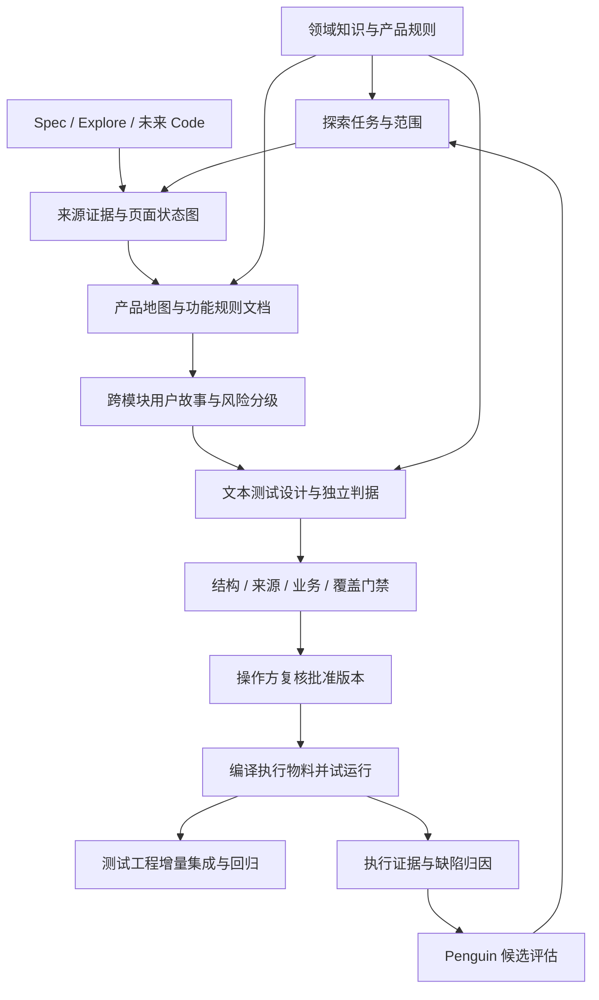
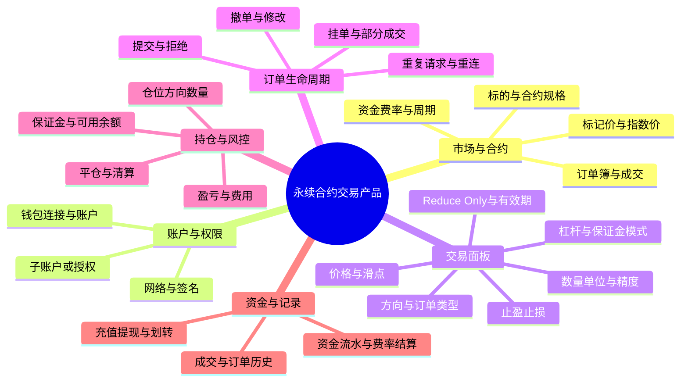

# 20 · 领域专业物料链路：诊断、重构与 Claude Code 交接

2026-09-10。**本轮完成的是代码与真实物料审计、修复设计和交接，不是已经实现下述专业链路。**

## 1. 目的与必须保持的产品方向

TestPilot 的目标是垂直领域的自动测试用例生成 harness：理解被测产品的领域规则，系统探索功能与状态，形成可复核的产品地图和业务故事，按风险设计专业文本用例，审批后生成和维护可执行测试工程。Web 管项目、运行、物料和 review；Claude Code / Codex / PenguinHarness 可以作为原生规划宿主；Penguin 评估 UI 管受控自进化。工程可用之外，还要留下可用于论文的可复现实验证据。

本轮用户要求的目标链路：

图中的反馈是经过评估的候选改进，不能让执行失败直接改写业务规则或批准的 oracle。两层模型继续保持：宿主负责规划，Midscene 使用现有低成本执行模型；Web 的 planner 当前可复用 executor 配置，后续仍可通过 env / 项目配置分别调整。角色多不等于需要配置更多模型。

## 2. 结论：提示词有缺陷，但不是“没有写专业方法”这么简单

我核对后确认有五类问题叠加：

1. **领域参考存在，但没有形成项目适用规则。** 两个 run 都收到内置 `REFERENCE-domain-perp.md`；它是通用/演示参考，不等于当前 Hyperliquid Testnet 版本的业务需求。两个 run 的 `knowledge/*` 项目知识版本均为空。
2. **探索计划没有兑现为业务操作。** 模型识别出保证金、杠杆、订单输入等候选，但实际只走了导航路径；预算消耗在离开交易页上。
3. **当前 skill 主链缺少强制的“证据→规范产品模型”中间产物。** 旧 pipeline 有 `spec.compose`；本次 Web 和 Codex 都走 skill 模式，主要顺序是 instructions→stories→cases→gate→finalize。仅改旧 pipeline 的提示词不能保证当前产品生效。
4. **专业规则主要是自然语言建议，数据契约和门禁没有足够约束。** 方法名、优先级已有，但缺测试条件、风险理由、业务规则绑定和可计算覆盖项；评分不能代表领域完整性。
5. **上次 Codex 验收主动缩窄了目标。** 脚本明确只设计有证据支持的未登录行为，复用同一份探索材料、最多 6 条故事。因此 10/10 是接入/冒烟成功，不是永续合约业务测试成功。

不要通过给模型加一句“你是金融专家”，或把更多资金功能设成 P0，就宣称修复完成。

## 3. 真实运行证据

来源：[本轮只读审计](../evidence/domain-material-audit-2026-09-10/current-runs.json)、[原探索图](../evidence/domain-material-audit-2026-09-10/exploration-graph.json)。审计读取活动 API，不重新生成、不变更审批，也不读取受保护 Gold。

| 指标 | Web run `38041ca0…` | Codex run `ca300440…` |
|---|---|---|
| 来源 | 新 Explore | 复用 Web 的 exploration.md，同一哈希 |
| 项目领域知识版本 | 0 | 0 |
| 指令中内置永续参考 | 已下发 | 已下发 |
| 模块 / 故事 / 文本用例 | 6 / 6 / 22 | 8 / 6 / 10 |
| 优先级分布 | P0=1，P1=16，P2=5 | P0=0，P1=3，P2=7 |
| 用例方法 | 7 状态、5 negative、8 等价、2 边界 | 9 状态、1 等价 |
| oracle 类型 | 7 URL、8 text、7 无独立 oracle | 10 text |
| 规则评分 | 1.0，存在多项 info | 1.0，negative-ratio 为 warn |
| 业务能力含义 | 以导航/展示为主 | 公开页面冒烟 |

探索实际：8 个 state 分别对应 `/trade`、`/outcomes`、`/portfolio`、`/earn`、`/vaults`、`/staking`、`/referrals`、`/leaderboard`。共 50 条 transition，**7 条 walked=true，均为 goto；43 条 walked=false，只看见链接**。停止原因为 `screenCap=8`，另外 4 个 URL 未访问。不能把 50 当作已验证交互数，也不能把 4 当作全部未验证业务功能数。

入口计划已经写出“连接钱包、逐仓/全仓、10 倍杠杆、订单参数”等候选；但没有任何实际页内点击形成交易面板状态。案例“页面显示 Order Book”可以是有效冒烟断言，却证明不了下单、成交、资金或持仓规则。类似地，`tier=1` 表示程序可判，不表示金融领域覆盖高。

## 4. 缺陷定位与修复落点

| 问题 | 当前代码与证据 | 修复要求 |
|---|---|---|
| Explore 没有领域前置输入 | [NewRunForm](../../../src/components/workbench/NewRunForm.tsx)、[workflowOps](../../../server/src/workflowOps.ts)：knowledge 只允许 stories/cases/gate；observeProduct 未传知识 | 领域/产品规则在 source 之前绑定，传入适用规则与探索目标；无知识时标通用探索 |
| 修改错误的提示词入口 | [index.ts](../../../server/src/index.ts) 的 setAgentObserver 调 live.observe；[interactive.ts](../../../packages/harness-testing/src/exec/interactive.ts) 的 askForScenarios 才做本次场景判断 | 优先修改当前 observe 调度与场景契约；不能只改 settings.DEFAULT_EXPLORE 或旧 pipeline prompts |
| 普通业务按钮排在路由之后 | interactive.ts 的 inPageCandidates 要求 group 和特定 ARIA role；普通 button 不在页内优先集合，goto 排在一般 click 之前 | 用领域功能/面板/状态组织 frontier；普通按钮、弹窗入口、自定义控件都能匹配任务；不是只调高 maxScreens |
| 模型“故事计划”过早且没有履约检查 | askForScenarios 从入口控件先猜 stories，后续没有逐项完成/阻塞记录 | 更名/迁移为探索 charter/candidate task；真正故事等产品模型完成后产生；计划每项都给证据或未完成原因 |
| 地图结构进入下游时被弱化 | workflowOps 保留 graph 在 report，传给规划的是 exploration.md；[runStages](../../../server/src/runStages.ts) retrieve 只索引 material 字符串 | 图与规则作为带 revision 的结构输入；不依靠模型从散文重建真实 walked/observed 状态 |
| 两条生成路径不等价 | [casegen/graph.ts](../../../packages/harness-testing/src/casegen/graph.ts) 有 spec.compose；runStages 的 skill 阶段没有产品模型门禁 | Web/三宿主共享 normalize_product/write_product_model 阶段契约，内部 planner 仅作可选实现 |
| 领域知识只是部分角色提示 | [workflowControls](../../../server/src/workflowControls.ts) beginStage 已按 roles 下发知识；不是完全未接入。但同一会话累计上下文，gateRun 的确定性代码也不解释知识文本 | 建 ContextManifest、节点输入回执和可执行规则包；知识“存了/下发了/被引用/规则校验了”分开显示 |
| 专业设计已有提示，但缺可检查工作产物 | [CASES_STABLE](../../../packages/harness-testing/src/casegen/prompts.ts)、[设计 Skill](../../../plugins/testpilot/skills/testpilot-design/SKILL.md) 已要求等价类、边界、判定表、状态、negative、清理、oracle、P0/P1/P2 | 除标签外，要求分区、边界点、决策行、状态边、数据与规则 ID；详见 21 |
| schema 比提示要求弱 | [types.ts](../../../packages/harness-testing/src/casegen/types.ts)：priority 可选；acceptance/precondition/postSteps 等有默认；模块挂接仍可缺省 | 新版本严格契约；旧归档保持兼容，不能用默认值伪装历史完整性 |
| 高分掩盖全局不足 | [gate.ts](../../../packages/harness-testing/src/casegen/gate.ts) score 只统计带 caseId 的 warn；全局 negative-ratio 不扣分。runStages 当前按 score>=0.6 放行 | 分开结构有效、业务充分性、可执行性；确定性阻断条件独立于评分；30%比例不能当通用专业标准 |
| 优先级偏通用网站 | [REFERENCE-priority](../../../plugins/testpilot/skills/testpilot-design/REFERENCE-priority.md) 强调认证/支付/结账/核心正常流，缺资金影响证据 | 先评故事/规则的损失影响，再选风险场景；罕见但可造成资金损失的负例也应为 P0 |
| 编译成功不等于工程集成 | [approvedRuns](../../../server/src/approvedRuns.ts) 将批准步骤确定性编译为 Midscene 动作；已有 project export ZIP | 增加目标仓库/测试框架/fixture/路径/增量清单/检查结果的 IntegrationReceipt，不重写现有测试 |
| 验收提示限制专业输出 | [verify-codex-project](../../../server/scripts/verify-codex-project.ts) 限未登录、最多 6 故事、不读取外部材料 | 明确 smoke / domain-discovery / domain-regression 范围；专业验收需要新 run、新上下文，不回写原 10/10 |

审计还确认：loadRunInstructions 一次下发 14 份 Skill/Reference；当前对应文件合计约 51.9 KB（磁盘字节，不是 token 数）。收到文件不等于模型逐项落实；把所有领域包继续叠上去会扩大上下文，并不能补上阶段验收。

## 5. 永续合约交易页应形成什么地图

以下是**领域引导的候选功能地图**，用来决定要查什么。它不是宣称本次页面已实现所有功能，也不是本轮重新点击得到的观察。平台可能采用不同保证金/账户模式；先绑定产品、网络、账户模式与文档版本，再判适用性。

产品图采用主模块→子模块→功能的稳定 ID；页面/区域/控件/状态是另外一张交互图。通过 mapping 连接两张图，不能把 URL 层级直接当业务模块层级。每个功能可挂多个页面，一个页面也可服务多个功能。模块图只用于组织，业务依赖、状态转移和跨模块旅程是独立关系。

必须分开的来源：`normative`（产品明确规则）、`observed`（实际观察）、`hypothesis`（领域推测）。适用性另设 `applicable / not_applicable / unresolved`；验证状态另设 `confirmed / unverified / blocked / conflicted`。不要把“已观察”与“符合需求”塞成一个布尔值。

例如：领域包提示检查 Reduce Only，官方文档支持该选项；当前页面只看到入口而未打开，就应展示“产品规则存在、交互未验证”。钱包未连接时，相关 P0 故事可进入设计，但执行标 `requires_fixture`；不能删除它们后显示完整覆盖。

Hyperliquid 官方说明提供订单选项、保证金模式、清算和资金费率依据；测试网是否适用仍需版本绑定。资金结算与清算还使用不同的价格语义，不能拿一个页面现价替代所有计算输入。[订单类型](https://hyperliquid.gitbook.io/hyperliquid-docs/trading/order-types)、[保证金](https://hyperliquid.gitbook.io/hyperliquid-docs/trading/margining)、[清算](https://hyperliquid.gitbook.io/hyperliquid-docs/trading/liquidations)、[资金费率](https://hyperliquid.gitbook.io/hyperliquid-docs/trading/funding)。

精度来自标的元数据和产品输入规则；不能从 API 的精度限制推断 UI 一定截断或四舍五入，也不能照抄演示包中的历史带宽常数。[精度规则](https://hyperliquid.gitbook.io/hyperliquid-docs/for-developers/api/tick-and-lot-size)。

## 6. 探索策略：先地图、再逐项兑现，而非无条件点击所有东西

1. 固定探索 run 的 domainPack/productRulePack、目标 URL、环境、视口、账户状态、功能范围、预算和动作策略。
2. 采集入口页和局部面板的控件清单：DOM/可访问性树、截图证据、输入约束、弹窗/iframe/虚拟列表等。采不到要记 unsupported，不写成无此功能。
3. 用领域模型生成探索 charter：目标功能、待验证规则、候选控件 ID、预期发现的状态、完成条件、动作风险与所需 fixture。候选不直接算用户故事。
4. 先覆盖当前交易页的关键业务面板，再扩展关联页面；不能让全局导航消耗全部预算。下拉/弹窗/悬浮说明/Tab/输入联动/分页都要有策略。
5. 对当前范围内每个可交互目标，记录 `attempted / observed_only / blocked / skipped_equivalent / failed` 和理由。恢复、关闭弹窗、返回前状态也记路径。动态选项可按有证据的等价类采样，未展开项留在 backlog。
6. 钱包连接、签名、下单、撤单、资金变动按预先配置的测试环境与动作预算执行。不能为了“点完”误触提交；也不能只靠 delete/logout 词表判断业务副作用。缺会话或 fixture 时保留阻塞任务并继续可执行部分。
7. 输出结构化图、证据索引、功能映射、覆盖报告和待继续 frontier。到达预算即 partial，保存检查点供单节点续跑，不能显示 complete。

`click coverage` 的分母是固定范围内已发现且适用的可交互目标，不是整个互联网意义上的所有控件。报告同时列出未发现风险、采样量、阻塞量、未访问状态与预算原因。visited URL、seen edge、walked edge、asserted transition 分开计数。

## 7. 用户故事与风险分级

故事描述“哪个角色完成什么业务目的”，不是“点一次按钮”。比如从交易面板、挂单列表到持仓和资金流水的完整业务结果，保持一个故事 ID，引用多个 featureId/moduleId。功能地图供故事、复核、执行报告和物料列表共用。

每条故事需要：actor、goal、benefit、前置业务状态、主路径、替代/拒绝路径、结构化验收条件、ruleRefs、featureRefs、evidenceRefs、riskAssessment、执行前提。没有确证的规则保留 openQuestion，不能补写貌似合理的结果。

下面是本项目建议的风险策略，不是 ISTQB 指定的 P0/P1/P2 分类：

| 级别 | 判定 | 典型场景 |
|---|---|---|
| P0 | 错误可直接损害资金/头寸/交易授权，或破坏核心交易结果 | 方向/数量/币种错误、重复成交、保证金/平仓错误、越权资金操作、关键风险校验失效 |
| P1 | 重要业务可用性、信息可靠性或流程受阻；按实际决策影响可上调 | 订单/成交记录不一致、交易状态迟滞、关键市场信息异常、恢复流程 |
| P2 | 不影响核心决策或资金正确性的辅助展示 | 普通导航、帮助、非关键布局和展示 |

每个等级附影响资产、失败后果、规则依据和理由。严重性/发生可能性/可检测性等分开记录；资金影响可做优先级下限，不能被“罕见”降成 P2，也不能把所有金融页面一律 P0。P0/P1/P2 业务优先级与 oracle tier、执行环境危险度是不同维度。

风险分析可以依据影响与可能性决定测试范围和深度；测试设计应明确使用等价类、边界、判定表和状态方法。[ISTQB CTFL 4.0.1 第 4、5 章](https://istqb.org/wp-content/uploads/2024/11/ISTQB_CTFL_Syllabus_v4.0.1.pdf)。下面的字段、策略和工程门禁是本项目设计，不宣称获得标准符合性认证。

## 8. 专业文本用例与门禁

已有提示明确要求测试方法；欠缺的是它们的实际设计记录。新用例除步骤/expected 外，应包含 testCondition、ruleRefs、testData、designEvidence、独立 assertions、清理/隔离策略、适用范围和阻塞原因。具体契约、角色提示与完整例子见 [21](21-节点提示词与结构化契约草案.md)。

- 等价类：指出有效/无效分区和代表数据，不是只填 equivalence。
- 边界：说明限制来源、单位、边界与相邻可表示值；不把任意数字当边界。
- 判定表：指出条件组合、规则行、期望结果及不适用组合。
- 状态迁移：给前后状态、事件、guard、合法/非法边，不只测页面跳转。
- negative 应是场景类型，和 designTechnique 分开；负例也可以用边界或判定表方法。
- 业务期望从独立产品规则/确认规格来；页面观察用于动作路径和实际结果。页面错了不能反过来定义 oracle。
- 多个独立验收点用 assertion 数组；一个数字相等或模式切换成功不能替代整段业务正确性。金额使用十进制字符串、明确单位/取值时刻/行情或数据快照。
- 实时金融测试优先可控 fixture 的精确 oracle；真实 testnet 采用请求/订单/账户关联与有界等待。不能对不断变化的价格/余额截图写固定常量，也不能用过宽容差掩盖错误。

建议三层门禁：

| 层 | 处理 |
|---|---|
| 硬事实校验 | schema、引用、版本、跨项目、未知规则、必需测试数据、方法设计证据、可执行断言缺失等；确定性错误阻断 |
| 业务充分性 | 必测风险项、规则覆盖、状态/分区/决策行未覆盖、未验证假设；输出缺口，专业 scope 下缺关键项不能冒充完成 |
| 语义审阅 | 用独立角色检查规则适用、期望是否受来源支持、遗漏；保存解释证据，模型判定与操作方审批分开 |

保留老 gate score 供历史重放。新 profile 固定质量门槛，不能为通过新测试偷偷改旧评分分母。冒烟 run 可以合理没有负例，但必须标 smoke；业务回归不能靠“全部正常路径也 100%”过关。没有账户条件时，可以完成专业设计，执行就绪状态应独立为 blocked/partial。

## 9. AI 交接、角色与长上下文

角色是职责、可读内容、可用工具、可写产物的组合；Skill 是方法/工具使用说明；KnowledgePack 是领域与产品事实。finance Skill 可以贡献分析方法，但不能直接替代 Hyperliquid 规则或执行脚本。

| 角色 | 主要读取 | 主要产出 |
|---|---|---|
| 领域分析员 | 通用术语、产品官方规则、版本/适用范围 | 适用规则集与待确认问题 |
| Explorer planner | 适用规则、当前功能缺口、局部控件/状态 | charter、下一步动作候选 |
| Midscene executor | 已批准的动作范围与当前局部状态 | 操作与屏幕/接口观察 |
| 产品分析员 | 证据图、规则、Spec/Code 来源 | 规范产品模型与差异 |
| 故事分析员 | 产品模型和风险策略 | 故事与验收条件 |
| 测试设计员 | 单故事、有关规则、方法包、fixture能力 | 设计矩阵和文本用例 |
| 独立审阅员 | 用例、规则原文、设计证据 | findings 与适用性判定 |
| 编译/集成员 | 批准版本、目标工程契约 | 执行物料、增量修改与集成回执 |

每次交接记录 ContextManifest：role/skill/knowledge/schema/policy 版本与哈希、实际 source chunks、上游 revision、工具权限、输入/输出预算、裁剪情况。按“领域→模块→规则/故事”检索，不把整站原文和所有 Skill 在每个节点重发。

稳定前缀放任务规则和角色方法；动态尾部放本节点相关资料与精确引用。总上下文按运行时能力配置预算，并预留输出；必需规则装不下就缩小工作单元，禁止静默裁剪关键条款。结构化结果先校验再持久化；局部修复带具体错误路径，不能以“再专业一点”重试整批。

独立审阅需要新上下文/受限工具，不能在同一聊天里改角色名后宣称隔离。宿主不能证明上下文隔离时记录 best-effort/unknown；MCP 工具权限仍可强制，但不能声称能删除宿主已经看过的信息。模型自报“已读”不是证据，服务实际下发哈希也只证明交付。

## 10. 从审批到测试工程

当前 g2 确定性编译批准步骤的原则保留；更专业的文本和 oracle 才是前提。无需再请模型任意重写已经批准的业务期望。

“用例通过”拆成：设计门禁通过→操作方批准→代码可编译→试运行结果→项目集成检查。不是所有红例都禁止进入测试工程：经批准的缺陷回归用例应保留真实失败状态，不得为集成而弱化 oracle。

增量集成必须绑定目标仓库与测试框架、代码版本、fixture/环境、依赖和命名约定。使用生成文件清单和语义 case ID，重复集成幂等；修改过的生成文件给出冲突，手写测试保持不动；外部发布/提交仍按用户授权。ZIP 导出仍可用，但它不是已经写入用户测试项目。

集成回执至少包含 caseRevision→codeHash→相对路径/testName、基础仓库版本、依赖改动、类型/收集/fixture 检查、试运行结果和剩余阻塞。生成代码不可夹带密钥；setup/teardown、API oracle、参数化数据和 Midscene 动作均要在工程中复现，不能只复制 aiAction 片段。

## 11. 实施顺序与验收切片

这些是 [13 现有 P 台账](13-UI与论文路线任务台账.md) 的细化，不另建第二套任务状态。基础依赖仍按 13；跨 P 的契约先一起定稿，再按切片接通。

| 顺序 | 工作与落点 | 对应 P | 最小验收 |
|---|---|---|---|
| 1 | 定义版本化规则包、产品模型、ContextManifest、方法证据；见 21 | P-02/07/27/15 | 旧归档只读可用；新格式拒绝悬空/跨项目引用、无依据 P0 和假方法标签 |
| 2 | 创建 run 绑定领域/产品版本/范围；让 source 真正收到知识 | P-25/07/27 | Web 和宿主相同绑定；manifest 可证明下发内容；缺领域时明确 generic scope |
| 3 | 修 explore frontier 和逐目标回执；复用 SFG 与 effect | P-25/09/15 | 固定交易页 fixture 不被导航带走；关键普通按钮/弹窗被展开；预算不足有可续 backlog |
| 4 | 统一 normalize_product/write_product_model；接通结构图审阅 | P-02/03/26/05 | required/observed/conflict 对照；多入口同一 feature ID；不同 run 不静默覆盖 |
| 5 | 故事和风险策略、跨模块验收条件 | P-02/15/04 | 资金相关非法路径优先；缺钱包故事保留，执行阻塞显式 |
| 6 | 方法设计证据、数据集、独立 oracle 与 gate profile | P-15/27/04 | 伪边界、无依据常数、前端读数自证等被指出；全局缺口不能藏在满分后 |
| 7 | 批准版本→编译→试运行→工程增量集成 | P-05/11/20 | 重复集成无重复文件，手写测试不覆盖，oracle 不漂移，失败证据可追溯 |
| 8 | 三宿主/Web 同输入验收，独立专业评测 | P-14/16/20/22/23 | 同范围、同 fixture、同版本可重放；工程冒烟与专业能力指标分别报告 |

**Claude 的第一条可交付切片**：在隔离的本地交易页 fixture 中，绑定一小份有来源的永续规则包；展开“订单类型、保证金模式、杠杆、Reduce Only”面板；生成 `ExplorationReport + ProductModel`，证明每个功能为 observed/blocked/conflicted 中哪一种。先把探索与产品文档打实，再调整故事/用例数量。不要一开始仅把 maxScreens 从 8 改成 50 后重新收费跑全站。

## 12. 专业性、论文与自进化如何验收

至少分开四组指标：

- 探索：范围内控件/面板完成率、walked 转移、领域目标命中、阻塞/未访问项、时间与调用成本。
- 产品/故事：来源正确率、规则适用准确率、跨模块故事完整性、P0 漏项、产品模型冲突检出率。
- 用例：方法设计正确率、风险加权规则覆盖、oracle 语义正确性、缺陷/变异检出率、误报和 flaky；文本条数不是主要质量指标。
- 工程：可编译/可执行比例、独立回放一致性、增量集成成功率、用户修订量、token 与时间。

实验拆开：固定同一探索证据比较“只改提示词 / 加领域包 / 加结构与风险契约 / 完整链路”；另做相同预算的探索策略比较，不能同时换探索范围和生成提示再归因于角色。预注册主要指标、采样与重复策略；论文 Gold/留出集不能流入生成或自进化上下文。真实人工专业标注仍需要实际专家证据，本地免登录 local-operator 不构成真人身份证明。

Penguin 只提出/评估领域检索策略、探索优先队列、角色提示/Skill 等候选版本。不能进化产品事实、审批 oracle、Gold、留出规则或评分分母来提高分数。评估批准后新 run 绑定新版本，旧 run 仍能回放。该设计是研究假设，尚未证明优于现有方法；相关论文定位继续沿用 [12](12-论文级研究与受控自进化.md) 和 P-13。

## 13. 交接状态

2026-09-10 更新：§11 第一切片已实施并在本地 perp-lab 上真实验收（规则包绑定、charter 探索、逐目标回执、代码整理的产品模型；健康版 4 功能 confirmed、缺陷版 1 功能 conflicted、0 次模型调用）。实施记录见 [09 §27](../09-执行目标与接手指南.md)，证据见 [evidence/domain-explore-2026-09-10](../evidence/domain-explore-2026-09-10/README.md)。切片 2 的宿主入口、切片 4–8 仍未实施；下文原始诊断保持不变。

已完成：真实 run/图审计；当前调用链与提示/Schema/门禁定位；角色、数据与实施方案；[21 契约草案](21-节点提示词与结构化契约草案.md)。未实施：本文件所列专业链路改动，未重新 Explore/下单/生成、未修改活动用例、受保护基准、模型配置或运行数据。

交接顺序：本文件→21→[16 既有多入口设计](16-产品结构与多入口知识契约.md)→13 对应 P 项。身份验证已按用户要求移除，不恢复旧审核登录；Web/API 仍在 5300/5301。执行历史见 18/19，不能将它们的冒烟通过率改写为业务完整性证据。
